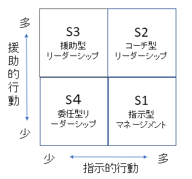

### 最短最速で目標を達成する OKRマネジメント入門

- 著者
    - 天野 勝

-----
- SL理論によるりだーシップの４スタイル
    
    
    - S1
        - 指示型マネージメント
        - リーダは業務について具体的に指示し、きめ細かく管理する。
        - 意思決定はリーダが行うため、メンバーとのコミュニケーションは少ない。
        
    - S2
        - コーチ型リーダーシップ
        - リーダは指示命令は行うが、質問を投げかけるなどのコミュニケーションをとり、部下にも提案さえせる。
        
    - S3
        - 援助型リーダーシップ
        - リーダーが部下の意見を聞き、意思決定を援助する
        - サーバンド型リーダーシップ

    - S4
        - 委任型リーダーシップ
        - 部下に仕事の責任を委ねる

     
- OKRの基本
    - なぜ目標が大事なのか？
        - 目標がメンバーの成果を最大化する  
            - メンバーがそれぞれ違う方向を向いていたら、成果に期待できない
                - 目標で方向性を合わせる必要がある
            - やらされ仕事の目標より、当事者意識を持った目標のほうが効果が高い
                - 目標を決めるプロセスに参加することが大事となる

    - OKRとは何か？
        - Objective（目的）と Key Result（主要成果）
        - Objectiveは「こうありたい」という姿を現したもの
        - Key Resultha,Objectiveがどのように達成しつつあるかを端的に測るための指数
        - OKRの狭義
            - チームの活動の方向性を示すためのゴール
        - OKRの広義
            - OKRを用いたマネージメント手法
        - OKRの４つの原則
            - フォーカス
                - 一番大事な事を選び、そこにリソースを集中させること
            - アライメント
                - 複数の要素間で整合を取ること
            - トラッキング
                - 状況がどうなっているか追跡すること
            - ストレッチ
                - 現状からさらに高みへ挑戦すること
       
    - OKRが成果を生むからくり
        - OKRは攻めの目標管理
            - 「野心的（Ambitious)」な目標を決めることが特徴
                - 野心的目標のメリット
                    - 達成できれば大きな成果
                    - 失敗が許される
                    - 新たなアイデアが生まれやすくなる
                    - 対立しにくくなる
    - OKR勘違い
        - スタートアップだけではなく、一般企業でも有効
        - 企業だけでなく、個人にも使用しても成果はある
        - 業務評価には使用しない
        - OKRの指標は決めつけるものではなく、自分たちで引き出すもの
            - リーダーが指数を決めて、メンバーを操るものではない
    - OKRメリット
        - 大きな成果が得られる
        - メンバーが当事者意識を持って仕事を行える
        - チャレンジしやすくなる
        - 活動の進捗が見える
        - 他の部署・チームと協力がしやすくあんる
            - 他の部署もOKRを使っていれば、どのような活動をしているのか、外部からも理解しやすくなる
                - 相手が理解できれば、利害がわかり、協力を得やすくなるし、協力しやすくなる。
    
- OKR始め方
    - ゴールを決めるプロセスを確認する
    - チームの境界を決める
    - チームのミッションを決める
        - チームがあることで外部にどのようなメリットが、無いことでどのようなデメリットが発生するか明文化する
    - マイルストーンを決める
    - モデルを作成する
        - 新しく何か始めるときは、その領域の知識を補うためにも仮モデルをメンバーで共に作り上げる
    - 目標を決める（Objectiveに対するKey Result)
        - ミッションは大きくわけて2タイプ
            - 新たなモノ・コトを創り出すクリエイティブタイプ
            - 現状維持だったり、少しずつの改善に重きをおくタイプ
    - Key resultはSMARTで考える
        - S：Specific（具体的に）
            - 齟齬が生じないような具体的なもの
        - M:Measurable（測定可能な）
            - 現状がわかるように定量化できるもの、測定方法についても
        - A：Achievable（達成可能な） または　Ambitious(野心的な)
            -  理想を追い求め過ぎず、ちょっと（60~70%)ぐらいで達成できる目標
        - R:Relevant（関連した）
            - ObjectiveとKey Resultは関連していること
        - T:Time-Bound(期限がある)
            - 目標を達成する期限
- チームでOKRを使う
    - ゴールに向かうプロセスを決める
    - 運用を設計する
    - 行動を決める
    - 行動（タスク）する
        - タスクサイズは1日以内に完了できる程度
    - 達成状況を評価する
    - 行動を見直す
        - 行動指標は、直接制御可能な指標
        - 結果指標は、行動の結果によって間接的に変化する指標であり、直接制御はできない
    - 最終的な達成状況を評価する
        - Objectiveが達成できているかどうか
    - OKRブリーフィングの進め方
    - OKRデイリーチェックインの進め方
    - 個人面談の進め方
    - OKRマネジメントボードを活用してみる
    
- 組織でOKRを使う
    - OKR組織導入パターン
    - ステップ１：立ち上げ方
        - OKR推進チームを作る
            - OKR推進チームのOKRを設定する
        - ガイドを作る
        - 有識者による講演会、有志による勉強会を開く
        - 最初の導入部門を決める
        - 研修する
        - 導入を支援する
        - 事例発表会を開催する
    - ステップ２；展開
        - 研修する
        - 導入を支援する
        - 事例発表会を開催する
        - 次の導入部門を決める
    - ステップ３：定着
        - OKRを制度化する
        - OKR推進チームを解散する
    - 階層型組織のOKR
        - どのような方向に向かって努力すべきが方針が必要
        - チーム間の相乗効果を生み出すには、上位のKey Resultを複数のチームで達成する形をとる
        
    - マトリクス型OKR    
    

