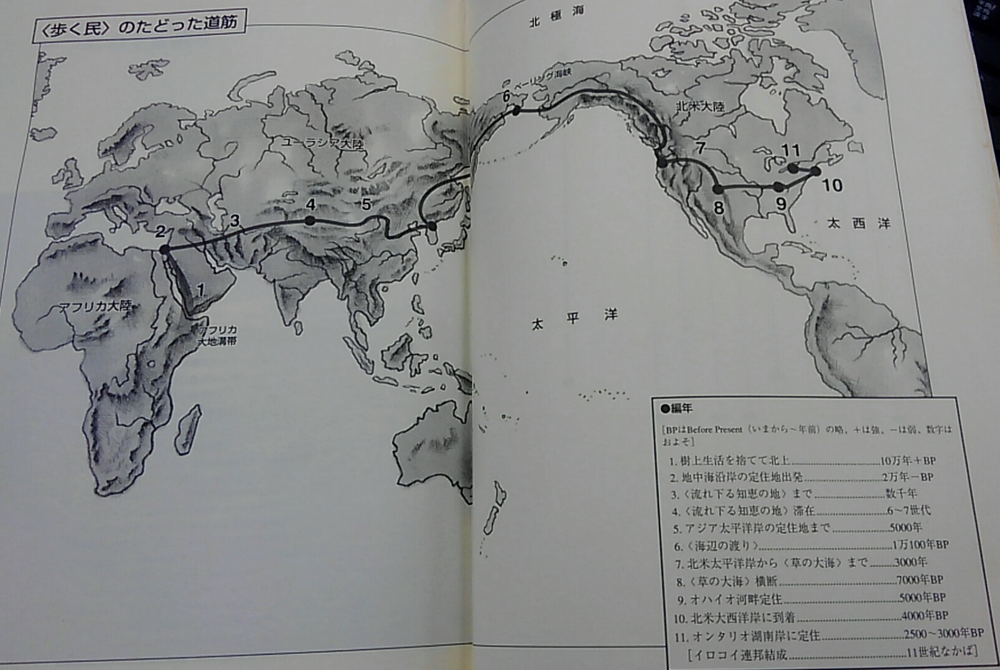

# THE WAKING PEOPLE 一万年の旅路

## 一族の旅の道のり

## 概要

アメリカ大陸に住むネイティブアメリカンのイロコ族がはるか昔、中東からユーラシア大陸を抜け、ベーリング陸橋を渡りアメリカ大陸の五大胡ほとりで永住するまでの長い道のりをに口承で語り継いできた、一族の長い歴史を記した本である。
読む際の注意点として、歴史の本ととらえるのではなく、一族の脈々と続く物語の流れを感じる事が大切である。  
彼らは自分達を「歩く民」と言うが、「学び続ける民」とも言えよう。

### 口承という形での知の蓄積

彼らは一族が得てきた知恵、経験、誇りを歌という形で継承（口承史）し、大いなる遺産を引き継ぎ続けている。  
そこには学ぶことの大切さと、次世代に伝承する困難さが含まれている。

口承文化は文字文化に比べ、蓄えられた情報にアクセスするには思い出すしか方法がない。  
口承伝承者は単に一字一句覚えているのではない、考えながら（≒イメージして）覚えているのである。  
歌に込められれている物語を疑似体験をすることで、自分の記憶とし一族の記憶を紡いできたのである。  
彼らはそれを「耳を傾ける」と呼んでいる。

### 知識と知恵と合意形成

彼らは一族の生死を決める幾たびかの決断を下してきました。   
特にベール海峡を越える時は、海を越え新大陸に向かうか、この地に留まるべきか、大きな決断でした。  
どちらが正解なのか誰にも判りません。  
大事なの事は、一族全員が海を越えることに同意し実践したことです。  

最初に一族は広く情報を集め、知識を蓄えました。しかし、どれだけ情報を集めても十分な知識にはなりません。  
次に集めた知識内で決断する方法を考え合いました。  
「多くの人々が一緒に知恵を探る」話し合いのあるべき姿と言われています。  

彼らは、この地に残っても食糧難で後がなく、海を渡るにしても一族の力を結集しなければ成し遂げられないと、危機意識を共有し、共有ビジョンをたてることで、一族の合意形成に活用しました。

結果として、彼らは無事に海を渡り、新大陸（北米）にたどり着きます。  
一致団結することで、個々のメンバーの力を足し合わせた以上の力を集団では発揮することができます。  
それは集団のシナジー（協働作業）とも言われています。

### 学び方の学び

彼らは学ぶことを尊重しており、 **“学び方の学び”**  を得ていた。  
（メタ学習とも呼ばれるもので、高いレベルの抽象度が必要）
- 学びを促すには、学び手の性質をつかむ必要がある  
- 学びにはちょうど良い学びの道を工夫してやる必要がある
- 学びの道を一番うまく工夫できるのは学び手自身である

### 役に立たない人などいない

一族の学びの中に「役に立てない人などいない」というものがある。  
興味深い話だったので引用したいと思う。

 > 足が悪く歩けない少年がいた。  
 > 母は少年を担いで歩くため、その腰は人以上に曲がってしまっていた。  
 > 少年はその姿に涙を流し、自分を置いていくことを提案したのだ。  
 > 
 > 母は優しく諭し、一つの問題をだすのだった。  
 > 「歩けない者でも、鷲のように飛ぶことができるかもしれない。  
 > この意味が分かったら、お前は一族にとってもお荷物ではなくなるのだよ」  
 > 
 > 少年は悩み、ついに一族に提案したのだった。  
 > 「だれか私を母の代わりに担いでくれませんか、  
 > そうして頂ければ私は新しい土地での新しい食べ物の毒見係になります」  
 > 一族はその提案を喜んで受け入れたのだった。  

役に立てない人などいないのである。  
役に立てない人がいるのならば、それは皆の知恵が足りないだけなのである。  

### 学び続けることの課題

知識・知恵がもたらす恩恵について今更書く必要もないでしょう。
しかし、膨大な知恵を辛抱強く学ぶだけで一生が費やされてしまったり、変化目まぐるし時代では学ぶゆとりがなかったり、次世代に何を残せるのか、どう残すのかは今を生きる私たちの課題です。  
もう少し規模を小さくしたとしても、組織、メンバー・・知識・知恵の伝承は常に課題となります。

一族は口承という形での伝承に解を求めました。  
自分たちはどのように伝承していくのか？  
個々の力ではなく、集団のシナジー（協働作業）を発揮させる為には重要な課題です。  
それを考えさせられる書籍でした。