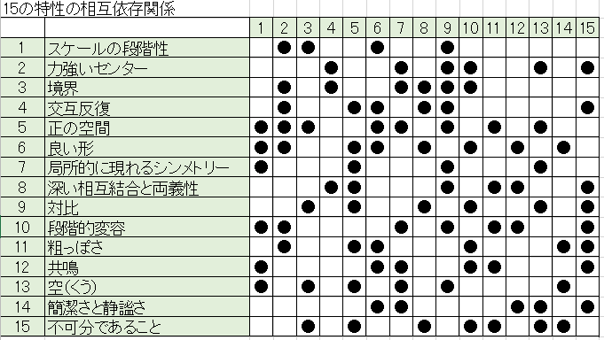

### ザ・ネイチャーオブオーダー
## 建築の美学と世界の本質 生命の現象

## THE NATURE OF ORDER
## An Essay on the Art of Building and The Nature of the Universe

- 著者
    - クリストファー・アレグザンダー Chistopher Alexander
    
- 監訳
    - 中埜 博
    
- 裏表示
    - アレグザンダーの積年のテーマである「生き生きとしたパターン」からさらに展開し「生命（Life)」や「全体性（Wholenness）」「センター（Center)」がキーワードとなり、環境の心地よさや美学、保存への実践が論じられている。
    
--- 

- いまだ芸術が求める「秩序」の法則は存在していない
    - エントロピーは理想気体の中で振る舞う分子秩序を解き合したが、「負のエントロピー」に関する秩序の処理の仕方が単術過ぎて、芸術家が求めるものとは異なるものだった
    - 結晶学や軍隊組織を発展させていっても満足いく秩序には会えなかった。

- 機械論としての秩序
    - ものごとがメカニズムとして機能する方法として語られ、生み出されるもの

    - この世界で心を揺さぶられるのは、「調和」と「秩序」の一面
        - 木の葉や伊勢神宮、モーツァルトの交響曲など
    
    - 秩序に関する機械論的思考法の起源は1640年ごろのデカルトにさかのぼる
        - 彼の考えでは、モノゴトの動きは機械のように考えると理解できると考えていた
            - ボールの回転やリンゴの落下など、興味の対象とそれ以外の対象を完全に切り離して感が増す。
            - そして機械的モデル、いうなれば知的玩具を開発し、それが法則に従えば、その事象を再現するという考え。
        
        - しかし、このプロセスというのは手法でしかない。
            - 私たちはしばしばそのことを見落としている
            - 対象を分離し、部分に分解し、モノゴトの動きについての機械的イメージ（またはモデル）をつくるということは、現実がどのようであるかということではありません。
            - それは理解を助けるための具現化できる、あるいは便利な思考実験にすぎません。
            
    - 20世紀の機械的視点
        - 「私」というものが私たちの世界観から外にでてしまったこと
            - 何をつくるにしても、それは「私」ら生じるというのに、どうやって「私」を含まないものが作れるというのか？
            
    - 真偽はどのように説明できるのか？
        - この問いかけが機械論的世界観とアレグザンダーの世界観とを分ける問題となる
        - アレグザンダーの世界観の中では、真偽を説明できるものは2つ目の指標考えられます。
            - それは「生命」「調和」「安全性」の総体的尺度、簡単に言うと価値の指標です。
                - 調和的、生命を生み出す・・・これらは機械論的視点では真偽の本質を示せない

- 生命の強弱
    - 現在流行の建築は、建築に「生命」を見ることを拒否しています。
        - その不快感は、自分の建築はよくないと判定されることを感じ取っているからかもしれません。
        
        
- 簡単な事例における「全体性」
    - 全体性
        - 第一、そこに存在する様々な一体化をめざす実体のすべてによって規定される構造体
        - 第二、これらの実体が互いに入れ子状態になり重なりあっている状態
        
- 全体性とセンターの理論
    - 全体性は部分でできており「『部分』は『全体性』からつくりだされる」
        - この一見矛盾する理論こそが、「全体性」の本質を根本的に表現していると言える
        
    - いかなる実体も、より大きな「全体」の中に生じる局所的な「センター」として現れる
    - センター
        - それ自体が持つ組織構成と、その内的一貫性と、文脈と一致した関連性を持ちつつ局所的ゾーンとして「センター性」という性質を表出している集まりのこと
        
- 繊細な構造としての「全体性」
    - いかなる「センター」の強さも、その「センター」を作り出しているはずの内的形状によってできるものではなく、その空間が外部に向けて発信する別の要素によって決まるのです。
    - そして、その強さは必ず「全体」としての形体の結果となります。
    - そこで「センター」の力強さは、一連の数学的な形体の特徴によって定義づけられます。
        - 対称性、結合性、凸状性、均質性、境界性、形体的急激な変化等、これらはすべて「全体」としての形体に直接作用します。
    - 与えられた「全体性」を構成する「センター」は、単独では存在せず、「全体」としての形体から作り出された要素として現れるのです。
        - これを大きいスケールの形の特徴で見ると、局所的に「センター」によって生み出され、かつその存在によって「安定」するのです。
        
    - 「全体性」は「全体」内に導き出される極めて繊細な構造である。
        - それは「部分」から簡単に予測できるものではない。
        - 「部分同士の間の」関係性から考えても意味がない
    - 「全体性」は自律的で全域にわたる構造でありながら、細部の形体によって導かれています。
    - この繊細な構造の本質を完全につかむためには「センター」が「部分」から作られてモノであるとみなす思想を避ける必要があります。
        - すべてものは「部分」からなると主張する人々のこと
        - 「全体」の前に「部分」が存在していると考えている人々
        
- 「全体性」と「センター」の理論
    - 全体性とは
        - 全体性は単に形体に注目したものではなく、実体を伴った具体的構造である
            - それは、この世に実在する構造であり、それは、私たちが形体として、全体像として、広域にわたる物事の本質として、直感的に感知できるものを含みます。
            - それは、この世界のあらゆる部分に実存する一貫性の源なのです。
        - この世のいかなる全体性も大きな「センター」と小さな「センター」が互いに結びついてたり重なり合ったりするシステムとなっているのです。
        - 「センター」には特別な名前はありません。全体の形体配置によって導かれるものです。
            - コンテキストに依存する        
    
        - 「全体性」の視点から見た場合に認識できる「センター」は、視覚的に支配的であるというだけではありません。
        - それらは、事物の真の振る舞い、どこで育まれる「生命」、そこで生じる実際の人々の営み、そしてそこに住む人々が感じる空気も支配していくのです。
        
        - 庭や家をごく普通に観察したのでは、それらの中に隠された深遠な「中心」の存在を想定することはできません。
            - ちょうど紙の上に描かれた点の場合と同じです。
            - それらはちょっと眺めただけでは眼には入らないほど繊細なものです。
            - しかし、これらの「センター」とその構造こそが、物事に「生命」を吹き込んでいる

        - 従来の生物学にもとづく生命もまた、この「全体性」からつくられていると考えられる。
        - 全体性が持つ重要な特徴は、際立った主張は存在しないという事ですｌ
            - それはただ単に存在するのです。
        - この世の一部分に生じた相当量の「生命」や美しさや良さは、ある種の主張や偏見、哲学などに左右されることはなく、
        - 単にそこに生じた「全体性」の結果として、見出されるのではかいかと私は考えるのです。
        
        - 人間の顔におけるこの捉えどころのない個性とは何でしょうか
            - 実は、この個性こそが「全体性」なのです。
            - それは顔における、あらゆる雰囲気のままであり、あらゆる質的構造であり、
            - あらゆる場の効果なのです。
            - 部位の特徴を正確に描いたとしても、仮名ずしも肖像画になるわけではない
                - 人物を描こうとするならば「全体性」を描かねばなりません。
        - 肖像画でも建築同様、内包されている「全体性」こそが真実であり、そのものすべてを決定しているのです。
                
        - 人間社会においては、与えられたスペースの全体性は常に文化的環境を包含しています。
        
        - 特別なセンターのシステムは、この世で私たちが経験する文化の多様性をも支配し定義します。
        
        - 現実世界に実体の区別が現れるのは、異なる空間の部分がそれぞれ異なる度合いの一貫性を持っているからです。
        - 最も古い時代にこのことを明確に認識したのは荘子でした。
            - 彼は肉の塊りの秩序がそれぞれの部位で繊維の密度が異なることに依拠していることを知り、この世を構成する事物のすべてが
            - 相対的に見て一貫性のあるひと塊りに切り離されることを正確に示していることを理解したのです。
                - 肉を力任せにたたき切るような肉屋の包丁の刃はすぐに綻びてしまいます。
                - しかし、心得ある肉屋は、包丁の刃を肉の柔らかい所に沿った部位にあて、肉の組織に沿って肉が裂けていくように切っていきます。
                - その刃は100年たっても綻びることはありません。
                
        - 実体を顕著な特徴の正確な「秩序」の中で見るものであり、誤ったものの中であってはなりません。
            
- 「生命」は「全体性」からどうやって生まれてくるのか
    - 1.「センター」はそれ自身が「生命」を持つ
    - 2.「センター」はお互いを補い合う。「センター」がひとつ存在すると、その「生命」は他のもう一方の「生命」を強化する
    - 3.「センター」は「センター」から作られる（これが「センター」の構造を述べる唯一つの方法です）
    - 4.「構造」は、その中で形成される「センター」の強度と、その密度によって、「生命」を持つようになる
    - これらの４つの点は、それ自身いたって単純ですが、私たちに「生命構造」の秘密を明らかにし、「全体性」から生まれる「生命」についての秘密を明らかにしてくれます。
    
    - センターとは何をさすのか
        - この問題は「秩序」の問題を解くカギであり、「生命構造」に関する問題を解くカギでもあります。
        - 問題の核心は「センター」は他の「センター」によってのみ定義することができる、ある種の実体なのです。
        - センターという考え方は「センター」以外のいかなる単純な実体によっても定義されえないのです。
        
    - 私たちが見ようとしている「センター」は他の「センター」からしかできていない
    - 「センター」の本質は、それゆえ再起的、循環的にしか理解できないものなのです。
        - これが機械論的な考えに染まった人にとって、「全体性」がとても神秘的に見える所以となる

    - 「センター」はいつも他の「センター」から生まれる
    
    - 局所的な対称性、差異、まとまりの存在、そして出っ張り、それらが「場」の効果を相互に作用しあって「センター」の存在を示している
        - 多くの事例が示しているように「センター」の鍵は対称性にあります。
        - 出っ張り、まとまり、大まかな対称性、周辺との相違など、これらの実在するものから派生する「場」によって「センター」たちを定義し得る
        - いくつかの「センター」はこれらの法則に従っています。
        - しかしこれらの法則は大雑把なまとめにすぎません。
        - いくつかの「センター」や「サブ・センター」では、絨毯の装飾に表現されているように、ふちの絵柄と中央の絵柄は相互関係を描いています。
            - いくつかは不完全な対称性です。
        - 個々でみていくと異なるのに、大雑把な見当で「センター」が一貫して実在するという概念を持ち得るのです。

    - それぞれの「センター」が他の「センター」でつくられる階層につながる「場」であるという概念で理論家することで、「センター」の生命に強弱があるという考え方に立ち返ることができる
    
    - すべての「センター」は区別できる「生命」の強さの差異をもっている
    - 世界のありとあらゆる「生命」がそれに含まれる「センター」の構造によって成り立っている
    - つまり「センター」は「生命」を与えられ、翻って、同時に他の「センター」から構成されるということを示している
    - 相互に影響を与え合うという事は、それぞれの「センター」が他の「センター」を強化する力をもち、「センター」の「生命」は隣接する「センター」の「生命」の相対的な強さと位置関係の結果として生まれるという事実の中で分かります。
        - 1.「センター」は空間的に生成される
        - 2.それぞれの「センター」は他の「センター」の形体配置によって決まる
        - 3.それぞれの「センター」は「生命」や強度を持つ。
            - さしあたって、この「生命」が何であるのかはわからない。
            - しかし、「センター」の「生命」は他の「センター」の「生命」に依存していることはわかる。
            - この「生命」や「強度」は「センター」自身が持つうまれつきのものではないが、「センター」が生じるときに存在する配置関係に由来する要素である。
        - 4.「センター」の「生命」や「強度」は、隣接する「センター」の位置関係や強度によって増大したり減少したりする。
            - 結局、「センター」は、それらがつくる「センター」は、それらが作る「センター」がお互いに補い合うことでもっと強まる。
            - この文脈の中で「補い合う」という意味は性格に定義しなければならない
        - 5.「センター」は、「全体性」の根源的な要素である
            - そして、空間の中で切り取られるあらゆる部分の「生命」の強弱は、そこに存在する「センター」の構造と存在にひたすら依拠している

    - 「生命」は「全体性」と「センター」の仕組みから生じます。
    - うまれた「生命」の強弱は、要素としての「センター」のまとまりが持つ「生命」の強弱と、それらの配列から生じるのです。
            
    - それぞれの「センター」は他の「センター」から生命をもらっている 

 
 
 

 
 
 
 
    - 1つのもととなるような「センター」や「生命」があるわけでなく、様々な異なる「センター」があ互いに緊密に支え合っているのです。
    - 「センター」が「センター」を支えるというやり方によってうまれるものこそ「生命」なのです。
        - どれか一つが最初にうまれるというものではありません。それぞれがお互いに支え合うのです。
        - そしてそれぞれが共に「生命」を生み出していくのです。 
        
    - 「生命センター」を作り出す鍵
        - 劇作家ジョージ・バナード・ショー『思想の達し得る限り』（岩波書店：1931年）
            - この概念を指摘に喚起する内容を含んでいる
            - リリスのセリフ
                - 『私はリリス。私は混沌の中に生命をもたらし、我が敵・物質を精神に従属させた。
                - しかし、生命の敵を従属させるために生命の主を創造したところ、これによってすべての従属が終わりを迎えることになった。
                - 今や奴隷は自由となり、敵とは和解し、世界は生命で満たされ、物質は姿を消すであろう』
                
- 15の幾何学的特徴
    - 1.スケールの段階性
    - 2.力強いセンター
    - 3.境界
    - 4.交互反復
    - 5.正の空間
    - 6.良い形
    - 7.局所的に現れるシンメトリー
    - 8.深い相互結合と両義性
    - 9.対比
    - 10.段階的変容
    - 11.粗っぽさ
    - 12.共鳴
    - 13.空（くう）
    - 14.簡潔さと静謐さ
    - 15.不可分であること
                    
    - 1.スケールの段階性
        - スケールの段階性を持つという特性は単に幅が異なったサイズがあればいいというような機械論ではありません。
        - この特性はそれぞれの「センター」が次の「センター」に確実に「生命」を与えるときにのみ、正しく生まれるのです。
        - 「スケールの段階性」とは、強い「センター」が自分の中にある小さな強い「センター」によって部分補強されることと、
        - 自分の中にある大きな強い「センター」によって同様に部分補強されることで強化されるという原理のことです。        
        - APL(A Pattern Language)
            - 「スケールの段階性」は建物の分野の多くの実例にとって必要であり、APLにおいて極めて多くのパタンがこの問題を扱っています。
            - 小さなスペースは、何らかの方法で、大きなスペースの「生命」を支えています。
            - サイズの変化がたくさんあれば、サイズが同じときよりも大きなスペースはさまざまな部屋の「生命」を支えます。
            - 機能的な「センター」の間の「スケールの段階性」は、建物の実用的な活動に影響を及ばし、そして、建物が「生命」を支えることがより可能である状態にします。
            
            - 「半インチの見切り線（#240）」
                - 建築部材は、特に相互の関係において、小さな断片の見切り縁により助けられ、補足されます。
                - 見切り縁は最後の「スケールの段階性」を生み出して、欠点をカバーし、そして仕上げをさらに実用的にします 

            - 「小割りの窓ガラス（#239））
                - 窓は、さららに小さな窓に分割されるとき、最もよく、そして感情にも働きかけるように機能します。
                - 窓ガラスの細分化された部分は、窓の境界を作るのに役立ちます。
                - 窓ガラスの棒部分（桟（組子））にも、力強さが加わり、また壊れたガラスを交換するのを無駄なく簡単にします。

            - 「自立地域（#1）」
            - 「700人のコミュニティ（#12）」
            - 「見分けやすい近隣（#14）」
            - 「段階的な屋外空間(#114)」
                - 「スケールの段階性」のさらに大きな例は同様に重要です。
                - 地域、コミュニティおよび近隣の構造を考察してみてください
                - これらすべては、都市の大きな構造における明確な一定の「スケールの段階性」が人間のコミュニティの維持の助けになることを示しています。
               
            - 「アルコープ（#179）」
            - 「ベッド・アルコープ（#188）」
            - 「天井高の変化（#190）」
                - あるいは、建物の中の部屋のサイズの種類を考えてみてください。
                - APLにおけるいくつかのパタンはこの問題を扱っています
                - 建物の中の必要な様々な種類の活動と、その結果生じる様々なサイズの種類の異なる部屋を扱ったパタンです。
                - 部屋がすべて同じサイズである建物は、どちからというと古臭いです。
                - しかし、大きな部屋が提供する「生命」の可能性の幅が強化されます。
                - ひとつの非常に大きな部屋とふたつの小さな部屋とふたつの小さなアルコープがある小さい家さえも、小さな４つの同じ大きさの部屋のある家よりも非常によく機能するでしょう
    
    - 2.力強いセンター
        - 強い「センター」はその力の主要な源泉として他の「センター」が作り出す特別な「場」の効果を必要とするという原理のことです。
        - APL
            - APLで論じられた多くのケースは、いかにスペースがさらに有益になるかを示し、
            - それが「力強いセンター」になったとき、されに強く感じます。 
                - 「おも屋（#99）」
            - 例えば、炉火、または、メインの今の中核として同等の何かを供給することは、必要なことです。
                - 「炉火（#181）」
            - すべての他の通路が1点において接している点として家の「センター」をつくることは必要です 
                - 「中心部の共域（#129）」
            - その一つは、ちょうど家の外の南向きのエリアを核としての陽光とみなすべきです。
                - 「南向きの屋外（#105）」「日のあたる場所（#161）」
            - 部屋の中の座る場所を、それ自身囲いがある保護されたそれ自身の端とみなすことは必要です。
                - 「隅のドア（#194）」
            - 「力強いセンター」はまた、街の中に必要な焦点をつくる際に、都市スケールで重要な役割を果たします。
                - 「都市の魔力（#10)」、「小さな広場（#61）」、「小高い場所（#62）」、「ほぼ中央の焦点（#126）」、「木のある場所（#171）」
            - そして「力強いセンター」はまた、プライバシーの保護と建物の中の深い感覚の変化する段階の構築においても、基本的役割を果たします。
            - 公的な入りやすい部屋は、さらに奥の部屋へ徐々に導き、他の者もまた、さらに奥へ導いています。
            - それぞれの「センター」の「場」のような性質は「全体性」としての「段階的変容」から起こります。
                - 「親密度の変化（#127）」
            - 時折、本当に最も奥まった部屋が公的なもので、必ずしも私的ではないこともあります。
            - しかし、それらはもし、このような段階的な変化の末に配置されていたとしたら、美しい静寂を持っていることでしょう。
            
            - 最後に、施行から例をひとつ。
            - 窓を取り付けるとき、私たち最初に「センター」として窓の位置（その大きな枠組み）を定め、その大まかな枠組みの中に完成したサッシを取り付けます。
            - その結果として、そこに配置されている垂直の炉火調節、土台、木枠、そして、炉火の木枠などが、その一角に「センター」を形成すべく一体的に機能することになります。
            - そのようにして、「全体」としての窓は「センター」となるのです。
            - 「力強いセンター」は、粗い開口に正確な四角いサッシを取り付け、それをできる限りきちんと整っている状態にしようとするときの実際的問題から生じています。
                
    - 3.境界
        - 「場」の効果を持つ「センター」がリングのような形の「センター」を創造することで強化されることを言い、
        - それは最初のセンターをか囲み強化する小さな「センター」で出来ています。
        - この「境界」がさらにそのまわりの「センター」をも結び付けていくとき、より強化されるという原理のことです。
        - APL
            - 近隣には、それらの周辺に力強い「境界」が必要です。
                - 「サブカルチャーの境界（#13）」、「近隣の境界（#225）」
            - 開口部の周辺を強化するためには、窓やドアを厚くすることが必要です。
                - 「厚い縁どりの枠（#225）」
            - 部屋のスケールにおいて、その中の戸棚や押入れを利用して、窓際の座席、アルコープ、または厚い壁に囲まれているようにすると、
            - 多くの部屋は美しく、有益になります。                
                - 「アルコープ（#179）」、「窓のある場所（#180）」、「厚い壁(#197)」、「部屋ざかいのクロゼット（#198）」
            - 建物は戸外のスペースとの関係部分からいちばん快適になります。
            - 野外と屋内の間にギャラリー、アーケードおよびテラスがあるならばとても快適です。
                - 「外廊（#166）」、「アーケード（#119）」、「戸外室(#163)」
            - コミュニティ活動の輪、はコミュニティの「中心」を強めるために、小さな公共サービスセンターをメジャーな公共の建築物の周辺に置きます
                - 「コミュニティ活動の輪(#45)」
            - これらのパタンはどれも「境界」の具体化ですが、異なる機能を持っています。
            - 「アルコープ(#179)」は大きい空間に「厚い」境界を付加することで小さな空間が内部の活動を活性化します。
            - 音を分離するものもあります
            - 戸棚は、部屋の間で音響の「境界」を形成しています。
            - ある場合は、「境界」としての「センター」はそれより大きな世界の「生命」に焦点を合わせることがあります。
            - それは、屋内と屋外の間でアーケードや回廊をつくることであったり、部屋の周辺の窓側の席や厚い壁のような境界層を形成することで実現します。
            
            - どの場合でも言えるのは、分離するゾーンと混合するゾーンを生み出す機能を強化したり、絶縁する一組の空間を手助けするのが「境界」です。
            - キーポイントは「境界」を生み出すために「センター」の機能を正しく選択しなければならないことです。
            - そうすれば、小さな「センター」を促して「境界」を形成し、それによって囲まれる大きな「センター」の機能を強化するようになります。
    
    - 4.交互反復
        - 反復する「センター」の間に反復する別の「センター」が挿入され繰り返されるとき「センター」が強化されるという原理のことです。
        - APL
            - 「交互反復」が「生命」の源して用いられているAPLのパタンには以下のようなものがあります。
            - 「フィンガー状の都市と田院（#3)」街と田舎の交互になっています。
            - 「平行道路（#23）」、道路と建物が交互になっています。
            - 「歩行路と目標（#120）」歩行路と目標点が規則的に交互になっています。
            - 「大物倉庫（#145）」居住のための部屋と倉庫が交互になっています。
            - 「段状の斜面（#169）」、壁とテラスが交互になっています
            - 「部屋ざかいのクロゼット（#198）」、部屋とクロゼットが交互になっています
            - 「人と車のネットワーク（#52）」、歩行路と歩行路間の空間、歩行路に直行する自動車用道路、その道路間の空間、ふたつのネットワークが互いに交差する点によって、複雑に5種類に短縮された繰り返しになっています。
            
    - 5.正の空間
        - ある「センター」を強化するには空間的に隣接する別の「センター」から部分的に補強されることで実現という原理のことです
        - APL
            - 「正」の空間の機能的効果について「正の屋外空間（#106）」において細かな説明をしています。
            - また、他の例の説明も、以下のパタンの文中に散見できます
                - 「屋内空間の形（#191）」
                - 「あいだの家（#48）」
                - 「見えない駐車場（#97）」
                - 「敷地の修復（#104）」
                - 「一間バルコニー（#167）」
                - 「窓のある場所（#180）」
                - 「天井高の変化（#190）」
                
            - 建築に関する実用面での問題は明らかです
            - 「中世的」な特徴を持つ部屋と道路は建物の「生命」を減少させます。
            - どの空間も「正の空間」を持つ場合は、すべての部屋がお互いに調和し合い、それと同時にそれらが必要とする大きさや形状、型、特性をもつように空間の配置が工夫があるのです。
            - それによりその「完全」な特性は力強く印象深く素晴らしいように強めらあれるのです。
            - それらは単に「平凡な」計画のように、隣り合うだけではないのです。
            
            - より一般的に見ると、様々な型の中で「正の空間」がもたらす効果のうち主なものが次の二つです。
                - それは(a)空間のすべての部分がとても役に立つという事と、
                - (b)役に立たない残り物のような無駄な空間がないという事です。
                - この二つの組み合わせにより有用で効果的な空間が生み出され、それに伴いとても丈夫な「生命」のある特性がうまれるのです。

            - 建築界では多かれ少なかれ、個体であれ、中空であれ、つくられた「正」の部分がどの程度「正」でるかということが、実際的な「生命」をもたらす鍵となります。
            - タイルを貼るとき、タイル間に十分な重量感を持つようにグラウトを厚く詰めますが、グラウトの線上でさせ「正の空間」となります。
            - 椅子をつくるときは、部材を用い、その部材の間の空間に「正」でかつ幾何学的に単純な形状を作り出します。
            - それは、椅子の構造上、これらの形状は強固でとても有用的になるのです。
    
    - 6.良い形
        - 特定の「センター」の強化はその実際の形に依存し、この力の影響が輪郭にも境界にも周囲の空間にも現れ、
        - それらも「力強いセンター」によって成立していなければならないという原理のことです。
        - APL
            - 「良い形」がなぜ実用的なのか、という具体的議論があります。
            - 生き生きとした事物には良質の「正の空間」があることを見てきました。
            - したがって、機能的事物とは、すべての部分部分の間も「良い形」であることです。
            
            - この特殊規則は一般規則の一部です。
            - 生き生きしているものは、目に見えるほとんどすべての部分とすべてのレベルにおいて「良い形」をしています。
            - それ故に「生命センター」になるということなのです。
            - 植物の葉は、その形が「センター」で出来ていることを見てきました。
            - 「良い形」の橋においては、それを構成するすべてのものが効果的、効率的に構造の役割を果たします。
            - 「良い形」の窓では、アーチ、窓かまち、窓枠、脇柱等、すべてが効果的にうまくそれぞれの役割を果たしています。
            
            - 一方、無定形のシミのような形には全く「センター」を見ることが出来ません。
            - このように明白な「センター」がつくられることなく、また明確に「センター」の場の導入もないとき、機能の美も、明快で微妙なそのはたらきも、悪くなるのです。
            
            - 「良い形」の本質は、空間尾それぞれの部分が「正」であり、明確である、ということです。
            - 結論として、単純な形は「良い形」であり、「良い形」は単純な形で出来ています。これが基本です。
            
            - 「蟻継手」をつくるときには、木の継手の両側に強い丈夫な「センター」を生み出すように加工します
            - それによって継手の部分として構造的一体性を保持するためです。
            - 「良い形」を常に支配しているルールは、構造的正当性です。
            - 壁の閉口部を見て下さい。
            - その閉口部の形を最高の「良い形」にするために、その閉口の形自体とその扉が双方とも単純かつ構造的一体性を持つように定めます。
            - APLにおいて、「歩行の形（#121）」、「建物の正面（#122）」、「柱のある場所（#226）」、「屋根飾り（#232)」等はすべてのその例です。
            - 実際の部屋の形を決定するための議論の中で、APLでは、部屋の形、空間、その通路、その平面と断面などが絡み合って検討され、
            - 決定することが説明されています（例えば、「屋内空間の形（#191）」）
           
    - 7.局所的に現れるシンメトリー
        - ある「センター」の強化は自分自身の中の別の小さな「センター」が存在する領域内に局所的に現れる
        - シンメトリーのグループの数によって決定されるという原理のことです
        - APL
            - 機能的な事例、起状のある丘陵での荒っぽい棚の作り方、これは正方形や直角のある木片をつなぎ合わせて、
            - 丘の不正整に合わせて作っていけば簡単にできます。
            - これと同じことが、備え付けの家具でもあります。
            - まず、普通の対称形のタンスを作り、各部分にぴったりするように不規則な（部屋には大抵完璧な直角はないので）装飾で調整して取り付けます。
            
            - さらに重要なレベルとして、環境レベルの問題でも同様のことが言えます。
            - 例えば「レース状の田園道路（#5）」は、道路のシンメトリー性と田舎の道路の間を埋める広場とを頼りにすると、規則的な構造にたどり着きます。
            - 「段階的な動線領域（#98)」によれば、複雑な都心部の交通空間を整頓するにあたり、対称的な「センター」をその移動目的の「センター」の核として定めます。
            - 通りは明らかに対称的に作られているのです。
            - 不規則な交差点や庭、地形からくる「プロムナード（#31）」や「連続住宅（#38）」などは、対称性からは外れています。
            - 屋内に関しても、まずは対称性から始めて、ささやかな修正を加え、ちょうど「屋内空間の形（#191）」のように変則的な状況を調整し、継ぎ足しをしていくのです。
            
    - 8.深い相互結合と両義性
        - ある特定の「センター」の強化は隣にある力強い第２の「センター」によって引き起こされるが、
        - その両方に曖味に属している第３の別の強い「センター」によって補完されるときにより強化されるという原理のことです
        - APL
            - APLには、かなり多くの階層にわたって「深い相互結合と両義性」が存在しています。
            - 最大の地域的尺度から最小の物理的敵尺度まで、物理的世界には様々な尺度にわたって「深い相互結合と両義性」が作り出されています。
            
            - まず最も大きなスケールの「相互結合」の例として、都市と農村の「結合」です。「フィンガー状の都市と田園（#3)」
            - 次に、都市と産業の「結合」として、「工業の帯（#42）」が当たります。
            - 建物のスケールでも同様に屋内空間と屋外空間が＠深い相互結合」の関係になければなりません。
            - これは、全ての部屋に適切な光を採り入れるということに繋がります。
            - 開口部が２つないし３あるとき、最も生き生きした部屋となるのです。「光の入る棟（#107）」「どの部屋も2面採光（#159）」
            - そのひとつは、ちょうど家の外の南向きのエリアの核としての陽光とみなすべきです「南向きの部屋（#105）」「日の当たる場所（#105）」
            - この実現のためには、内部の「センター」（部屋）と壁の「センター」（窓）、そして外部の「センター」（外部空間）の間の構造的関係を必要とします。
            
            - 屋内と屋外の間に横わたる「両義性」は、社会的人間関係にとって重要です。
            - アーケードやテラスと呼ばれる屋内と屋外を「結合」する代表的な例へと導かれるのです。
            - このことは、アーケードとテラスについての機能的議論で明確に説明されました。「アーケード（#119）」「街路を見下ろすテラス（#140)」
            - その他の例には、「いっぱいに開く窓（#236）」があります。
            - ここでは「結合」は窓枠と外部の空気のことであり、「格子窓の散歩道（#174）」では、格子棚がそのまわりの空間を「結合」するという形で存在しています。

    - 9.対比
        - ある「センター」を強化するには自分の持つ特質とその周辺の「センター」の特質が鋭く異なっているときであるという原理のことです
        - APL
            - 異なる人間集団の間の「対比」の重要性は、「モザイク状のサブカルチャー（#8）」で協調されています。
            - 仕事と住まいの「対比」と、この二つが互いに育て合う必要性については「仕事場の分散（#9)」で議論しています。
            - 空間と構造の「対比」および、それぞれが一方を定義する方法は「生活空間にしたがう構造（#205）」に記述されています。
            - より詳細で不可欠な「対比」、例えば光と闇は、「明暗のタビストリー（#135）」、
            - そして、「明かりだまり（#252）」で説明されています。
            - より繊細な種類の「対比」、そしてその効果は「生活を見下ろす窓（#192）」そして「炉火（#181）」に記述されています。
            
    - 10.段階的変容
        - ある「センター」の強化は新しい「センター」に向かってその「場」の効果を強める方向に段階的に、
        - 一連の大きさの変化する「センター」によって引き起こされるという原理のことです。
        - APL
            - 幾何学の「段階的変容」は、機能上重要な多様性に応じるリアルな「場」が存在するとき、いつでも用意されていなければなりません。
            - その結果、「生命」を持つ建築あるいはその複合体は、必ずそのような「段階的変容」を特徴として備えています。
            - 例えば、建物の上部までの窓の大きさの変容、屋根瓦の、屋根の傾きや高さや割付に応じた大きさや形式の変容「カスケード状の屋根（#116）」
            - 梁のスパンに応じた柱の太さや梁の厚さの変容「補強柱の配分（#213）」ドアの取っ手の大きさは、その重要性で変容します。
            - 天井高に合わせたドアの高さや家具の棚の大きさは変容。
            - 中心からの距離と重要性に応じたドアの大きさの変容。
            - 建物の内部配置に応じた床厚、屋外の使用に合わせた大きさやラフさ。
            - どの場合でも、より小さな「センター」の「段階的な変容」は、それが示す方向のより大きな「センター」の「生命」を力づけるのを手助けします。
            
            - 大規模構造では、鋼鉄を最も経済的に使用するにあたり、フレーム構造の構成上異なるサイズの部材を用います。
            - 金門橋のタワーでは、鋼鉄の倹約して、力が最も必要とされるところには多くの材料を配置するために、
            - タワーの最上部から下部に至るまで、セルサイズ、部材サイズおよび鉄板の厚さの細かな「段階的変容」が存在することになるのです。
            - 同様のことは、APLにて「補強柱の配分（#213）」により説明されています。
            
            - 都心スケールにおいても、「段階的変更」は例えば都市の中心「密度のリング（#29）」から系統的に減少する密度や、
            - 商圏に関する地域センターのその地域の中心へのばした線上との相対的位置関係「中心をはずした核（#28）」等があります。

            - 一連の建物が、その大きさや間隔を変容させていくときも「段階的変容」が生じます。
            - 例えば、部屋の連なり、小さいものから大きなものへ、公共的なものから詩的なものへの変容のときなどでしょう
                - 「親密度の変化（#127）」、「入り口での転換（#112）」、「公共度の変化（#36）」
            - 大きなものから小さなものへの連続性や部材の隣同士の結合部の合わせ目のモールド飾りなどにもみられます。
            - さらに「段階的変容性」は、中央部にむかっていく部材にも起こります。
            
    - 11.粗っぽさ
        - ある「センター」の「場の効果」が強化されるのは近くの別の「センター」の大きさや形や配列の仕方が、
        - 必然的に不規則性を伴うことによって実現できるという原理のことです。
        - APL
            - 「荒っぽさ」の必要性の実践的な例。
            - 建物の壁面に窓を取り付けるとき、さまざまな部屋の採光や景色、日光、プライバシーを考えるならば、単純に窓を並べるだけでは済まないでしょう。
            - その壁面の長さや、上記のような機能に合わせて位置の調整や変更をしなければならないでしょう「自然なドアと窓（#221)」
            
            - そして、美しさはここに生まれます。
            - 上記のような、窓の配置に関する注意の払い方から生じる「荒っぽさ」です。
            - この、無意識で、完全ではないけれど、ほとんど完璧に近いゆえに調和しているものは、常に美しいのです。
            - ２×４で住宅の柱枠を組み上げるとき、等間隔で柱を組んでいき、最後の柱を別の寸法の間隔で入れることは簡単にできます。
            - 14.75インチ間隔で組んだりするのは、馬鹿げています。
            
            - もっと大きなスケールでは、カミロ・ジッテの都市空間の有名な実証的研究が、公共広場の「生命」がいかに幾何学的な形に影響を受けているかを明確にしました。
            - 彼は「公共広場はほとんど不規則である。この不規則性こそが、広場の打ち解けた雰囲気をもたらす。
            - そして、広場の形が町や建物に結びついている」と述べています。
            - カミロ・ジッテ著、大石敏雄訳「広場の造形」参照。
            - しかし、不規則であっても「センター性」のフィーリングの重要性は強調しておきます。
            - 広場の中心近くに何かを配置することで軸性を生み出し、「局所的なシンメトリー」を形成することが必要です。
            - されにはっきりした力強いシンメトリーを持った建築の正面を、重要なポイントや方向づけとして配置することも重要でしょう。
            
            - 平面計画に慎重過ぎたり、あらゆる事物に血T駆除を必ず付与することに固執しすぎたりしていると、
            - かえって、その機能性を犠牲にして適切な適合性を抑制してしまう、という指摘は当たっています。
            - 例えば、建物の部屋が全く同じ大きさで、必ず主な廊下に通じていなければならない、
            - などと言ってい要ると、部屋に縮こまってしまい、最適の陽光を採り入れる間取りは出来ないかもしれません。
            - もし、そのような決定をもっと「荒っぽく」もっと楽天的に運に任せるようにしたら、それぞれの部屋は、
            - 最適な採光ができるような配置にすることが可能となるかもしれません。
            - このような、機能に対する劇的かつ慎重な配慮の結末を得るためには、この種の「荒っぽさ」と自由度が、その平面計画に必要です。
            - 平面計画には格式ばった概念からうまれる余計な条件は必要ありません。
            - 「荒っぽさ」によってひとつの「センター」が他の「センター」を力づける例をあげましょう。
            - 例えば、寸法の「荒っぽさ」によって、建物と建物の間の空間を生み出し、そこに陽光の「センター」を生み出すこともあるのです。
            
            - APLでは、必要な機能の関係性を生み出すかなり多くのパタンが、「荒っぽさ」の考え方に源を持っています。
            - 例えば「ほぼ中央の焦点（#126）」は広場の中央に焦点をあてます。
            - しかし、それは「ほぼ」中央でなければまりません。
            - なぜなら、その広場に通じる別々の通りからも見える場所といった、重要な判断基準によってその位置が決定されるからです。
            - 「野生の庭（#172）」では、「荒っぽさ」によって庭の有機的調和が力づけられます。
            - 「柔らかいタイルとレンガ（#248）」、「禅窓（#134）」、「見えがくれの庭（#111）」、「重ね張りの外壁（#111）」はどれもみな、
            - 最大の効果を得るために、微妙な「荒っぽさ」によって様々な外部条件に合わせることで実現しています。
            - 例えば、材料の選択であったり、視点であったり、場所であったり、表面の質感であったりするのです。
            - 「床、天井ヴォールト(#219）」は、各部屋にとっての完全なヴォールトは完璧な幾何学的形態で厳密に決定されるのではなく、
            - 部屋の形と各ヴォールトを張っていく相互作用の中で決まっていく、とうことを示しています。            
            
    - 12.共鳴
        - ある「センター」の強化は「センター」の強化は「センター」が特別な角度を形成するシステムや方向性によって、
        - 類似性を生み出し、その「センター」を含む大きな「センター」を作り出すときに出来るという原理のことです。
        - APL
            - 実践的な例、よくできた古い納屋においては、すべての異なる部材がある種の同じ方法によって作り出されています。
            - 斧で切り出された梁と柱は、杭やほぞ継ぎで組み立てられていることで、単一の集合となります。
            - このことは、実践的で機能的な考察により姿を現します。
            - しばしばあることですが、全ての異なる細部がみな同じ集合の一員である場合、建物づくりはより簡潔になり、建物のリズムはより速いものとなり、より経済的になります。
            - 必要な多様性は、混乱することなく作れます。
            - 一方で、もし細部がそれぞれ異質なものであったなら、建物づくりは、精神的に極めて大変な労力を要することになり、
            - そこには耐用性や創造性が入り込む余地は限られてしまいます。
            - その結果、「共鳴」を伴わない建物では、建物に必要な最終段階での調整の効果がしばしば弱いものになってしまいます。
            
            - 機能が真剣に考慮されるときには、大抵の場合、機械的要件としての様々な幾何学的形状のルールが存在します。
            - 繰り返し繰り返し適用されるこれらのルールは、親しみやすい角度や線や形のフィーリングを作り出すでしょう。
            - それは、形式的な理由によるものではなく、単純に、機能上の要求に注意深く忠実であろうとしたことによる結果なのです。
            - 例えば、丘の上の建物はみな、傾斜や陽光や水はけや地くずれに対して、類似の対応をとるようなかたちになります。
            - 丘の上の建物密集地では、そのすべての建物がこれらのルールに従い、その結果、それらの物理的形体において「共鳴」が生じるようになるのです
            
            - もし、このようなタイプの「共鳴」を持たないものが作られたとしたら、確実で深い要求は無視され、様々な非「共鳴」的形体が、様々な機能上の欠陥をもたらすことになり得るのです。
            
            - APLでは、次のような類似ケースについて述べられています。
            - 玄関「見分けやすい入り口の集まり（#102）」、
            - 柱と梁「順に固める構造（#208）」、
            - 窓と陽光「どの部屋も2面採光（#159）」
            - 身の回り品「自分を語る小物（#253）」
            
    - 13.空（くう）
        - あらゆる「センター」の強さはだいたいそれのつくる場の内の静かな場所（空のセンター）の存在に依拠するという原理のことです
        - APL
            - 機能的な例。
            - 1つの素材の広い区域が、小さなその他の素材に囲まれている場合は、経済的で効果的です。
            - ふたつの素材が拮抗する場合、それがうまく機能する例を見ることはほとんどありません。
            
            - 同様のことは、建物の平面にも言えます。
            - 小さな機能の間取りがうるさい時、常に必要なことは、相対的に大きく、ゆったりして、落ち着いた雰囲気が、それを包み込む空間です。
            - これの失敗例は、近代の建築の平面の中で多くみられます。
            - その主なものは、住宅でしょう。
            - どんなに小さな住宅でも、大きな空間と小さな空間の対比が不可欠です。
            - それによって、社交的な場と感情的場との区別が生まれるのです。
            
            - APLでは、「聖地（#24）」において、偉大な「空」を表現しています。
            - 山岳や湖などが聖地の例として出ています。
            - 「水への接近（#25）」では、まとまった広さの水辺による「空」を示し、人が佇む場として重要性を述べています。
            - 人が相対的にこれらの水辺に佇むことで「空」の周りにある「センター」となっています。
            - 「泳げる水（#71）」では、水事態に静謐さを求め、「空」を作り出しています。
            - 親密なヒューマン・スケールに則ると、同じ「空」を「くるま座（#185）」の中に見ることができます。
            - それは、それ自体が作り出す円です。
            - その円の中心が作り出す「空」の空間、それは小さなスケールの「空」の表現に他なりません。
            - 同じような小さなスケールの例では「入浴室(#144)」の静謐さが挙げられます。
            - カジノ空間やざわめきの中に「空」が必要であるという例は「開かずの間（#204）」です。
            - 小さな場所、かくされた、住宅のどこかにあるような場所です。
            - しかしながら、「空」としての本質的な機能がそこにあり、小さなものですが、完全な静謐さが備わっているのです。
            
    - 14.簡潔さと静謐さ
        - 「センター」の強さはその単純さからうまれるということで、内部に存在する多様な「センター」の数を減少させるプロセスによって
        - その「センター」の力の重みが増加することになるという原理のことです。
        - APL
            - APLにおいて、この種の究極の「簡潔さ」を扱っているパタンは多くあります。
            - これらのパタンは、台風の目のような中心をつくっているようなものです。
            - 「生命」の一部の心臓に「簡潔な」核を作り出します。
            - 例えば「縁路（#51）」、「池と小川（#64)」、「低い戸口（#224)」、「柔らかい内壁（#235）」、「キャンパス屋根（#244）」
            
    - 15.不可分であること
        - 「生命」と「センター」の強さはその「センター」ができるだけ滑らかに融合される範囲に依存しているという原理のことで、
        - 時折その周りの「センター」と見分けがつかなくなることさえあります。
        - APL
            - さまざまな機能的理由で、環境システムがより「全体的」になったり、より「生命」を持つことになります。
            - それは、システムの内部に自分を超えた別のシステムや、外部のシステムと結びつく結合力があるときで、世界に環境システムの連続的な構造を生み出します。
            - このテーマは、APL全体で扱われており、多くの異なるスケールの例があります。
            
            - 地域的、都市的、社会的スケールで不可欠な社会問題として結合性を扱っているのは、次のパタンです。
            - 「仕事場の分散（#9)」、「どこにも老人（#40）」、「自主管理の作業場とオフィス（#80）」
            - それは、建物の建設の物理的なテーマとしても扱われています。
            - 隣同士でお互いが接し合うことで、「つながった建物（#108）」、また、屋内と屋外を結びつける「通り抜け街路（#101）」、「戸外室（#163）」、そして車との結びつき「車の接続（#113）」などです。
            
            - それは、周辺の小規模な建物と近隣の結びつき構造としての社会テーマとして同様に扱われています。
                - 「つながった遊び場（#68）」や「人前の居眠り（#94）」等です。
            - それは、心理的な問題としても現れます。
            - 内側と外側の微妙な結びつきとして、「柔らげた光（#238）」と「いっぱいに開く窓（#236）」等です。
            
            - APLでは、建物の端部においては、実用的かつ生態学的理由から、建築資材の変化を生み出すべき、と示唆しています。
            - そのために、各々の資材は、それぞれの隣同士が共存できるうように配してあります。
            - 例えば木材とコンクリート、コンクリートと地面です。
            - この資材の変化は、経年変化にも耐えられるように、唐突な結合は避けるようにしているのです。
            - その他の例は、テラスや歩行路と地面の結びつきに見られます。
            - 意思や舗装が柔らかな地面と自然に、正確に、ほとんどわからないように接しているときがベストであり、「全体的」なのです。
            - それと比較して、テラスは土台柱の上になり、空中にあるわけですから、人が太陽と空気に触れることが第一であり、地面と接触は認められません。
            - こういった課題は「大地へのなじみ（#168）」、「さわれる花（#168）」、「さわれる花（#245）」、「すき間だらけの舗石（#247）」の中で十分に検討されています。
            - 「不可分であること」は、庭と歩行路と建物端部の壁とがお互いに機能的に支え合うことを可能にします。
            - そして、現実的な相互支援を強化することで、お互いの接合の適切な量の決定をします。
            
            
    
- 15の特性の相互依存関係
    - https://1drv.ms/x/s!AgAI5_NZ9YX1gptORink5bRvi6rVBA
 

- 個人的な秩序の本質
    - 生命の内的様相としての感性
        - 「人間的であること」とは、宇宙の中や「秩序の本質（ザ・ネイチャー・オブ・オーダー）」の中で固有の実体であるというテーマである
        - 時間の源であり、すべての物質の下に潜んでいる
        
- 自分を映す鏡
    - 生命構造の強弱と「自分を映す鏡」のテストはどちらも生命に対する理解の取っ掛かりを与えてくれます。
    - 空間の中に生命構造が生まれたとき、まるで自分自身がそこに存在しているような形になるのです。
    - すべてのものに生命の強弱はあるのです。
    - 「鏡に映しだす自分らしさ」の実験は、物事の中に「自分らしさ」がどれくらいあるかのみに集中して、生命の強度を実験するならば、
    - 確かに実験結果は自分の好みや嗜好を裏付けることもあります。
    - しかし、全く異なる結果となることもあります。
    - 型どおりの良いデザインではなく、自己満足を揺さぶられ、驚かされる結果となるのです。
    
    - 自分らしさの驚くべき物質
        - あるものの中で、どれが多くの生命を持っているか尋ねる事と、どれが一番「好き」かと尋ねることは同じではないことを理解することは大切なことです。
        
- 自分を映す鏡
    - 全体性と本当の好み
        - 本当に好きなことと、表面的に好きなことが異なることを示唆している
        - これは意見の相違ではなく、判断と知識の問題です
        - それには、あらかじめ多くの経験が必要です。

- デカルトを越えて
    - 共有体験への呼びかけ
        - 現在科学の特徴「客観性」というものは、主に結果を共有できるという事実から成り立っています。
        - デカルト的手法は、限定的かつ機械主義的にとらえ得るような現象の限られた出来事を観察することなのですが、
        - これは同様の実験をすれば、誰もが概ね同じ結果にたどり着くという状況を作り出しています。
        - それは私たちに共有可能なイメージを与えてくれるとともに、その作り出されたイメージは「客観的イメージ」へと私たちを導きます。

    - 測定技術
        - 生命の強度を測るのに、現代科学的な手法適用しません
        - 私たち自身を測定の器具としなければなりません。
        
    - 私たちの人間らしさの膨張と収縮
        - 人間らしさが大きく広がったり、小さく縮こまったりするのは、人間に限ったことではありません。

    - 比較
        - 自身の及ぼす「全体性」の力を基準にすると、全体性はこれらすべてが含まれるという事なのです。
        - これがポスト・デカルト的観察手法の本質です

        - 実物大のテストは、計画やデザインを作り出せるツールを提供してくれることです
        
    - 判断と建築を極めること
        - 何が美しく、何が魂にとっていいのか
            - これらはすべて「全体性」という総合的判断でとらえるとうまくまとまるのです。
            - 自分が観察している自分自身の内部の体験を尺度として「全体性」の強弱を測定するのです。
            - 同様にして、このようなテストは全てある状況で存在する生命の客観的な強さを理解するのに役立つことでしょう
        - 観察の究極的な目標は、観察者自身の反応に対する観察ではなく、世界のシステムについて観察するという事であり、
        - このことを理解しておくことが極めて重要です。
        - 観察者自身の体験をその「システム」を測る物差しとして使用し、その「システム」の生命の強弱の客観的強さを測定するのです。
        
    - 近代科学の方法から脱した新しい観測方法の出現
        - 「全体性」というものは「センター」同士が互いにはたらき合い、関係しあって空間の一部分の「システム」となることです。
        
        - 「自分の中により大きな全体性をうみ出すものはどちらですか」
            - このテスト方法だけでは困難でしょう
                - なぜなら、その感覚はとても奥深く、より大きな「全体性」を作り出しているものを感じたり、
                - 知ることができるような「自覚」にはなかなか到達し得ませんですから。

- 人間生活に「生命構造」が及ぼすインパクト
    - 人間の「生命」を増大させる世界
        - 人間の生活にとって最良の環境とは、人々が自由であるための最大限の機会を提供し、実際に人々が自由であることを可能にするようなものでしょう
        - 生き生きとした環境とは、そこに暮らす人が皆、あらゆる事態に的確に対応できる、すなわち自由であり、
        - より実りの多い生活を築いていくことを促すことが可能なものであるべきです。
        - そこでは、人々は自らの手で自らの生活を築き上げていくことができます。
        - そこでは、どこでどのような形であれ、成長を望めば、人々も環境も自由に成長することができます。
        
        - この構造こそが、述べ続けている「生命構造」なのです。
        - それは自然界にあるような、多大の存在を助け合い、それが本来の姿で生き生きとすることができるような、
        - 高度に複雑な「センター」のシステムです。
        
        - 葛藤やストレスを引き起こすような形とは正反対の「形体」です
        - このような正反対の形体こそ、より困難な問題に取り組み、人間らしい自由を得るための努力を生み出すのです。
        
        - 「パタン・ランゲージ（APL）」における253の形体は、この典型（モデル）です。
        - それぞれのパタンではいくつかの課題が述べられています。
        - 課題を引き起こすようなシステムとでも言ったほうが相応しいでしょう
        - このシステムはある種の過ちを含んだ環境を作り出す要因ともなりますが、
        - しかし、これをうまく処理・解決すれば、環境はふさわしいものになります。

        - 「パタン・ランゲージ」は人間の環境に生じる253の最も一般的で繊細な課題を引き起こすシステムを説明したものです。
        - そしてそれは皆、どのような形態がストレスのサイクルを解消することができるかを示しているのです。
        - それによって、人々が元来自然に備えている力を解放され、ポジティブな力、ポジティブな感情、ポジティブな人智が自由に発揮できる余地が与えられています
        
        - 「全体性」は、複雑な「生命構造」です
        - それはその「全体性」の起こっている空間を満たす、そまざまなシステムの数えきれないほどの要素により、
        - 支持されたり、されなかったりするのです。
        
    - 自分を映す鏡
        - 環境には「成長のためのポテンシャル領域」が存在するということです。
        - このポテンシャル領域の起源、つまり環境や「生命構造」が私たち自身に及ぼすインパクトは、
        - 人間を取り巻くストレスの機械的分析ではわからず、複雑で深いものです。
        
        - 環境との繋がりは単純に、一つの「センター」は他の「生命」の「センター」の安定的な室によって強められ、
        - より生き生きとする、という事実によって決められます。
        - つまり、私たち人間の「生命」の「センター」も同様に他の「生命」の「センター」によって支えられ、高められ、より生き生きとするのです。
        
    - 私たちの時代における実験
        - メキシコ・メキシカリにて
            - 住宅を作った一人（ホセ・タビア氏）
                - 「自分の仕事や自分の世の中に対する態度がこのすまいづくりから特に影響を受けたとは感じないのですがね。
                - 今自宅に居るときに、以前の家に住んでいた頃に比べると、随分と違うことをしているなぁと感じますね。
                - 昔の家に住んでいた頃は、仕事から帰ってくると、映画を見に行ったり、酒場に行ったり、とそんな具合に暇をつぶしていたんですよ
                - でも今は、ここが気に入っているし、心地が良くて自分にピッタリだし、もっと他にやることがあることに気づいたのです。
                - 何がを作ることもできる、家をさらに改造することにうちて妻と話し合うこともできる
                - こんな具合に、個人的な面でこの家は私を変えましたね。
                - 私の私生活を変えたというべきかな
                - 自分はもっと色んな事ができるじゃないかと思えてね。
                - いや、世の中に対して、とかいうんじゃなく、仕事から帰ってきて家で何かとかいうんじゃなく、普段の生活でのもっと些細なことがね」
                
    - 初めて自由になった
        - 盈進学園の生徒は「自分の人生で、はじめて自由になった、と感じました」と話していました。
        - 生徒や職員たちに、この学校でいちばん好きな場所はどこかと尋ねると、「池」という事が返ってきました。
        
- 空間を覚醒させること
    - 序
        - いかなる建築でもその美しさと力強さは「全体性」から生じるという事です。
        - それは、そこに宿る深い意味での機能性をもった「センター」から生まれるのです。
        
        - 現在の有名建築はことごとくその機能と美が一致していません
        - 「機能」は機械主義的概念として捉えられ、「装飾」は表面的かつ様式的な概念だるとされています。
        - そのどちらの解釈も不十分です。
        - 現在のこの「装飾」と「機能」の不一致こそが建築の解体現象という病をうみ出した原因の一つといえるでしょう。
        
    - 装飾と機能
        - 「必要性」と「目標」がどんあに慎重に書き上げられても、建物の物理的なかたちと結びつける困難さに遭遇するのです。
        - 機能は、「全体性」そのものと同じく「センター」に基づきます。
        - 機能は、単に全体性のダイナミックな側面です。
        - 静的状態のときに見られる構造は、その中に現れる「センター」のシステムを（ダイナミック）処理しなければなりません。
        
        - 何かが息づいていると、それが世界の中で活動し、世界と相互作用し、異なった「センター」が現れては姿を消すのです。
        - 動いているものもあり、一時的なものもあります。
        - これらの動きの変化と、暫定的な「センター」が姿を現したり消えたりすることこそが、私たちが「生命」と呼ぶプロセスなのです。
        
        - 先ほどの謎の答えは、建築の目標は「かたち」の外にあるのではないという事実から導かれます。
        - 私たちは建物の目標を十分に語りつくすことができません。
        - なぜなら、建築の目標を語れば常に、無限後退（※ある事柄の成立条件の条件を求め、さらにその条件を求めるといったように無限にさかのぼること）に陥るからです。
        - そうではなく、まず最初に「生命」の考え方を取り入れるのです。
        - そして建物は「生命」に支配されていると考えれば、（幾何学的かたちとしての）「かたち」と（その振る舞いとしての）「機能」の両方を了解できるでしょう
        
        - 世界には「生命構造」以外、何もありません。
        - そして、この生命構造が私たちが論ずる必要のすべてなのです。
        - 「生命構造」こそ生きた「センター」として何度も繰り返されるのです。

- 空間を覚醒させること
    - 私たちが説明している「生命」は、私たちがその構造が幾何学的であり、機能的であることを理解したときのみつくり出すことができるのです。
    - 片方だけでは成立しないのです。
    - それはふたつが加え合わされてできるものでもありません。
    
    - 装飾から生じる機能
        - 機能的で良い構造とは「センター」の幾何学的な「場」を作る作り手の意識的な努力から、
        - そのクオリティにたどりつくものあると大学の生徒を納得させるのに苦労しました。
        
    - 空間自体が「生命」の源泉
        - 「センター」が互いを助け合いながら「生命」をもたらします。
            - 助け合うということは機能的なもの、幾何学的なものの両方をさします
            - その助け合う領域こそが「生命」を生み出し、その空間を覚醒させる領域であることです
            
        - センターがセンターを強めていく
            - この理解の中で「機能」と「装飾」の差異はおまけみたいなものです。
    
    - すべての「センター」には次の二つがいえる
        - 通常、「センター」はそれ自身より大きなセンターに生命を吹き込み、支えるという事実から「センター」がそれ自身の生命をお持つ
        - そうなることで「センター」はいとおしい存在となる
            - 「いとおしさ」こそがすべての「センター」の生命の根幹なのです           

                              
        