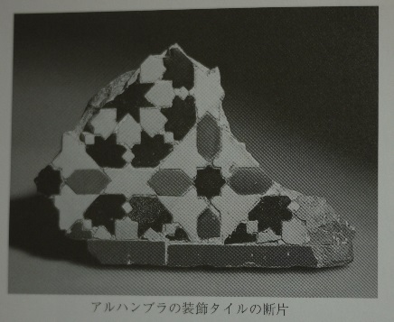
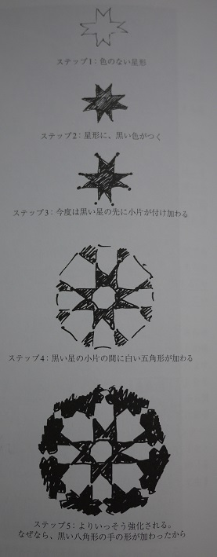
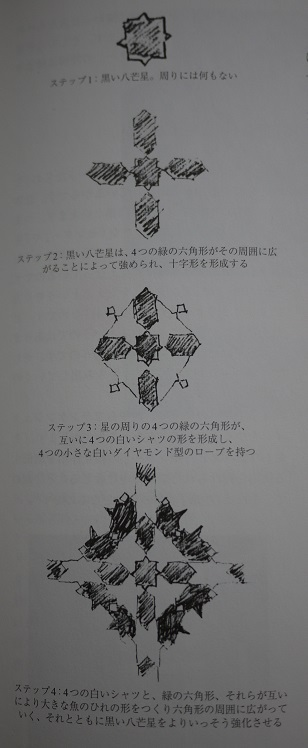
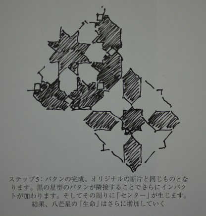

### ザ・ネイチャーオブオーダー
## 建築の美学と世界の本質 生命の現象

## THE NATURE OF ORDER
## An Essay on the Art of Building and The Nature of the Universe

- 著者
    - クリストファー・アレグザンダー Chistopher Alexander
    
- 監訳
    - 中埜 博
    
- 裏表示
    - アレグザンダーの積年のテーマである「生き生きとしたパターン」からさらに展開し「生命（Life)」や「全体性（Wholenness）」「センター（Center)」がキーワードとなり、環境の心地よさや美学、保存への実践が論じられている。
    
--- 

- いまだ芸術が求める「秩序」の法則は存在していない
    - エントロピーは理想気体の中で振る舞う分子秩序を解き合したが、「負のエントロピー」に関する秩序の処理の仕方が単術過ぎて、芸術家が求めるものとは異なるものだった
    - 結晶学や軍隊組織を発展させていっても満足いく秩序には会えなかった。

- 機械論としての秩序
    - ものごとがメカニズムとして機能する方法として語られ、生み出されるもの

    - この世界で心を揺さぶられるのは、「調和」と「秩序」の一面
        - 木の葉や伊勢神宮、モーツァルトの交響曲など
    
    - 秩序に関する機械論的思考法の起源は1640年ごろのデカルトにさかのぼる
        - 彼の考えでは、モノゴトの動きは機械のように考えると理解できると考えていた
            - ボールの回転やリンゴの落下など、興味の対象とそれ以外の対象を完全に切り離して感が増す。
            - そして機械的モデル、いうなれば知的玩具を開発し、それが法則に従えば、その事象を再現するという考え。
        
        - しかし、このプロセスというのは手法でしかない。
            - 私たちはしばしばそのことを見落としている
            - 対象を分離し、部分に分解し、モノゴトの動きについての機械的イメージ（またはモデル）をつくるということは、現実がどのようであるかということではありません。
            - それは理解を助けるための具現化できる、あるいは便利な思考実験にすぎません。
            
    - 20世紀の機械的視点
        - 「私」というものが私たちの世界観から外にでてしまったこと
            - 何をつくるにしても、それは「私」ら生じるというのに、どうやって「私」を含まないものが作れるというのか？
            
    - 真偽はどのように説明できるのか？
        - この問いかけが機械論的世界観とアレグザンダーの世界観とを分ける問題となる
        - アレグザンダーの世界観の中では、真偽を説明できるものは2つ目の指標考えられます。
            - それは「生命」「調和」「安全性」の総体的尺度、簡単に言うと価値の指標です。
                - 調和的、生命を生み出す・・・これらは機械論的視点では真偽の本質を示せない

- 生命の強弱
    - 現在流行の建築は、建築に「生命」を見ることを拒否しています。
        - その不快感は、自分の建築はよくないと判定されることを感じ取っているからかもしれません。
        
        
- 簡単な事例における「全体性」
    - 全体性
        - 第一、そこに存在する様々な一体化をめざす実体のすべてによって規定される構造体
        - 第二、これらの実体が互いに入れ子状態になり重なりあっている状態
        
- 全体性とセンターの理論
    - 全体性は部分でできており「『部分』は『全体性』からつくりだされる」
        - この一見矛盾する理論こそが、「全体性」の本質を根本的に表現していると言える
        
    - いかなる実体も、より大きな「全体」の中に生じる局所的な「センター」として現れる
    - センター
        - それ自体が持つ組織構成と、その内的一貫性と、文脈と一致した関連性を持ちつつ局所的ゾーンとして「センター性」という性質を表出している集まりのこと
        
- 繊細な構造としての「全体性」
    - いかなる「センター」の強さも、その「センター」を作り出しているはずの内的形状によってできるものではなく、その空間が外部に向けて発信する別の要素によって決まるのです。
    - そして、その強さは必ず「全体」としての形体の結果となります。
    - そこで「センター」の力強さは、一連の数学的な形体の特徴によって定義づけられます。
        - 対称性、結合性、凸状性、均質性、境界性、形体的急激な変化等、これらはすべて「全体」としての形体に直接作用します。
    - 与えられた「全体性」を構成する「センター」は、単独では存在せず、「全体」としての形体から作り出された要素として現れるのです。
        - これを大きいスケールの形の特徴で見ると、局所的に「センター」によって生み出され、かつその存在によって「安定」するのです。
        
    - 「全体性」は「全体」内に導き出される極めて繊細な構造である。
        - それは「部分」から簡単に予測できるものではない。
        - 「部分同士の間の」関係性から考えても意味がない
    - 「全体性」は自律的で全域にわたる構造でありながら、細部の形体によって導かれています。
    - この繊細な構造の本質を完全につかむためには「センター」が「部分」から作られてモノであるとみなす思想を避ける必要があります。
        - すべてものは「部分」からなると主張する人々のこと
        - 「全体」の前に「部分」が存在していると考えている人々
        
- 「全体性」と「センター」の理論
    - 全体性とは
        - 全体性は単に形体に注目したものではなく、実体を伴った具体的構造である
            - それは、この世に実在する構造であり、それは、私たちが形体として、全体像として、広域にわたる物事の本質として、直感的に感知できるものを含みます。
            - それは、この世界のあらゆる部分に実存する一貫性の源なのです。
        - この世のいかなる全体性も大きな「センター」と小さな「センター」が互いに結びついてたり重なり合ったりするシステムとなっているのです。
        - 「センター」には特別な名前はありません。全体の形体配置によって導かれるものです。
            - コンテキストに依存する        
    
        - 「全体性」の視点から見た場合に認識できる「センター」は、視覚的に支配的であるというだけではありません。
        - それらは、事物の真の振る舞い、どこで育まれる「生命」、そこで生じる実際の人々の営み、そしてそこに住む人々が感じる空気も支配していくのです。
        
        - 庭や家をごく普通に観察したのでは、それらの中に隠された深遠な「中心」の存在を想定することはできません。
            - ちょうど紙の上に描かれた点の場合と同じです。
            - それらはちょっと眺めただけでは眼には入らないほど繊細なものです。
            - しかし、これらの「センター」とその構造こそが、物事に「生命」を吹き込んでいる

        - 従来の生物学にもとづく生命もまた、この「全体性」からつくられていると考えられる。
        - 全体性が持つ重要な特徴は、際立った主張は存在しないという事ですｌ
            - それはただ単に存在するのです。
        - この世の一部分に生じた相当量の「生命」や美しさや良さは、ある種の主張や偏見、哲学などに左右されることはなく、
        - 単にそこに生じた「全体性」の結果として、見出されるのではかいかと私は考えるのです。
        
        - 人間の顔におけるこの捉えどころのない個性とは何でしょうか
            - 実は、この個性こそが「全体性」なのです。
            - それは顔における、あらゆる雰囲気のままであり、あらゆる質的構造であり、
            - あらゆる場の効果なのです。
            - 部位の特徴を正確に描いたとしても、仮名ずしも肖像画になるわけではない
                - 人物を描こうとするならば「全体性」を描かねばなりません。
        - 肖像画でも建築同様、内包されている「全体性」こそが真実であり、そのものすべてを決定しているのです。
                
        - 人間社会においては、与えられたスペースの全体性は常に文化的環境を包含しています。
        
        - 特別なセンターのシステムは、この世で私たちが経験する文化の多様性をも支配し定義します。
        
        - 現実世界に実体の区別が現れるのは、異なる空間の部分がそれぞれ異なる度合いの一貫性を持っているからです。
        - 最も古い時代にこのことを明確に認識したのは荘子でした。
            - 彼は肉の塊りの秩序がそれぞれの部位で繊維の密度が異なることに依拠していることを知り、この世を構成する事物のすべてが
            - 相対的に見て一貫性のあるひと塊りに切り離されることを正確に示していることを理解したのです。
                - 肉を力任せにたたき切るような肉屋の包丁の刃はすぐに綻びてしまいます。
                - しかし、心得ある肉屋は、包丁の刃を肉の柔らかい所に沿った部位にあて、肉の組織に沿って肉が裂けていくように切っていきます。
                - その刃は100年たっても綻びることはありません。
                
        - 実体を顕著な特徴の正確な「秩序」の中で見るものであり、誤ったものの中であってはなりません。
            
- 「生命」は「全体性」からどうやって生まれてくるのか
    - 1.「センター」はそれ自身が「生命」を持つ
    - 2.「センター」はお互いを補い合う。「センター」がひとつ存在すると、その「生命」は他のもう一方の「生命」を強化する
    - 3.「センター」は「センター」から作られる（これが「センター」の構造を述べる唯一つの方法です）
    - 4.「構造」は、その中で形成される「センター」の強度と、その密度によって、「生命」を持つようになる
    - これらの４つの点は、それ自身いたって単純ですが、私たちに「生命構造」の秘密を明らかにし、「全体性」から生まれる「生命」についての秘密を明らかにしてくれます。
    
    - センターとは何をさすのか
        - この問題は「秩序」の問題を解くカギであり、「生命構造」に関する問題を解くカギでもあります。
        - 問題の核心は「センター」は他の「センター」によってのみ定義することができる、ある種の実体なのです。
        - センターという考え方は「センター」以外のいかなる単純な実体によっても定義されえないのです。
        
    - 私たちが見ようとしている「センター」は他の「センター」からしかできていない
    - 「センター」の本質は、それゆえ再起的、循環的にしか理解できないものなのです。
        - これが機械論的な考えに染まった人にとって、「全体性」がとても神秘的に見える所以となる

    - 「センター」はいつも他の「センター」から生まれる
    
    - 局所的な対称性、差異、まとまりの存在、そして出っ張り、それらが「場」の効果を相互に作用しあって「センター」の存在を示している
        - 多くの事例が示しているように「センター」の鍵は対称性にあります。
        - 出っ張り、まとまり、大まかな対称性、周辺との相違など、これらの実在するものから派生する「場」によって「センター」たちを定義し得る
        - いくつかの「センター」はこれらの法則に従っています。
        - しかしこれらの法則は大雑把なまとめにすぎません。
        - いくつかの「センター」や「サブ・センター」では、絨毯の装飾に表現されているように、ふちの絵柄と中央の絵柄は相互関係を描いています。
            - いくつかは不完全な対称性です。
        - 個々でみていくと異なるのに、大雑把な見当で「センター」が一貫して実在するという概念を持ち得るのです。

    - それぞれの「センター」が他の「センター」でつくられる階層につながる「場」であるという概念で理論家することで、「センター」の生命に強弱があるという考え方に立ち返ることができる
    
    - すべての「センター」は区別できる「生命」の強さの差異をもっている
    - 世界のありとあらゆる「生命」がそれに含まれる「センター」の構造によって成り立っている
    - つまり「センター」は「生命」を与えられ、翻って、同時に他の「センター」から構成されるということを示している
    - 相互に影響を与え合うという事は、それぞれの「センター」が他の「センター」を強化する力をもち、「センター」の「生命」は隣接する「センター」の「生命」の相対的な強さと位置関係の結果として生まれるという事実の中で分かります。
        - 1.「センター」は空間的に生成される
        - 2.それぞれの「センター」は他の「センター」の形体配置によって決まる
        - 3.それぞれの「センター」は「生命」や強度を持つ。
            - さしあたって、この「生命」が何であるのかはわからない。
            - しかし、「センター」の「生命」は他の「センター」の「生命」に依存していることはわかる。
            - この「生命」や「強度」は「センター」自身が持つうまれつきのものではないが、「センター」が生じるときに存在する配置関係に由来する要素である。
        - 4.「センター」の「生命」や「強度」は、隣接する「センター」の位置関係や強度によって増大したり減少したりする。
            - 結局、「センター」は、それらがつくる「センター」は、それらが作る「センター」がお互いに補い合うことでもっと強まる。
            - この文脈の中で「補い合う」という意味は性格に定義しなければならない
        - 5.「センター」は、「全体性」の根源的な要素である
            - そして、空間の中で切り取られるあらゆる部分の「生命」の強弱は、そこに存在する「センター」の構造と存在にひたすら依拠している

    - 「生命」は「全体性」と「センター」の仕組みから生じます。
    - うまれた「生命」の強弱は、要素としての「センター」のまとまりが持つ「生命」の強弱と、それらの配列から生じるのです。
            
    - それぞれの「センター」は他の「センター」から生命をもらっている 

 
 
 

 
 
 
 
    - 1つのもととなるような「センター」や「生命」があるわけでなく、様々な異なる「センター」があ互いに緊密に支え合っているのです。
    - 「センター」が「センター」を支えるというやり方によってうまれるものこそ「生命」なのです。
        - どれか一つが最初にうまれるというものではありません。それぞれがお互いに支え合うのです。
        - そしてそれぞれが共に「生命」を生み出していくのです。 
        
    - 「生命センター」を作り出す鍵
        - 劇作家ジョージ・バナード・ショー『思想の達し得る限り』（岩波書店：1931年）
            - この概念を指摘に喚起する内容を含んでいる
            - リリスのセリフ
                - 『私はリリス。私は混沌の中に生命をもたらし、我が敵・物質を精神に従属させた。
                - しかし、生命の敵を従属させるために生命の主を創造したところ、これによってすべての従属が終わりを迎えることになった。
                - 今や奴隷は自由となり、敵とは和解し、世界は生命で満たされ、物質は姿を消すであろう』
                
- 15の幾何学的特徴
    - 1.スケールの段階性
    - 2.力強いセンター
    - 3.境界
    - 4.交互反復
    - 5.正の空間
    - 6.良い形
    - 7.局所的に現れるシンメトリー
    - 8.深い相互結合と両義性
    - 9.対比
    - 10.段階的変容
    - 11.粗っぽさ
    - 12.共鳴
    - 13.空（くう）
    - 14.簡潔さと静謐さ
    - 15.不可分であること
                    
    - 1.スケールの段階性
        - スケールの段階性を持つという特性は単に幅が異なったサイズがあればいいというような機械論ではありません。
        - この特性はそれぞれの「センター」が次の「センター」に確実に「生命」を与えるときにのみ、正しく生まれるのです。
        - APL(A Pattern Language)
            - 「スケールの段階性」は建物の分野の多くの実例にとって必要であり、APLにおいて極めて多くのパタンがこの問題を扱っています。
            - 小さなスペースは、何らかの方法で、大きなスペースの「生命」を支えています。
            - サイズの変化がたくさんあれば、サイズが同じときよりも大きなスペースはさまざまな部屋の「生命」を支えます。
            - 機能的な「センター」の間の「スケールの段階性」は、建物の実用的な活動に影響を及ばし、そして、建物が「生命」を支えることがより可能である状態にします。
            
            - 「半インチの見切り線（#240）」
                - 建築部材は、特に相互の関係において、小さな断片の見切り縁により助けられ、補足されます。
                - 見切り縁は最後の「スケールの段階性」を生み出して、欠点をカバーし、そして仕上げをさらに実用的にします 

            - 「小割りの窓ガラス（#239））
                - 窓は、さららに小さな窓に分割されるとき、最もよく、そして感情にも働きかけるように機能します。
                - 窓ガラスの細分化された部分は、窓の境界を作るのに役立ちます。
                - 窓ガラスの棒部分（桟（組子））にも、力強さが加わり、また壊れたガラスを交換するのを無駄なく簡単にします。

            - 「自立地域（#1）」
            - 「700人のコミュニティ（#12）」
            - 「見分けやすい近隣（#14）」
            - 「段階的な屋外空間(#114)」
                - 「スケールの段階性」のさらに大きな例は同様に重要です。
                - 地域、コミュニティおよび近隣の構造を考察してみてください
                - これらすべては、都市の大きな構造における明確な一定の「スケールの段階性」が人間のコミュニティの維持の助けになることを示しています。
               
            - 「アルコープ（#179）」
            - 「ベッド・アルコープ（#188）」
            - 「天井高の変化（#190）」
                - あるいは、建物の中の部屋のサイズの種類を考えてみてください。
                - APLにおけるいくつかのパタンはこの問題を扱っています
                - 建物の中の必要な様々な種類の活動と、その結果生じる様々なサイズの種類の異なる部屋を扱ったパタンです。
                - 部屋がすべて同じサイズである建物は、どちからというと古臭いです。
                - しかし、大きな部屋が提供する「生命」の可能性の幅が強化されます。
                - ひとつの非常に大きな部屋とふたつの小さな部屋とふたつの小さなアルコープがある小さい家さえも、小さな４つの同じ大きさの部屋のある家よりも非常によく機能するでしょう
    
    - 2.力強いセンター
        - APL
            - APLで論じられた多くのケースは、いかにスペースがさらに有益になるかを示し、
            - それが「力強いセンター」になったとき、されに強く感じます。 
                - 「おも屋（#99）」
            - 例えば、炉火、または、メインの今の中核として同等の何かを供給することは、必要なことです。
                - 「炉火（#181）」
            - すべての他の通路が1点において接している点として家の「センター」をつくることは必要です 
                - 「中心部の共域（#129）」
            - その一つは、ちょうど家の外の南向きのエリアを核としての陽光とみなすべきです。
                - 「南向きの屋外（#105）」「日のあたる場所（#161）」
            - 部屋の中の座る場所を、それ自身囲いがある保護されたそれ自身の端とみなすことは必要です。
                - 「隅のドア（#194）」
            - 「力強いセンター」はまた、街の中に必要な焦点をつくる際に、都市スケールで重要な役割を果たします。
                - 「都市の魔力（#10)」、「小さな広場（#61）」、「小高い場所（#62）」、「ほぼ中央の焦点（#126）」、「木のある場所（#171）」
            - そして「力強いセンター」はまた、プライバシーの保護と建物の中の深い感覚の変化する段階の構築においても、基本的役割を果たします。
            - 公的な入りやすい部屋は、さらに奥の部屋へ徐々に導き、他の者もまた、さらに奥へ導いています。
            - それぞれの「センター」の「場」のような性質は「全体性」としての「段階的変容」から起こります。
                - 「親密度の変化（#127）」
            - 時折、本当に最も奥まった部屋が公的なもので、必ずしも私的ではないこともあります。
            - しかし、それらはもし、このような段階的な変化の末に配置されていたとしたら、美しい静寂を持っていることでしょう。
            
            - 最後に、施行から例をひとつ。
            - 窓を取り付けるとき、私たち最初に「センター」として窓の位置（その大きな枠組み）を定め、その大まかな枠組みの中に完成したサッシを取り付けます。
            - その結果として、そこに配置されている垂直の炉火調節、土台、木枠、そして、炉火の木枠などが、その一角に「センター」を形成すべく一体的に機能することになります。
            - そのようにして、「全体」としての窓は「センター」となるのです。
            - 「力強いセンター」は、粗い開口に正確な四角いサッシを取り付け、それをできる限りきちんと整っている状態にしようとするときの実際的問題から生じています。
                
    - 3.境界
        - APL
            - 近隣には、それらの周辺に力強い「境界」が必要です。
                - 「サブカルチャーの境界（#13）」、「近隣の境界（#225）」
            - 開口部の周辺を強化するためには、窓やドアを厚くすることが必要です。
                - 「厚い縁どりの枠（#225）」
            - 部屋のスケールにおいて、その中の戸棚や押入れを利用して、窓際の座席、アルコープ、または厚い壁に囲まれているようにすると、
            - 多くの部屋は美しく、有益になります。                
                - 「アルコープ（#179）」、「窓のある場所（#180）」、「厚い壁(#197)」、「部屋ざかいのクロゼット（#198）」
            - 建物は戸外のスペースとの関係部分からいちばん快適になります。
            - 野外と屋内の間にギャラリー、アーケードおよびテラスがあるならばとても快適です。
                - 「外廊（#166）」、「アーケード（#119）」、「戸外室(#163)」
            - コミュニティ活動の輪、はコミュニティの「中心」を強めるために、小さな公共サービスセンターをメジャーな公共の建築物の周辺に置きます
                - 「コミュニティ活動の輪(#45)」
            - これらのパタンはどれも「境界」の具体化ですが、異なる機能を持っています。
            - 「アルコープ(#179)」は大きい空間に「厚い」境界を付加することで小さな空間が内部の活動を活性化します。
            - 音を分離するものもあります
            - 戸棚は、部屋の間で音響の「境界」を形成しています。
            - ある場合は、「境界」としての「センター」はそれより大きな世界の「生命」に焦点を合わせることがあります。
            - それは、屋内と屋外の間でアーケードや回廊をつくることであったり、部屋の周辺の窓側の席や厚い壁のような境界層を形成することで実現します。
            
            - どの場合でも言えるのは、分離するゾーンと混合するゾーンを生み出す機能を強化したり、絶縁する一組の空間を手助けするのが「境界」です。
            - キーポイントは「境界」を生み出すために「センター」の機能を正しく選択しなければならないことです。
            - そうすれば、小さな「センター」を促して「境界」を形成し、それによって囲まれる大きな「センター」の機能を強化するようになります。
            
    
    - 4.交互反復
    - 5.正の空間
    - 6.良い形
    - 7.局所的に現れるシンメトリー
    - 8.深い相互結合と両義性
    - 9.対比
    - 10.段階的変容
    - 11.粗っぽさ
    - 12.共鳴
    - 13.空（くう）
    - 14.簡潔さと静謐さ
    - 15.不可分であること
    
