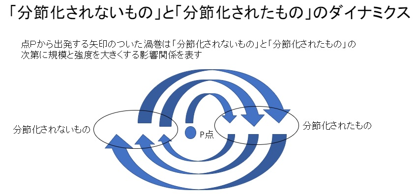

# マイケル・ポランニー「暗黙知」と自由の哲学

- 著者
    - 佐藤 光
---
### 目次
- 序章 現代世界とマイケル・ポランニー
    - 1 はじめに－相対主義を越えて
    - 2 生涯
    - 3 ポランニーはどのようによまれてきたか
    - 4 本書のプラン
- 第１章　自由の哲学
    - 1 ポランニーのリベラリズム
    - 2 2つの「２つの自由概念」－ポランニーとバーリン
    - 3 自生的秩序－市場システム、法システム、科学システム
    - 4 「多中心性問題」
    - 5 市場システムと自由
    - 6 「道徳的反転」
- 第２章 経済学
    - 1 貨幣サークルと雇用量の決定
    - 2 「中立性の原則」
    - 3 ソ連、ナチス、戦時経済体制などをどう見るか
    - 4 ポランニーの「ハーヴェイ・ロードの前提」
    - 5 完全雇用が可能とする自由貿易
- 第３章 知識論
    - 1 『個人的知識』の目的と構成
    - 2 批判的哲学の批判
    - 3 「文節化されたもの」と「文節化されてないもの」のダイナミクス
    - 4 知的情熱と共同体
    - 5 信仰と懐疑
    - 6 「生きて在るもの」を「知る」ということ
- 第４章 「宗教の受容」への道－科学、芸術、そして宗教
    - 1 さまざまな意味－－「指示」「象徴」「隠喩」
    - 2 芸術の力
    - 3 「観察すること」と「受容すること」
    - 4 福田恆存（つねあり）「人間・この劇的なるもの」への寄り道
    - 5 宗教的欲望の本質－－ポランニー、福田、エリアーデを結ぶもの
- 第５章 暗黙のリベラリズムの可能性
    - 1 リベラルなケインズ主義者の社会経済学
    - 2 個人的で時無くて気で暗黙の知識の役割
    - 3 「道徳的反転」「宗教的反転」そして宗教の回復
- 補論「自由」をめぐるカールとマイケル・ポランニー
- あとがき
---
## 序章 現代世界とマイケル・ポランニー
### 1 はじめに－相対主義を越えて
### 2 生涯
### 3 ポランニーはどのようによまれてきたか
### 4 本書のプラン
- 第3章ではポランニー哲学の核心ともいうべき認識論と知識論を、おもに「個人的知識」をテキストとして検討する
- そこに展開された「脱批判的」な、あるいは人格的で主体的な知識論の核心が「暗黙の要素」の導入というより、むしろ、その驚くほどに深い宗教性あるいは宗教的関心にあることを指摘したい。
- 逆にいえば、この宗教的次元に関する周到な理解を欠いた暗黙知講義は、少なくとも、ポランニー知識論に関する議論にとしては、殆ど無意味で荒唐無稽な「おしゃべり」に堕としかねないことを強調する。
- この点は、ポランニーの根本的な問題意識が価値相対主義やニヒリズムの超克（ちょうこく）にあったという、すでに述べてきた論点にも密接に関連する。
- 普遍的真理や絶対的価値と宗教の間に必然的関連はないが、あるいは、それらを語るために宗教を持ち出す必要は必ずしもないが、ポランニーの場合には、相対主義やニヒリズムの超克と、宗教、特に、ユダヤ＝キリスト教的伝統のなんらかの形での継承は不可分の関係にあった。

## 第１章　自由の哲学
### 1 ポランニーのリベラリズム
### 2 2つの「２つの自由概念」－ポランニーとバーリン
### 3 自生的秩序－市場システム、法システム、科学システム
### 4 「多中心性問題」
### 5 市場システムと自由
### 6 「道徳的反転」
## 第２章 経済学
### 1 貨幣サークルと雇用量の決定
### 2 「中立性の原則」
### 3 ソ連、ナチス、戦時経済体制などをどう見るか
### 4 ポランニーの「ハーヴェイ・ロードの前提」
### 5 完全雇用が可能とする自由貿易

## 第３章 知識論
### 1 『個人的知識』の目的と構成
- 「科学的無関心」という誤った理想
    - 現代科学思想に支配的な「科学的無関心」や「客観主義」や「没人格主義（impersonalism）」を排して、より熱く主体的かつ人格的で、しかもなお主観的（subjective）でない普遍的知識のあり方を模索し、現代の誤った世界観の超克を目指す事－これが、ポランニー知識論あるいは哲学の究極的な目的であり、その方向性を一般的に確認することは容易だが、厳密な内容と合意を確認し検討するのは決して容易なことではない。
    - 至難の業といっても過言ではない。
    - 本章では「個人的知識」を基本的なテキストとしてこの作業を行なうが、同書の構成と概要を明らかにしておこう。
        - 「個人的知識」は以下の4部から構成されている
            - 第１部 知ることの術
            - 第２部 暗黙の要素
            - 第３部 個人的知識の正当化
            - 第４部 知ることと在ること
        - 内容をキーワードによる特徴
            - 第１部は（既存の批判哲学の）「批判」
            - 第２部は（個人的知識論の）「例解」
            - 第３部は（個人知識の）「理論」
            - 第４部は（個人的知識論に基づく宇宙観・世界観・人間観の）「展開」
            - しかし、ポランニーの議論はそうした特徴づけに必ずしも収まるものではない。

### 2 批判的哲学の批判
- 客観主義批判
    - ポランニーによれば、天動説に代わって登場したコペルニクスの地動説の意義に関しては、人間が宇宙の中心にあるといった人間中心主義な臆断を打ち破り、人間自身も含めた宇宙や世界を「客観的」に観察しうるようになった点が協調されることが多いが、果たして、人間が人間を離れて虚心坦懐に宇宙を観察し理論をつくりうるかといえば、それはきわめて疑問である。
    - もし本当に宇宙のあらゆる部分を平等に観察するという意味で、宇宙を「虚心坦懐」に観察するとすれば、星間のチリを観察するなどの作業を生涯にわたってしなければならないことになるが、もちろん、科学者はこんなことをやっていない。
    - コペルニクスもそのようなことはやらなかった。
    - コペルニクスが地動説にたどり着いたのは、人間的視点を取り去ったからではなく、地球から見た天体のパノラマより太陽から見たそれのほうに大きな「知的満足」を感ずるという、それ自体が一つの人間的視点にたっての事である。
    
    - 数学的確率論は無限回試行というフィクションによって検証しようとするが、有限に生きる人間では無限回数サイコロを振ることはあり得ない。
    - そのため、確率的命題に関しては、現存する人間による直接的な検証や反証が厳密な意味では不可能なことになる。
    - サイコロの１の目がでるのは1/6だが、10回、20回、100回など有限回で、近似的に1/6の比率と大差ない頻度を示すことが確認されれば、その確率的命題を「もっともらしい」と見なし、さもなければ「もっともらしくない」と見なす、すなわち、ある種の主観的評価を下して納得するというのが事実である。
    - 確率事象に対する判断には、人間というより個人（person）が主観的に判断せざるをえない側面が少なからず含まれている。
    - さらに何が確立事象、すなわちランダムに決定される事象が、なにが法則によって決定される秩序（order）なのかというのも、客観的に与えられているわけではない。
        - 路に転がった石が何らかの文字列を示していたら人はそれを偶然ではなく、秩序をもって誰かの意図した作業の結果と考える。
        - しかし、何の文字も読み取れない石の配置の場合は、ランダムにただ石が散乱しているのだと考える。
        - 何を秩序とし、何を偶然とするかは、自然の側から客観的に与えられるのではなく、人間の主観的判断や、その背後にある人間の文化などによって決定されるという事である。

- 不可欠な「こちら側」からの働きかけ
    - ポランニーは結晶学で本格的に論じている
        - 「結晶学の体系は、もろもろの個体を、その理想を満たすものと満たすようには思われないのとに分類する。
        - 各々の結晶は、ある規則性の理想を表しており、それからのあらゆる乖離は不完全さの証明と見なされる」
    - 結晶体の「理想」の基本原理が「対称性（symmetry）」であり、結晶学では、この「対称性」がほぼ「秩序」と同様な意味を持つものと見なされる
        - 規則的なものほど、幾何学的に整っているモノほど良いとする結晶学の思想の正当性を、客観的に根拠づけるのが不可能なことは明らかであろう。
        - 正三角形がぐちゃぐちゃの物体より秩序あるものと見なされるのは、石の散乱の秩序と見なす事と同様である
    - 「経験の理解にとって巨大な価値を持ちながら、反証可能性（falsifability）の概念がまったく適用不可能な知識の体系が示されている
        - この理論によって記述されない事実は当該理論にとってなんの困難ももたらさない。
        - というのは、理論はそれらの事実を重要でないものとみなすからだ。
        - そのような理論は、みずからに適切な事実のみを確認し、理解不可能な事実は無視する包括的な慣用句として機能する」

    - 経済学者が経済現象を新聞で分析する際、毎日すべての記事に目を通すことなど事実上不可能であることは分かるだろう。
        - 仮に目を通すことが出来たとしても、何か意味のある一貫したメッセージを読み取ることが出来ないことも容易にわかる。
        - そもそも「新聞を読む」「記事を切り抜く」「データを保存する」などという行為自体が、何らかの「理論」「哲学」「視点」を前提している。
        - それら「理論」「哲学」「視点」「秩序」はどこから来ると言えば、資料そのものではなく、教師や研究仲間や学会などの「包括的な慣用句」あるいは「パラダイム」からである。
            - 「包括的な慣用句」を身につけ、自家薬籠中のものとして、実際の実証・理論的研究宇で使いこなすには、徹底的な修練が不可欠である。
            - 「こちら側」からの主体的で能動的な働きかけが必要なのである。

- 「住み込み」と「コミットメント」
    - 科学者が科学的知識を獲得するのは、万人に与えられたマニュアルに従ってではなく、彼あるいは彼女の個人的な技能の実践を通してである。
        - より具体的には、教室、研究室、実験室などでの理論や実験手法の学習と実践を通してだが、その過程は、たとえば水泳の習得の過程などとよく似ている。
        - 一般的にいえば「ある技能の目的は、個人がそれとは知らずに一組のルールを尊守することによって達成される、という周知の事実」によく似ている。
    - たとえば、泳者が身体を浮かせるために必要不可欠なのは、息を吐くときは肺のなかのすべての空気を吐くのでなく少し残し、吸い込む時は通常以上に肺を膨らませる事だが、そうした事実を泳者が自覚していることは一般にない。
    - ものを見るときにも、一定のやり方で眼球とその周辺の筋肉を動かすことが必要だが、それを自覚して目の前のものを見ている人はいない。
    - 自転車に乗る人、ピアノを弾く人、大工仕事をする人など、これらの技能者の行為は、本人も「それとは知らずに一定のルールを厳守することによって達成される」のだが、では、彼らが意識的に反省して「一組のルール」を取り出しマニュアル化できるかというと、それも不可能である。
        
    - 「明示的に取り出された－－技芸のルールは有用でありうるが、技芸の実践を決定することはない。
        - それらは格言にすぎないのであって、技芸への案内として役立つとしても、それはそれらが技芸の実際的知識に統合される場合に限られる。
        - 技芸のルールが実際的知識に取って代わることは不可能である」
        
    - 自動車運転の教習書を読んだだけで運転できる人はいない。
        - 運転できるようになるには、多少なりとも路上を実際に走ってみることが不可欠である。
        - また、ほぼ例外なく、熟練者が同乗した上での現場でのアドバイスも、運転技能の習得には不可欠である。
        - すなわち
        - 「詳細に特定化できない技芸は、指令書で伝達することが不可能である。
            - というのも、この種の技芸にはそもそも指令書が存在しえないからであり、その知識は師匠から弟子への例示としてのみ伝えられることが出来るのである」
            
    - 技能や技芸の習得の多くは、ただ師匠と弟子などの具体的な人間関係を通した伝統（tradition）の継承としてのみ可能だとポランニーは言うのだが、これは科学的知識に関しても当然当てはまる。
        - 実験技術など、文字通りの「職人芸」を要する知識についてはいうまでもなく、数学の技法についても、その習得の具体的プロセスを思いだしてみれば明らかなように、教師や仲間の指導や叱咤激励が必要である。
            
    - 我々があるものを知ったり見たり行う時の意識を反省してみると、当面の行為の対象となっている物事に対する意識と、その背後にあってそれを支える物事に対する意識との、大別して２つの種類の意識があることに気が付く。
        - ハンマーで釘を打ち込むとき、我々は、ハンマーにもくぎ煮も注意を向けるが、主要な意識はもちろん打ち込むべき釘とハンマーの先に向けられている。
            - しかしそれと同時に、ハンマーを握る自分の手のひらと指の感覚にも、これとは別のやり方で敏感である。
            - ハンマーの握り具合や打ち込んでいる時の響き具合が「しっくり」していて、ハンマーが自分の身体の一部のように感じられ、最後には、ハンマーを握っているという意識がなくなるほど「しっくり」している場合が最適であり、、逆に、握り具合が終始気になって、そればかりが意識されるようになれば釘打ちの作業は不可能となる。

    - ポランニーは、釘打ち作業が上手くいっている時の前者の意識、つまり打ち下ろされるハンマーの先と打ち込まれる針に向けられた意識を「焦点的意識（focal awareness）」、「しっかり」ハンマーを握っている手のひらと指の感覚を「従属的意識（subsidiary awareness）」と呼ぶ。
        - もっとも、作業がうまくいっている限り、これら２つの意識が分離されて意識されることはなく、後者は、いわば前者の中に「溶け込んでいる（merging into）」。
        - 先に述べた「それとは知らない一組のルール」すなわちハンマーを握り打ち下ろすときの筋肉や神経の働きに関するルールが、行為の背後で、作業者によって概ね無意識のうちに「厳守」され、作業を可能としているわけである。
        
    - 大工仕事の場合も数学の問題の解答の場合も重要なのは、ハンマーや因数分解の公式が、自分の身体や頭脳の一部と思われるほど、それらに「溶け込んでいる」ことである。
        - 「我々は、我々自身をそれらのなかに注ぎ、それらを我々自身の存在の諸部分として同化する。我々はそれらの中に住み込むことによって、それらを実存的に受容する」ことが必要なのである。

    - 我々は、ハンマーや数学的公式という道具の中に「住み込み」、それらを自己の実存の一部とすることによって始めて存分に活躍できるのだが、その過程は、道具を心から信頼し、言わばそれらに「一蓮托生」する過程でもある。
        - この場合の「道具」に、数学の記号や芸術的なシンボルなど、ありとあらゆる知的活動のメディアが含まれている
            - 「道具と同じように、記号やシンボルは、なにごとかを達成したり表示するためにそれらを信頼する個人の目に対してのみ、そのような（何事かを達成したり表示することが可能な－）ものとして現れる。
                - この信頼とは、我々が、あるものを焦点的注意の中心に従属的に統合するあらゆる知的行為のなかに含まれる個人的コミットメント（personal commitment）なのである」
        - 「コミットメント」とは主体的で個人的な行為なのだが、批判哲学者たちや客観主義的知識論者たちは、知識獲得におけるこうした要素を無視しているのである。

### 3 「文節化されたもの」と「文節化されてないもの」のダイナミクス
- さまざまな事例
    - 人間活動における「文節化されたもの」と「文節化されないもの」とのダイナミックな関係
        - 「思考の形式的諸道具の獲得によって可能となった精神的諸力の巨大な増大は、もろもろの事実と一種の奇妙な対照をなしている。
            - というのは、それらの事実は、本質的に文節化されない技芸を行使するためには、知ろうとしている個人が知るという行為に全面的に参加しなければならないということを示しているからである。
            - 形式化された知性のこの矛盾した２つの側面は、文節化がつねに不完全なものに留まると仮定することによって和解させることが出来るかもしれない。
            - すなわち、我々の文節化された言葉は我々がかって幼児期にチンパンジーと共有していたような無言の知的行為を完全に凌駕してしまうのではなく、成人後も依然としてそれに依存しなければならないのだ。
            - しかし、当然のことながら、私が以前に概観した科学者の知るという技芸は、子供や動物のそれより高度の水準にあり、形式化された学科としての科学の知識と関連させてのみ獲得されることが可能である。
            - 他の高度の知的技能も同様に継続的な正式の教育の過程でのみ獲得される
            - 実際、われわれの無限の諸能力は、まさに我々の文節化された諸力の実行のなかで成長しつづけるのである」
            
    - ポランニーはすべての「文節化されたもの」たとえば科学的知識の有効性が「文節化されないもの」に基づいているという意味で、人間活動における「文節化されない」ものの根本的な重要性を認めた上で、「文節化されたもの」と「文節化されないもの」とのダイナミックな相乗的関係の意義を強調している。
         
            
        - 経験を記憶し語るという行為を考えてみよう
        - こうした人間行為も「分節化されないもの」「暗黙の要素」の関与なしに実行されることは決してないが、人間の記憶が動物より圧倒的に広範囲かつ長期にわたる、たとえば有史前の経験まである程度は語りうるという事実は、文字や印刷その他の「分節化された」ものの助けを抜きにしては考えられない
        
        - ひらめき
            - 「ひらめき」は無から生まれたものではなく、多くの予備知識や、それ以前の、あるいは問題を解き始めた前日の夜からの無数の作図の結果でもあるに違いないが、それらの作業自体が「ひらめき」を生み出したわけではない。
            - 「ひらめき」はある種の「直観（intuition）」によって生み出されとしか言いようのないところがあるが、ともかく、「ひらめき」によって問題が解けたときの快感には曰く言い難いものがある。
            - この「快感」はどこから来るのか。解けたことによる功利的理由を越えたものが含まれている。
            
- 「啓示」としての発見       
    - 数学に難問に取り込んだ際
        - 「自分の核心を直観から計算へ、また計算から直観へと行きつ戻りつさせながら、この２つのもののいずれからも決して逸らさないという、数学者の発見に向けての方策は、分節化が人間の推理能力を規律づけ拡張づける、あらゆる範囲の諸操作の縮図を表している。
            - この（直観と計算の－－）交代は非対称的である。というのは、形式的ステップは我々の暗黙の確証によってのみ有効だからである。
            - その上、記号による形式化は、それ自体が、それに先行する我々の非形式的諸力を体現したもの、すなわち、我々の分節化されない自我によって、外部的な案内として依拠するために技能的に考案された道具にほかならない」
    
    - ポランニーにとっての「独創」とは、無からの創造ではない。
        - それは文字通りの「発見」なのであり、未知ではあったが、すでに潜在的には存在していた「実在」の一側面の「啓示（revelation）」なのである。                 

### 4 知的情熱と共同体
- 科学における情動的要素
    - ポランニーは「科学的価値」を定義して、
        - 「確実性あるいは正確さ（certainty or  accuracy）」
        - 「体系的有意義性あるいは深遠さ（systematic relevancy or profundity）」
        - 「内在的興味（intrinsic interest）」
        - の３つが結合したものとしているが、これらのなかでも特に3番目「内在的興味」すなわち出された結果が「面白い」かどうかは、最後は評価する者の主観－感情も重要な一部である主観－によらざるをえないと言ってよい。
    
    - 既に得られた結果の科学的価値を評価し、いずれの結果が科学的により価値あるものかを決定する「知的情熱」、ポランニーの言葉で言えば「選別的情熱（selective passion）」に関することだが、まだ得られない結果を求め発見する場合に科学者を示す情熱、すなわち「発見的情熱（heuristic passion）」は、文字通り「情熱的」なのである。
    
- 自由社会を支える「共同性」
    - 「個人文化」とは、個人の思考を自由に発展させることを保証する文化的環境であり、大小さまざまな学会に典型的に見られるような、入会も退会も自由な自発的結社がつくりだす文化である。
    - 個人文化の最大の意義は、個々人、個々の科学者の自由な研究を支持し可能とすることだが、その支柱は逆説的なこと、個人を超越した「文化的理想（cultural ideal）」の存在に対する各人の確信である。
    
### 5 信仰と懐疑
- 「意味の意味」の探求
    - 重要なのは、言語にせよ、科学にせよ、技術にせよ、人間の「分節化されたもの」の平面における高度な知的活動が矛盾なく有効に展開されるためには、「分節化されない」ものへの個人的信頼とコミットメントが不可欠だという点である。
    - こうした個人的信頼やコミットメントのうち、差し当たって、もっとも重要なのは、そうした活動を行っている自分自身に対する信頼であろう。
    - 話し、読み取り、判断し、研究するなどの活動をするにあたって何より大切なのは、そうしている自分の知覚や判断能力や分析能力などを、明確な証拠も確固とした根拠もなしに「なんとなく」信頼していることである。
    - もちろん、自分の能力なるものはたかが知れており、その能力の使用に当たっては、この卑小な自分という特定の存在にまつわる、もろもろの制約－解釈学の言葉を借りれば（複数形の）「地平」－が、我々自身に明確に知られることなしに、あらかじめ課せられている。
    - 「私」の認識や行為を可能とするものは、小さく歪んでいるのだが、その「歪み」を信頼することなしには何事も無しえない。
    - 逆に言えば、その「歪み」のいちいちを気にした挙句、何かを認識し判断し行動する自分自身を疑うところまで行きついてしまえば、何かを為す、為さぬを越えて、もう「自己の崩壊」と言うべきだろう。
    
- 信仰のプログラム
    - 聖アウグスティヌスにまで立ち返って、認識力の平衡を回復しなければならない。
    - 紀元４世紀に、聖アウグスティヌスは、史上初めて脱批判哲学を創始することによって、ギリシア哲学を終焉された。
    - 彼の教えによれば、あらゆる知識は恩寵の賜物であり、我々は、信じなければ知ることは出来ないという古来の信念の下に努力しなければならないのである

    - 真理、特に科学的真理という「分節化されたもの」を、信念という「分節化されないもの」の「外部に突き出た極」とするのは言い得て妙な表現であり、ポランニーの個人的知識論に親しい者には容易に理解されうることであろう。
        - 宇宙には意味があると信ずるからこそ、全力を尽くして科学的真理の探究に邁進するのである。

- 「天職」へのコミットメント
    - 科学者の仕事を、個人の地平に囚われつつも、普遍的真理は存在するという信念に導かれてコミットする「天職（calling）」と見なすポランニーの特異な思想が現れている。
    - 普遍的真理は、科学者や人間の卑小な知恵や努力などとは無関係に存在する。
    - が、それを知り、それに至る道には、科学者個人の努力をおいてない。
    - 科学者が全力を尽くして、みずからの信ずる道にコミットすれば、安全にリスクなく真理に到達できるわけでは残念ながらなく、信念のゆえに、熱意とコミットメントのゆえに誤診に至る可能性は少なくないが、信念をもってコミットするほかはない。
        - というより、科学者は、普遍的真理によって、その危険と苦労に満ちた認識の冒険旅行に出かけるように「呼びかけ（call）」られるのだ。
        - その呼びかけには「応え（respond）」なければならない。
            - それが科学者の義務であり、責任なのである。
    - ポランニーによれば「個人的なもの（the personal）」と「主観的なもの（the subject）」を、その類似した外観にもかかわらず明確に区別するのは、科学者が内面深く感ずるこの「責任感」と「呼びかけ」の有無である。
        - なにか「私」の奥底に感じられる普遍的「呼びかけ」、その普遍的真理の「呼びかけ」に応えなければならないという、現表しがたい「責任感」－－これらが「個人的なもの」を定義する。
        - だから天職としての科学の内部では「個人的なものと普遍的なもの（the universal）がたがいに他を必要とする」のである。
    - ポランニーは「個人的なもの」を科学的研究の核に据える自説に対する批判主義者や客観主義者の可能な批判を意識しながら、次のように書いている
        - 「もし、我々が仕事するときに用いる概念的枠組みが局所的文化からの借り物であり、我々の動機が社会的特権を維持しようとする諸力と交じり合っているとしたら、我々は、どのようにして、普遍的意図を持った責任ある判断に到達する、などという主張を行う事ができるだろうか。
        - 批判哲学の観点からは、この事実は、われわれのすべての確信を単なる特定の場所と利害の産物に縮約してしまうことを意味することになるだろう。
        - しかし、私はこの結論を受け入れない。
        - 私は、自覚的な知的コミットメントの正当性を信ずるから、個人存在にまつわる、これら諸々の偶然的事柄を、個人的責任を果たすための具体的な機会として受け入れる。
        - この受容こそが、私の言う天職の意味なのである」
            - このあまりにも古風で宗教的な「職業としての科学」観を、現代の科学者が受け入れるのは難しいだろう。
            - 「科学的無邪気さ」に懸念を表明している、が、それを嘲笑し拒絶する前に、こうした科学観を失った科学界がどのような知的退廃に陥るかについて、思いをめぐらせるほうがよいかもしれない。
            
### 6 「生きて在るもの」を「知る」ということ
- 「目的」への思い
    - 『個人的知識』の最終部「知ることと在ること」のテーマは、人間という特異な、特異きわまる生物が存在することの「第一原因と究極目的」を知ることである。
    - こうした企ては、言うまでもなく宗教的な問いに導かれたものだが、ポランニーは、科学者として、哲学者として、その問いにみずからの知識論を基礎として一歩一歩近づいていく。
        - 「私は以下の核心的議論を、さまざまに言い換えたり敷衍（ふえん）[意味のわかりにくい所を、やさしく言い替えたり詳しく述べたりして説明すること。]したりしながら、使用する。
            - すなわち、ある生命個体に関する我々の理解は、その個体の諸部分に関する従属的意識を含んでいるが、それらの全体像をより客観的な言葉で特定することは不可能である。
            - このような理解の仕方は生命個体それ自体の特殊な包括的達成、すなわち「統合的」達成という事実を承認する。
            - この統合的機能についての我々の知識は「分子的」言葉によって特定することができないから、その機能自体も分子的諸部分に還元することができない」
    - ポランニーが語ろうとしているのは、非生命と違って、生命を理解するためには、ある種の目的概念の存在を前提とした「包括的達成」あるいは「統合的達成」という概念を用いることが不可欠だということである。
        - この「統合的達成」が、生命個体を構成する「分子的諸部分」に還元されることはけっしてない。
        - 後者を従属的意識としながら、生命の意味に焦点的意識を振り向ける個人的意識によってのみ可能となるのだ。

    - ポランニーによれば、非生命と生命を区別するもっとも重要な点は「目的」の有無である。
        - たとえば、そこに転がっている石ころ自体に目的というものはない。
        - 人間によって建材その他の道具として使われれば別だが、石そのものには目的はない
        - しかるに、生命には目的がある。
        - 正確には、あるとしなければ生命を理解できない。
        - より具体的には、生命個体の、ある器官の存在や行動の意味を理解することができないのである。
        
        - モノの機械論的な説明では不可能であり、目的論的説明だけが可能なのである。
            - たとえばフカのヒレ、ウロコ、目玉、口などいわば「パーツ」は、フカの泳ぎ、捕食行動、生命維持、生殖などにとって、不可欠の土台を為している。
            - しかし、個体維持など目的そのものを説明することは決し得てできない。
            - 目的、より高次の目的が指定され、その目的を実現する手段とされて初めて、「パーツ」の存在理由や意味が理解されるのである。

- 「個人的要因」
    - 生命あるいは生命個体に関する目的論的議論はポランニーの独創とは言えない。
    - ポランニーの独創は、この伝統的な目的論に、生命研究者や生物学者の対象への「参加」「コミットメント」「住み込み」という「個人的要因」を、不可欠の要因として差し込むことである。
        - 「成功するシステムの意味を、その諸部分を従属的に意識しながら全体として理解することによってのみ、知ることが出来る。
                - 我々は、全体への関連抜きに、これらの諸部分を有意味に研究することはできない。
                - より高いレベルでの成功を目指すのならば、研究対象への参加は、それだけより一層深まらざるえない。」
        
        - 「成功するシステム」とは、たとえば「泳ぐ」という目的の実現に成功したフカであり、「従属的に意識」される「諸部分」が、ヒレ、エラ、ウロコなどであることは言うまでもない。
        
        - フカの「成功」レベルをあげて「生き生きと泳ぐ」としたらどうなるのだろう。
            - 同じ「泳ぐ」にしても「生き生きはつらつと泳ぐ」と「死に体で腐った魚のように泳ぐ」とでは、印象ばかりでなく、個体維持という、とりあえずフカの究極目的にとっても大きな違いがある。
            - この違いを、科学は認知し理解しなければならない。
            - しかし、機械論は、どのようにして、この違いを厳密に区別し理解するのか。
                - フカの感情を客観的解析を可能だとしても、どこまで客観的、没個人的に「フカの感情」を記述し、「生き生き」などど振る舞いの意味を理解するという問題はどうなるのか。
                - フカの振る舞いを「擬人主義的な」方法で理解するのがいけないのであろうか
                    - しかし、対象を理解するのは、人間以外にない。
                    - 生命の理解にとって、目的概念はもちろん、生命個体の形態の「正常」「異常」、生命個体の挙動の「健康」「不健康」などという基礎的状態についての判断基準を研究者が持っていることが不可欠だが、それらの基準の意味は、人間による研究である限り、人間世界のカテゴリーを持ち込む他ない。
                    
- 「対話」の始まり
    - 観察・分析・理解の対象が人間になれば「観察・分析・理解の主体」と「観察・分析・理解の対象」という近代科学の認識論上の二分法が崩れ、「理解すると同時に理解される者」「話しかけると同時に話掛けられる者」同士の「対応」が始まるということだ。
    
- 対象を「愛する」ということ
    - 「対話が持続しうるのは、参加者の双方が、図分自身の主張を判断するに際して、全体として同一の教えと伝統を受け入れる、一つの共同体に属している場合に限られる。
        - 責任ある出会いは、上位の知識という共通の天蓋の存在を前提とする」
    - 各人の対話あるいは出会いが成り立つ、噛み合い、各人の知識が広がり高まっていくためには、共通言語や共通規範など、その多くは共同体の伝統によって与えられる「上位の知識という共通の天蓋」を受け入れることが前提となるという、この文章の書きぶりには、最終的には、おそらく「神：の復権を目指すポランニーのコミットメントがすでに鮮明に表れている。
    - 誤解を恐れずに、ポランニーの議論のエッセンスをあえて要約すれば、物質にせよ、生命にせよ、対象の本質をきちんと認識し理解するためには、まず対象を「愛すること」が必要だということである               
             
    - ポランニーは、共同体の伝統によって支えられた「上位の知識という共通の天蓋」への帰依の必要性を説く
        - ある学説や生き方にコミットする場合には、まず先達によって確かめられ鍛え上げられた伝統を習得し、自家薬籠中[自分の手のうちにある]のものとしなければならない。
        - そこには、分節化もマニュアル化もされえない、先人の知恵がいっぱいに蓄えられているのだ。
                        
        

## 第４章 「宗教の受容」への道－科学、芸術、そして宗教
### 1 さまざまな意味－－「指示」「象徴」「隠喩」
### 2 芸術の力
### 3 「観察すること」と「受容すること」
### 4 福田恆存（つねあり）「人間・この劇的なるもの」への寄り道
### 5 宗教的欲望の本質－－ポランニー、福田、エリアーデを結ぶもの
## 第５章 暗黙のリベラリズムの可能性
### 1 リベラルなケインズ主義者の社会経済学
### 2 個人的で時無くて気で暗黙の知識の役割
### 3 「道徳的反転」「宗教的反転」そして宗教の回復

