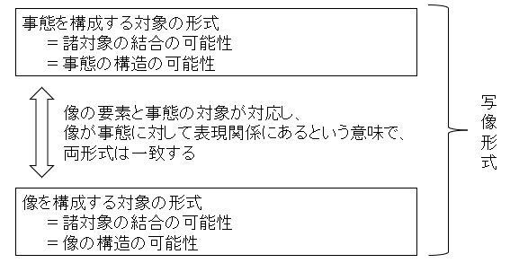

- 書籍
    - ウィトゲンシュタイン論理哲学論考
        - 角川選書
        - 古田徹也
        - 2019

---- 

- 用語の対称表

|原語|本書での訳語|各訳書・解説書での訳語|
|---|:---:|---:|
|Fall|成立している事柄|事実、おこっていること|
|Tatsache,Fall|事実|事実|
|Ding,Sache|物|もの|
|Sacheverhalt|事態|事態|
|logischer Raum|論理空間|論理的空間|
|Wirklicheit|現実|実在|
|Bild|像|映像、絵|
|Abbildung|写像|描写|
|Logische Form|論理形式|論理的形式|
|Gedanke|思考|思考内容、思想、思念|
|Satz|命題|文|
|Projektion|射影|投影、投射|
|Satzzeichen|命題記号|文ー記号|
|einfache Zeichen|単純記号|単一記号|
|Name|名|名前、名辞|
|Urzeichen|原記号|原始記号、原初記号|
|Bedeutung|指示対象|意味、イミ|
|Sinn|意味|意義、意味内容|
|Erlauterung|解明|注釈、解説|
|Ausdruk|表現|コトバ|
|logische Ort|論理的場|論理的領域、論理的場所|
|Elementaratz|要素命題|要素命題|
|Tautologie|トートロジー|同語反復命題|
|sinnloss|意味を欠く|無意味、意義を欠く|
|unsinnig|無意味|ナンセンス、無意義|

- 語彙

|単語|意味合い|
|---|---|
|事実|成立している事柄|
|事態（状態）|成立可能な（または、実際に成立している）事柄|
|物（対象）|事態の構成要素|
|世界|事実の総体|
|論理空間|事態の総体|

- 論理哲学論考は哲学の諸問題を一挙に葬り去るためにあった
    - 魂は不滅か、神は存在するか、因果律はなどは、ウィトゲンシュタインによれば、言語使用の混乱から生じたものにほかならない。
        - まったく無意味な問いと答えの応酬といえる。
        - これらは言語の限界を超えている
    - 言語の限界を明らかにすることで哲学の問題を一挙に解決しようとした
    
- われわれに「語りうること」と「語りえないこと」の区別をつけることができるのか
    - 「〇〇については語りえない」という発言が何事かについて語っているとすれば、それについて語っているということになるし、
    - 逆に何事も語っていないとすれば、そのような発言自体が意味を為さないことになる
    - 私たちには「これについては語りうる/語りえない」の判断を下すことは不可能
        - 言語と思考の分業が不可能なので、言語の外で考えることはできない
            - 私たちは語りえないことがあるということを語りうる
            
- 論理哲学論考でウィトゲンシュタインが提示しようとするのは、
    - 真偽の値をもちうる言葉である「命題」を現実（実際の世界の在り方）を写し取る模型として捉える視座であり、言語を命題の総体として特徴づける見方である。
        - 言語と世界を写像という関係で把握することが当面の目標

- 1. 世界は、成立している事柄の総体である
- 1.1 世界は事実の総体であり、物の総体ではない
       
    - 世界は、成立している事柄、事実の総体（事実すべての集まり）であり、物の総体ではない
        - 物が集まっただけでは世界にならない
        - ただ物が集まっただけでは、それらの物がどうなっているのか、物と物がどういう関係にあるのかといったことが全く分からない
        
        - 世界が事実の総体であるというポイントは下記のように表現できる
            - 「リンゴ」という物自体は真にも偽にもなりえない。
                「リンゴ」が真である、偽であるということは全く意味をなさない
            - 真偽が言えるのは「リンゴが赤い」とか「テーブルの上にある」といったことなのである。
                - そうしたことがなりたっているとき真と言える
        - 事実の総体とは成立している事柄のすべてである。
            - したがってどのような事柄が成立していないかも同時に定めるものである
                - 自分がいままでどの都道府県に行ったかは、行っていないもはっきりさせる
                
        - 論理空間
            - 想定しうるだけの可能性がいっぱい集まった空間
            - 論理的には可能なことはすべて含まれる空間                

- 2.事実と事態、事態と物（対象）
    - 物（対象）は事態から文節化される
        - 我々が世界のうちで出会うのは、物ではなく、まずもって事実である。
            - 例えば我々は、車という物に最初に出会うのではなく（ある時、ある場所に）車があることに出会う。
            - そして、車が走っていたり、駐車したり、誰かを乗せたり、事故を起こしたりしていることにまず出会う
            - 成立しているのであれ、成立していないのであれ、様々な事態の中に共通して現れる要素として、
            - はじめて我々は「車」という物をそれとして見出すのである。

        -  どこそこに存在することなしに、何かが存在することはあり得ない。
            - 赤いことなしに、赤い何かが存在することもありえない。
            - 何かが赤いことなしに、ただ「赤い」ということもありえない。
            - それはまさに意味不明でしかない。
                - つまり、「存在する」とか「赤い」というのがそもそも意味を成すのは、「車が存在する」とか「車が赤い」といった事態のなかに限られるのである。

        - 物をどれだけかき集めても、あるいは「存在する」であれ何であれ、事態ではないものをどれだけかき集めても、事態にはならない。
            - 言うなれば「はじめに事態ありき」なのであり、その他のものは、いずれも事態から文節化される（特定の仕方で切り分けられる）のである
            
    - 物が事態のなかに現れる可能性は、論理空間の中ではすべて予定されている
        - ある対称の形式
            - ＝ある対称が諸事態のなかに現れる可能性
                - ＝ある対象が諸事態のなかで他の諸対象と結合する仕方の総体
        - 全対象の形式の総体
            - ＝論理空間
                - ＝あらゆる可能な事態の総体
                
        - T2.0124
            - 「すべての対象が与えられたならば、それとともに、すべての可能な事態も与えられる
                - すべての対象の形式を合わせたならば、それは論理空間と一致するのである
                 
- 不変のものとしての対象、移ろうものとしての対象の配列
    - T2.022
        - どれほど実際と異なる世界を想像したところで、その世界もまた、何か、ある形式を実際の世界と共有しなければならない。これは明らかだ。
    - T2.0231
        - 世界のあり方は、諸対象の配列によってはじめて構成される。
    - T2.0232
        - 言うなれば、対象は無色である
    - T2.0272
        - 対象の配列によって、事態が構成される
        
    - 対象の形式はあらかじめ確定しているが、実際の世界のあり方は確定していない
        - ある対称が様々な事態の中に現れる可能性、事態の構造の可能性は、その対象のうちですべて予定されている
            - 例えば、リンゴが銀河系の外側に運ばれる可能性すら論理空間には含まれている
            - しかし、リンゴが輸血をうけるなどは論理空間には含まれていない
                - すなわち、リンゴの形式には含まれていない
            - このように、それぞれの対象が論理空間において、どのような事態の中に現れうるかは、あらかじめ確定している

        - 対象それ自体は不変のもの、存在し続けるものである
            - 変化し、移ろい、事態になったり虚構になったりするのは、対象の配列の仕方なのである
            - ただし、これは当然、事態の構成以前に対象がそれとして独立に存在するということではない。
                - 対象は事態から文節化される
                - リンゴは「どこそこにリンゴがある」とか「リンゴは赤い」等と表現される事態の中ではじめて、一個の対象たりうる
                    - すなわち、ある時間にある空間において何ものかとして存在し、あるかたちや色ともちうる。
                    - 対象はいうなれば無色である
                        - 対象は事態ありきだという論点を別の仕方で表しているといえるのである。
- 現実と事実
    - T2.04
        - 成立している事態の総体が世界である
    - T2.05
        - 成立している事態の総体はまた、どの事態が成立していないかも定める
        
    - 世界とは事実の総体であり、事実の総体とは事柄（＝事態、状況）のうちで成立しているものすべてのことである。
        - それゆえ、事実の総体は、成立していない事柄のすべても同時に定めることになる。
    - 成立している事態の総体が世界である
    - 成立している事態の総体はまた、どの事態が成立していないかも定める
    - 重要なのは、現実という概念を「事態の成立・不成立」、すなわち、事態が成立していることや成立していないこととして規定している
        - 事実とは成立している事態の実を表す概念だが、他方、現実というのは、成立している事態と成立していない事態の双方を現しうる概念だということだ
            - 「机の上にクッキーがある」これは現実であり、「机の上にはミカンはない」これも現実である
                - つまり「机の上にミカンがある」という事態が成立しているないということも、いまある現実のひとつである。              

    - 現実の総体と事実の総体の一致
        - 事実の総体は、実質的に、現実の総体、すなわち、成立している事態と成立していない事態の総体と一致する
            - その意味で、事実の総体が、世界であるのならば「現実の総体が世界である」とも言える。
        - 事実の総体と、現実の総体、両者に違いがあるとすれば、それはいわば、世界に対する照明の当て方の違い、焦点の合わせ方の違いといえる。
            - 事実の総体という場合には、そのとき実際にどのような事態が成立していないかという点も暗に前提にされているとはいえ、その点は背景に退いている
            - つまり、そのとき実際にどのような事態が成立しているかということに焦点を合わせている概念と言える

    - 現実の総体（＝事実の総体）と論理空間の違い   
        - 現実の総体（＝世界）
            - ＝「成立していない事態の総体」＋「成立している事態の総体」
                - 成立している事態と成立していない事態とを分かつ境界性が、論理空間のなかに実際に書き入れられているもの
            
        - 事実の総体（＝世界）
            - ＝「成立していない事態の総体」＋「成立している事態の総体」

        -　現実の総体と事実の総体の違い
            - 世界に対する照明の当て方の違い、焦点の合わせ方の違いといえる
                - 現実の総体
                    - そのとき実際にどのような事態が成立しているかということと、どのような事態が成立していなかったかということに、
                    - 等しく焦点を合わせている。
                - 事実の総体
                    - そのとき実際にどのような事態が成立していなかという点も暗に前提にされているとはいえ、その点は背景に退いている
                    - つまり、そのとき実際にどのような事態が成立しているかということに焦点を合わせている概念 
            
        - 論理空間＝事態の総体
            - 成立している事態と成立していない事態の総体ではない
            - すなわち、事態の内どれが実際に成立しているか（または、成立していないか）というのは、論理空間それ自体のうちでは何ら定まっていない
            - 実際の世界のあり方（＝事態の実際の成立・不成立）はあらかじめ確定などしていないのである
            
- 像と写像形式
    - 2.12
        - 像は、現実に対する模型である
        
    - 我々は、像＝現実の模型を用いて、事態を表現する
        - 「像」とはいったいなになのか。
            - ウィトゲンシュタインは、それを理解するためには、成立していない事態、つまり、「虚構」はいかにして、それとして輪郭づけられるのかということを考える必要がある

        - 論理空間のなかで、ある対称の配列の仕方が事実となったり、虚構となったりする。
            - では、ある対称の配列の仕方が虚構であるとはどういうときか。
                - たとえば、「机の上にペンがある」という事態が虚構であるためには、この配列の仕方自体が実際に生じてはいけない。
            - 実際の対象（物）を配列してしまっては、虚構の事態をそれとして輪郭づけることはできない。
                - それゆえ、我々は対称の代理となるものを使って像をこしらえるのだ。
                    - ここで言われる「像」とは、文字通りの「現実の模型」
                    - 私たちは、例えば鉄道模型や駅や機器などの模型を組み立て、特定の仕方で配列することによって、実在しない事態を描きだすことがある。
                    - つまり、我々は、現実の模型である像をこしらえることによって、
                    - はじめて成立していない事態や成立している事態を、つまり「現実」を、それとして輪郭づけることができる。
                    
    - 命題という、最も強力な像
        - 私たちは、鉄道模型やレゴブロックなどとは比較にならないほど強力な像（＝現実の模型）を、日々の生活のなかで情用している
        - 「命題」とは、我々の言語表現のうち、「机のうえにペンがある」「街を襲っている」といった事態、真または偽でありうることを、表現する記号の配列の仕方のことである。
        - ウィトゲンシュタイが「像」という場合には基本的に念願においているのは、我々が日常言語において語りうる命題のことだと理解して構わない。
            - ただ、彼にとって命題というものが、特定の仕方で配列されたジオラマやレゴブロックといった現実の模型と、本質的には変わらないものであるという点も、同時に留意しておいてほしい。

    - 像は一つの事実である
        - 像がまさに模型という一個の対象（あるいは対象の集合）として捉えるのと同時に、諸対象（諸々の鉄道模型、レゴブロック、音声、文字、等々）が
        - 特定空間内で、特定の仕方で配置され、関係し合っていることそれ自体である、という点も重要である。という点も重要である。
        - つまり像とは、対象である以前に、諸対象の結合の仕方なのであり、その意味で「像はひとつの事実」（T2.141）なのである
        
        - 対象がまずあって、その後にそれらが結合して事実（および虚構）が構成されるのではない。
        - 対象は事実ありきで、事実から文節化される。
        - それゆえ、像という事実を構成する諸要素も、像ありきで、像から文節化されるのである。
        
    - 「写像」という表現関係＝「像が現実を写し取る」という関係
        - 命題という像、ジオラマ模型という像、像には様々な種類があるが、いずれにせよそれらは、自身とは異なる何かを表現している
        - そして、これが肝心なのだが、ウィトゲンシュタイがそのように「像」と呼ぶものは、繰り返すように、現実の模型を表す概念だということである。
        
        - 我々が日常で「模型」と呼ぶものは、必ずしも現実の模型とは限らない
        - 例えば、新幹線の鉄道模型それ自体は、新幹線という物の模型ではあるが、現実の模型ではない。
        - 言い換えれば、新幹線という物を表現しているが、新幹線が特定の駅に停車している事態や、特定の街並みにを走っている事態などを表現はしていない。
        
        - 他方、命題をはじめとする像は、必然的に、特定の事態を表現する模型である。
        - この、像と事態の表現関係を表すために、ウィトゲンシュタイは特に、写像という用語や、像が現実写し取るといった言い方を導入している。
        - すなわち、「像とは、論理空間における状況（＝事態）を、すなわち、諸事態の成立・不成立（＝現実）を表現するもの（T２．１１）」であるが、
        - 彼はこの表現関係を「像が現実を、正しく、あるいは誤って、写し取る（T2.17）」という言い方で表すのである。
        - たとえば、「私の机の上にハリネズミがいる」という命題（あるいは、私のミニチュアの前に置かれた机のミニチュアの上に、ハリネズミのミニチュアが置かれたジオラマ模型、等）は、
        - いま私の机の上にはハリネズミはいないという現実を誤って写し取っている。
        - そして、そのようにして、私の机の上にハリネズミがいるという「成立していない事態を表現している（描き出している）」ということである。
        
    - 像とそれが写し取る現実は、写像形式を共有している
        - 像は現実を写し取る模型である。
        - そして、「像において、像の要素が対象に対応する」（T2.13）
        - すなわち、像を構成する諸要素は、現実（その像が写し取る事態）を構成する諸対象に対応する。
        
        - では、像の要素（像という事実を構成する対象）が、事態を構成する対象に対応する、とは具体的にはどういうことだろうか。
            - 精巧につくられたアヒルの模型なら、アヒルという本物の対象に対応しているとすぐにわかるだろう。
            - しかし、これは今問題にしている「対応」という事柄にとって全く本質的なこどではない。
            - なぜなら、像の要素はそうした写実的な物だけでなく、レゴブロックのパーツや漢字、片仮名、アルファベットなど、実に多様なものでありうるからだ。
            - たとえば、「アヒル」「duck」という要素は、本物のアヒルとは似ても似つかない。
            - これらの要素が、アヒルに対応しているというのは、どういう事として説明できるのだろうか。
                - この要素は、この像以外の無数の像のなかに現れるすべての可能性を含んでいる。
                - この可能性は、本物のアヒルという対象が論理空間内の他の様々な事態の中に現れるすべての可能性、すなわち事態の構造の可能性と一致している
                - これこそが、像の要素が事態の要素に対応しているということの内実なのである。
        
        - 「事態の構造の可能性」ということをウィトゲンシュタイは「形式」と呼んでいる。
            - 像の要素「新幹線」は、本物と新幹線という対象と同じ形式を備えていることになるし、
            - さらに、すべての要素の形式を合わせたもの（つまり、我々がこしらえうる像の可能性すべて）は、
            - 全ての対象の形式を合わせたもの（世界がいかにありうるかの可能性すべて、つまり論理空間）に一致することになる。
            - これこそが、およそ像が像として事態を表現していることの内実にほかならない。
            
            - それゆえに、ウィトゲンシュタイは、像の要素と事態の要素（＝対象）との間で一致する形式を、
            - 特に「像の写像形式（T2.15）という名称で呼ぶのである。
 
            
    - 論理形式と論理像ー「論考」の議論の次元
        - ある種類の現実（たとえば、「新幹線」や「東京駅」といった語が一定の仕方で結合しているという現実）が、
        - 他の種類の現実（たとえば、本物の新幹線がいま東京駅に停車しているという現実）を写し取る像となりうるためには、
        - 一般に、像と写像される現実が、何らかの意味で同じものである現実との間で、何かが一致している必要がある。
        - そして、その同一性ないし一致の内実、像をまさに像たらしめているもの、を今見たようにウィトゲンシュタイは「写像形式」と呼ぶ。
            - 彼は「写像形式が論理形式であれば、その像は論理像と呼ばれる（T2.181）」と続けている
        - 写像形式はそれ自体、多様な種類の写像形式の集まりとして捉えることができる。
        - たとえば、あるコンサートの演奏を音符に起こした楽譜のように、音にまつわる現実を写し取っているが、
        - コンサートの場所や演奏家たちの空間的な配置、演奏時間等は写し取らない像というものがある。
        - 同様に、色にまつわる現実のみを写し取る像や、時間と空間にまつわる現実のみを写し取る像等々、様々な写像形式の像がありうる。
        
        - ウィトゲンシュタイが「論理形式」と呼ぶとき、多様な写像形式全体を指している。
        - 論理形式とは、音符を配列した像と現実が共有する構造の可能性でもありうるし、また、色見本や色彩語を配列した像と現実が共有する構造の可能性でもありうる。
        - あるいはまた、ジオラマ模型や命題などが現実と共有する構造の可能性でもありうる。
        - いずれにせよ、像が像である限り、それが写し取る現実と共有していなければならない何かの総称を、かれは「論理形式」と呼んでいる。
        - それはちょうど、どんなに荒唐無稽な事態であれ、論理的に可能な事態の総体を「論理空間」と呼んでいるのと同様である。
        - つまり、ここでの「論理形式」とは、何であれ論理的に可能な写像形式すべてを指す用語なのである。
        
        - 「すべての像は論理像でもある（T2.182）」
            - すべての像が論理的に可能な何らかの種類の写像形式を背景にした、何らかの像、正しく・または誤って現実を写し取る、特殊な模型であるということである。

        - ウィトゲンシュタイは個別の写像形式や像のひとつひとつではなく、論理形式や論理像といった全体を問題にしようとしている。
            - つまり、どんな写像形式にも当てはまる、写像形式一般の本質とは何か、どんな像にも当てはまる像一般の本質とは何か。
                - これが「論考」の関心ごとなのである。
                
        - 写像形式は語り得ず、示される
            - （T2.172）「像は自分自身の写像形式を写し取ることはできない。像は自分の写像形式を示している」
                - 像は、それと写像形式を共有するすべての現実を写し取ることができる。しかし、写像形式それ自体を写し取ることができない。
                    - たとえば、新幹線が東京駅に停車しているとい現実の写像となるジオラマ模型があるとして、
                    - この現実と像の対応関係は次のように表現することもできるだろう。
                    - 新幹線が東京駅に停車している情景と、それに似たジオラマ模型を並べた一枚の絵を描いて、
                    - この対象にはこの要素が対応しているということを、絵の中に点線を引いて表現する。といった具合である。
                    - しかし、この絵はつまり、ある現実とある像が対応しているという現実を写し取る、さらに別の像をこしらえたという事にすぎない。
                    - そうすると今度は、この新たな像と現実の対応関係を表現する別の像が必要になってしまう。
                    - 以下、きりがない。要するに、写像という関係そのものを写し取る像を描くことは、最終的に不可能なのである。
                    
                - 事情は、命題という像であっても変わらない。
                - 「新幹線が東京駅に停車している」という命題が、新幹線が東京駅に停車しているという現実をどのような仕方で写し取っているかという事を、
                - 私たちはきめ細かに語ることができるだろう。
                - しかし、そのように語られた命題もまた、ひとつの像にすぎない。
                - つまり、最終的には、像とそれが写しとる現実とが何を共有しているかを語ることは不可能なのである。
                
                - しかし、語り得なくとも、像が像として働いていることは、対応する現実との間で何らかの写像形式が共有されていることを示している。
                - この「語り得ないが、示されている」という図式は「論考」を読み解く重要なカギとなる。
                
                - ある言語と世界内の現実の写像関係が、その言語の特定のメタ言語によって語られるというのは「論考」の関心事ではない。
                - 「論考」の目的は、メタ言語がもはや原理的に存在しえない（＝究極の言語）を想定したうえで、その言語ですら語り得ないことを示すことなのである。
                
- 像とア・プリオリ性
    - (T2.201)「像は、事態の成立・不成立の可能性を描き出すことによって、現実を写し取る」
    - ア・ブリオリとア・ポステリオリ、必然的と偶然的
        - ア・ブリオリ
            - 経験に先立つ
            - 必然的
            - 像の意味
        - ア・ポステリオリ
            - 経験的
            - 偶然的
            - 像の真偽＝像の意味が現実と一致しているかどうか
                
        - 「ア・ブリオリ」「ア・ポステリオリ」は認識論に属する概念であり、「必然的」「偶然的」というのは存在論（形而上学）に属する概念でありカテゴリーが異なる
        - 各性質が当てはまる事態の外延が一致しているということである
        
- 思考と像、像と論理空間
    - 思考とは、像をこしえらえることである
        - ウィトゲンシュタイは、論理像をこしらえることこそが思考だと規定している。

    - 非論理的な命題は語り得ないがゆえに、非論理的なことは思考しえない
        - （T3.02）「思考は、思考される状況が可能であることを含んでいる。思考しうることは可能なことでもある」
            - 論理的に可能であるということは思考できるが、逆に論理的に不可能なことは、思考できないということである。
            
            - 論理的に不可能なこと（非論理的なこど）とは何だろう
            - 「マグネットの次は織田信長である」、または「の次マグネットはである織田信長」
            - 完全なランダムな文字列ともなれば、我々にはお手上げである。
            - こうした何の法則性もない文字列は、そもそも如何なる事態も描き出していない。
            - つまり、これらの文字列は像でも何でもない。
            - 我々はどうやっても、意味を成さない像、論理的に破綻して像をこしらえることができない。
                - 言い換えれば、我々は非論理的な命題を語ることができない
                
    - 語りうることの可能性（＝思考の可能性）と世界の可能性は一致する
        - なぜ「語りえないこと」ことから「思考しえない」こととなるのか、言語を用いずに考えることも可能ではないのか。
            - カギになるのは、成立していない事態は命題（および他の種類の像）をこしらえることで初めてそれとして輪郭づくられるということである。
            - つまり、成立していない事態が、それを描き出す命題なしに、それだけで論理空間内に含まれている、ということはありえない。
            - その意味で、成立していない事態を我々があれこれ思考できる可能性は、我々があれこれ命題をこしらえることができる可能性と一致する。
            - 逆に言えば、我々は語り得ないことと、我々には思考し得ないことは同じである。
            
        - 我々は、気づいたときにはすでに言語によって考えている
        - すなわち、成立している事態であれ、成立していない事態であれ、我々がおよそ何事かについて考えるときには、用語を用いて命題をこしらえざるを得ない。
        - どうあがいても、言語の外に出て、言語を用いずに考えることはできないのだ。
        - そのように、思考と言語は文字通り切手も切れない離せない関係があるがゆえに、語りうることの限界がそのまま、思考しうることの限界に直結するのである。
        
        - 世界は、我々が命題というかたちで語りうるのと同じあり方をしうる、という事、
        - すなわち、世界が様々なあり方をしうるその可能性は、我々が様々に命題をこしらえることができるその可能性と一致する。ということである。
        - この意味で、我々が原理的に語りうる命題の総体と、事態の総体（＝論理空間）は一致するというのが、ウィトゲンシュタイの立場なのである。
        
- 命題と語
    - （T3.1)「思考は命題において知覚可能なかたちで表現される」
    
    - 命題は対象（物）であり、かつ事実である。
        - 「射影」
            - 命題と世界の関係を表現している
            - たとえば、ガラス板に何らかの図形を描き、それを卓上ライトであてると机には様々に異なる影が射影（投影、投射）されることになる。
            - つまり、ガラス板という平面上の元々の図形と比べて、机の平面上の図形は、射影の仕方によって様々に異なるものに変化する。
            - しかし、ある種の性質に関しては、どんな射影の仕方をしても、元々の図形とその射影との間で変化せず共通している性質。
                - いくつかの点が同一の直線上（または同一の平面上）にある」という性質などである。
                - これを幾何学では射影的性質、あるいは射影的に不変の性質と呼ぶ。

        - ウィトゲンシュタイは、「写像形式」をこの「投射的性質」に例えている。
        - どんな命題記号であっても、それが当該の現実の像である限り、その現実と写像形式を共有している。
        - それはちょうど、ある図形とその無数の射影の間で、射影的性質が共通しているのと同様だというわけである。
        - それゆえ、命題には意味の形式は含まれているが、内容は含まれてないと言われることになる。
        - 命題記号が像である限り、それは写像形式を背景に存立しており、成立可能な何らかの事態を描き出している。
        - 言い換えれば、命題には意味の形式（＝現実を写し取る写像形式）がア・プリオリに含まれている。
        - しかし、内容は含まれていない。
        - すなわち、命題の意味が現実を一致しているか否か、命題が真か偽か、までは含まれていない。
        - それはア・ポステリオリな事柄だからである。
        
    - 命題が語へと文節化される
        - 諸要素が像とは独立にまずあって、その後にそれらが結合して像が構成されるということではない。
        - 諸要素は、像ありきで、像から文節化されるのである。
        - そして、事情は、命題という像も全く同じである。
        - 個々の語をそれだけで、孤立したかたちで捉えることはできない。
        - むしろ、語は命題ありきではじめて捉えうる。
        - まず語があって、それから命題が合成されるのではない。
        - その意味で、むしろ「命題が語へと文節化されるのである」
        
        - ウィトゲンシュタイの論点は、フレーゲの「文脈原理」を継承したものと言える。
        - フレーゲによれば、我々は語はそれ自体として孤立させて考察することはできない。
        - 語は本来、命題という文脈のなかではじめて息づく、ということである。

- 名と要素命題
    - 「名（単純記号、原記号）」とは何か、「完全に分析された命題」とは何か、という難問
        - 思考は像である。そして像にはミニチュア模型で表現されるものやレゴブロックで表現されるもの、あるいは命題記号で表現されるものなど、様々な種類がありうる。
        - その意味で、思考は様々な仕方で表現されうるといえる。
        
        - 名とはどういうものであるか、「論考」という書物を何回にしている原因の多くが、名が具体的に何を指すのかが捉えがたいという点にある。
        
        - 通常、我々は命題の構成要素を「語」と呼んでいる。
        - しかし、そう呼ばれるものは基本的に、定義によって次々分解することができる。
            - 新幹線という語は、JRが運航している旅客用列車など。
        - この命題を分析していく作業は、文字通り果てしないといえる。
        - では、こうした作業の果てに、定義によってそれ以上分解することができない「名」なるものは、いったいどのようにして取り出されるものなのだろうか。
            - 「論考」はこの問いに一切答えていない
                - 名が指示する対象とは何か、完全に分析された命題が描き出す事態とは何か、積極的には何も指示していないのである。
                
    - 「論考」で想定されている言語とは、最大限の表現能力をもつ言語である。
        - 「完全に分析された命題」のことを、ウィトゲンシュタイは「要素命題」と呼んでいる。
        - 「語りうること」というのは、文字通り最大限広くとらえておく必要がある。
            - それでもなお、「語り得ないこと」があるということを主張できなければ「語りうること」と「語り得ないこと」の境界線を引くというという説得力をもつことがない。
        - これ以上なく明晰に語りうるだけのきめ細かさをもつ言語こそが、「論考」で想定されている言語だということである。
        
    - 「名」と「要素命題」は、語りうることの可能性を最大限担保するために要請される
        - 語と命題のきめが細かくなればなるほど、可能性の総体も大きく成りうる。
            - ウィトゲンシュタイは、命題の総体と可能性の総体は一致すると語っている
            
    - どれほど表現能力のある言語でも語り得ないこととは何か、という課題
        - 像の写像形式と、像が示す対称の配列の仕方それ自体である。

|命題の総体|事態の総体|
|:---:|:---:|
|複合命題＝要素命題の結合|（複合的な）事態＝（単純な）事態の結合|
|要素命題＝名の結合|（単純な）事態＝対象の結合|
|名|対象|

- 解明と定義
    - (T3.262)
        - 記号において表現されてないことを、記号の使用が示す。
        - 記号が呑み込んでいるものを、記号の使用が露にする            
    
    - 記号の使用以前に、記号がそれ自体として何らかの機能をもちうるわけではない。
    - つまり、命題の中に現れる以前に、記号がそれ自体として何らかの機能をもちうるわけではない。
    - 我々は、すでに記号の無数の使用法にすでにかなり馴染んでいるから、この記号が様々な事態を「呑み込んでいる」ように感じられるのである。
    
    - 語の解明とは、その語が私用されている命題のことである
    - 「新幹線」という記号それ自体には、あの乗り物を指示するという機能は内臓されていない。
    - 「新幹線は列車だ」や「新幹線はすごく速い」等などの命題の中で使用されることにおいてはじめて、「新幹線」はあの乗り物を指示する記号たりえている。
    - このことをウィトゲンシュタイは、定義と区別して「解明」と呼んでいる。
        - 「新幹線は列車だ」「新幹線はすごく速い」等などの命題には、まさに「新幹線」という語自身が現れている。
        - つまり、これらの命題は「新幹線」という語の使用法の一端を例示しているのであり、それを通じて、この語がどういうものを表しているかを、それぞれ部分的に明らかにしているのである。
        - それゆえ、ウィトゲンシュタインは語の定義と区別して、当の語が使用されている諸命題のことを、その語の解明と呼ぶわけである。
    - このように、命題とはそれを構成する記号の指示対象を明らかにするものとして捉えることができる。
        - （T3.263)
            - 「原記号の指示対象は解明によって明らかにされうる。解明とは、当該の原記号が使用されている命題である」
            - （T3.263）は「探求のパラドックス」に陥っているのか  
                - 記号が何を表しているかは解明（＝命題）によって明らかになるはずなのに、
                - そもそも記号が何を表しているかを知らなければ解明（＝命題）を理解することはできないというのは、矛盾しているのではないだろうか。
                    - 理解補助線にプラトンの対話編「メノン」第14勝がある
                        - 我々が何かを探求するためには、すでにその何かについて知っている必要がある。
                        - しかし、すでに知っているのであれば、それを探求する必要がない。
                        - これが探求のパラドックスである。
                    - 例えば、勇気とは何か。と我々が問うことができるが、そもそも勇気について何も知らなければ、勇気とは何かと問うこと自体が不可能だろう。
                    - なぜならその場合、自分んが何について問うているのかがそもそも不明になってしまうからだ。
                        - それはちょうど、顔も名前も知らない人を探そうとするようなものである
                    - しかし、勇気とは何かを知っているのなら、探求する必要がないではないかというわけである。
                - このパラドックスは普通は当然見せかけのものにすぎない。
                    - 勇気という言葉も、何も知らない訳ではなく、おぼろげにはわかっているが、はっきり言語化できるかたちで理解しているわけではない。
                    - だからこそ、勇気とは何かを改めて問い、きめ細かい明確な理解を得ようと試みるのである。
                    - 命題の中に現れている語が何らかの物体であるいこと、あるいは少なくとも何らかの名詞であることはわかる。
                    - その理解の手掛かりに、この語の様々な使われ方、様々な命題の中にこの語がどう現れるかを、数多く見渡していくことを通じて、この語の輪郭をつかんでいくことができるだろう。
                - このパラドックスを回避できるのは、語が名（原記号、単純記号）ではないからである。
                    - これらの語はまだそれ以上分解する余地があり、まだ完全に分析された命題ではないがゆえにという、時間的経過を含んだ動的なプロセスとして捉えなおすことで、探求のパラドックスを解体することができるのである。
                - 諸命題の分析がすでに完了し、あらゆる命題の意味が確定し、明確に示しうる仕方でその内容を表現している静的な次元、あらゆる可能性の総体である論理空間という無時間的な次元、においては
                - 名はそれが指示する対象と同様、自陣がどのような命題のなかにどう現われるかという可能性をすでに含んでいると言える。
                - 従って、ある名が何を表しているかを特定することは、同時に、その名の使用法をすべて明らかにすることだともいえる。
                - 換言するならば、
                - 「名が何を表しているかは、命題によって明らかになる」といういことと、「名が何を表しているかを知ることは、命題を理解する条件である」ということは、名に関しては、同じ事柄をふたつの側面から述べていることになる。
                - 名が何を表しているかを知っている場合には、必然的にその名が現れるすべての命題の意味を、理解していることにもなるからである。
                    -  （T3.263）は矛盾でも何でもないのである。
                - 末木剛博は下記のように説明している
                    - 初等平面幾何学において、「点」や「線」、「面」という基本概念（語）は、それ自体としては何も表さない。
                    - 「2点を通る直線はただ一個存在する」、「3点を共に含む平面はただ一個だけ存在する」等などの公理（命題）によって、「点」「線」「面」相互の関係が定まり、その関係によって、これらの基本概念が何を表すかが定まるのである。
                    - 「しかも、この場合これら公理は、基本概念を使用しているのであるから、普通の意味での「定義」ではない。これら公理は基本概念を使って見せるのであり、その使い方を示しているのである」
                    
- シンボル（表現）と関数
    - （T3.3)命題だけが意味を持つ。名は、命題という文脈のなかでのみ指示対象をもつ。
    - シンボル（表現）とは、命題とその部分の本質的な側面である。
        - シンボル（表現）という用語を、命題の意味を特徴づける命題の各部分、あるいは命題自身であり、命題の意味にとって本質的な物として導入している。
        - 命題とその部分は、何らかの知覚可能な記号のかたちで、事態を表現する。
        - この、命題にとって本質的な側面を指すために、ウィトゲンシュタインは「シンボル（表現）」という用語をここで導入している。
        - 従って、「記号は、シンボルの感性的に知覚可能な側面である」ということになるのである。
        
        - 要するに、シンボル（表現）とは、命題とその部分にとっての本質的な側面である。
        - 他方、記号（音声、文字）とは、命題とその部分にとっての非本質的ないし偶然的な側面であり、そして、それらの本質的な側面であるシンボルの、ある特定の音や形状として見たり聞いたりできる知覚可能な側面である。

    - 命題は、シンボルを定項とする関数の値として捉えうる
        - 一般的に関数とは、ある変化に伴って別のモノも変化する場合の、前者に対する後者の呼称である。
        - 例えば、「２Ｘ」という記号例をみてみると、「２」という定数（変化しない数）と「Ｘ」という変数（様々に異なりうる数）によって構成され、定数と変数の掛け算を意味している。
        - この場合、Ｘにどんな数が入るかに応じて、２Ｘという記号列全体がどんな数を表すか、どんな値をとるかも変わってくる。
        - このような対応関係にあるとき、２Ｘは変数Ｘの関数の一種と呼ぶことができるのである。
        - 例えば、Ｘに「すごく速い」が入れば、変更Ｘの関数としての「新幹線Ｘ」の値は、「新幹線はすごく速い」という特定の命題となる。
            - 正確にはこの不適切だといえる。
                - シンボルとは本来、要素命題とその部分（＝名）の本質的な側面である
                - 文字通りすべての命題の形式を前提にする名と、名によって構成される要素命題、この両者の本質的な側面こそが本来、シンボルという用語で表されるべきものである。
        - 野矢によれば、ウィトゲンシュタインのいう関数は「それ自体対象となりうるような実質をもたない」ものであり、「ただ入力項たる名と出力項たる命題の対照表にすぎない」
        - つまり、「ウィトゲンシュタインは関数を徹底的にノミナル（＝名ばかり）に捉えるのである」

- 日常言語（自然言語）と人工言語
    - （Ｔ3.321）
        - 記号は、シンボルの感性的に知覚可能な側面である。それゆえ、ふたつの異なるシンボルが、同じ記号（文字記号、音声記号等）を共有することがありうる。
        - その場合、同じ記号であっても、両者は異なる仕方で何ものかを指示する。

    - シンボルの混同が哲学的混乱を誘発する
        - 命題とその部分、正確には、要素命題と名、の本質的な側面を、彼はシンボルと呼んでいる。
        - そして、記号（音声や文字）は、シンボルの感性的に知覚可能な側面として捉えられる。
        - とりわけ日常言語では、こうした多義的、ないし同形意義的な記号の使用が極めて多い。
            - ウィトゲンシュタインは、これこそが哲学の諸問題が生じる大きな原因だと睨んでいる。 
            - 実際に見たり触ったりできる「もの」と、美という「もの」とを時に混同してしまう。
            
    - 混乱の解消法（１）－記号の使用を良く見通す
        - 個々の記号は、様々な命題のなかで使用されることで初めて指示対象をもつ。
        - 逆に言えば「私用されない記号は指示対象をもたない」
        - （Ｔ4.002）「日常言語から言語の論理を直接読み取ることは、人間には不可能である」
                
    - 混乱の解消法（２）－人工言語を開発する
        - ふたつの異なるシンボルに対して同じ記号を使わない新言語を用意する。
            - この解消法にはいくつかの注意点がある
                - ひとつめ
                    - 名および、要素命題の本質的な側面を指す用語だということである。
                    - 名や要素命題とは何かを具体的に例示することはできない。
                    - それゆえ、個々のシンボルにきちんと一対一対応した記号と、それらの記号によって構成される新言語なるものの役割を、普段用いている日常言語ないし、自然言語は果たせないことになる。
                - ふたつめ
                    - 「文法」や「構文論」というのは、特定の日常言語のそれを指すものではない。
                    - なぜなら、例えば日本語の文法のみを忠実に反映した言語というのは、要するに日本語だからだ。
                    - 新言語が反映する文法は、あらゆる日常言語の文法が共有しつつ、同時に、どの特定の日常言語の文法にも帰せられない、ものでなければならない。
                    - そういうものを、論理的文法、まいしは論理的構文論と呼ぶ。
                    
                    - 要するに、論理的でない文法をもつ日常言語など存在しないということとである。
                        - 従って有意味な命題であれば、どの日常言語の間でも、原理的には相互翻訳が可能である。
                        - アマゾン奥地の原住民に「インターネット」は翻訳できないかもしれないが、それは経験的な問題にすぎない。
                                                - 
    - 日常言語（自然言語）が論理的に不完全であるわけではない
        - 概念記法の開発を通じて、日常言語の使用をめぐる混乱を解消するという方法に関しては、もうひとつ重要な注意点が存在する。
        - それは、日常言語に何か欠陥や不完全さが、存在するわけではない、ということである。
        
        - 日常言語に非論理的な部分があるわけではない。
            - たとえ、我々がときに非論理的な言葉を口走ったとしても、それは我々の迂闊さや不完全さを示すものであり、日常言語それ自体の論理的な不完全さを示すものではない。
            - それゆえ、より論理的に何事かを語るために、論理学の人工言語である概念記法が必要であるわけではない。
            - 言い換えれば、そうした人工言語は、日常言語に取って代わるべき、理想言語などはない。
            - そうではなく、記号の多義的な使用などに起因する混乱を除去する際にのみ役立つにすぎない。
            - 日常言語自体には何ら非論理的な部分はないが、その構造は見た目よりも複雑で、見えにくい。
            - 概念記法は、そこをよく見るために有用な、いわば日常言語の補助的な道具なのである。
            
            - (T5.5563）
                - 我々の日常言語のすべての命題は、実際、そのあるがままで、論理的に完全に秩序づけられている。
                
- 個別性の軽視、個別性の可能性の重視
    - （T3.342）
        - 我々の表記法には確かに懇意的な側面がある。
        - しかし、懇意的にではあれ、ひとたびそれが取り決められれば、他の事柄もそれに応じて決まらなければならない。
        - このことは決して懇意的ではない。（これは表記法の本質にかかわる）
        
    - 事態が特定の日常言語の命題で表現されることは、経験的＝偶然的＝懇意的なことである
        - (T3.34)命題には、本質的な側面と偶然的な側面がある
        - (T3.342)我々の表記法には確かに懇意的な側面がある
        
        - 犬が寝ている事態が「犬が寝ている」という日本語や「The dog is asleep」と色々表現されるのが、偶然的ないし懇意的なことだ。
        - さらに、「犬」という記号がまさに、そのような音や形状をしていることに必然性はない。
            - 全く違う音や形状の記号が、我々が犬と呼んでいるものを指す記号であってもよかったはずだ。
        - 各文化の日常言語の個別性は、それが長い時間をかけて生まれ、変化してきた歴史に由来するのであって、その意味で経験的な事柄、あるいは偶然的ないし懇意的な事柄なのである。

    - 事態が何らかの日常言語で具体的に表現されうることは本質的に重要である。
        - 語りうることのア・プリオリな条件、つまり、経験に先立ち、必然性と重なる条件を探るという「論考」の目的からすれば、
            - （T3.3421）個別の特定の表現方法は重要ではない。個別の事例は取るに足らない。
            - ということである。
        - 事態が何らかの日常言語によって様々に具体的な仕方で表現されうるということそれ自体は、根本的に重要である。
        - 言い換えれば、何事かが個別の日常言語で語りうるという可能性それ自体は本質的なことである。
        
        - 有意味な命題であれば、どの日常言語の間でも、原理的に相互に翻訳が可能である。
        - その意味でも、どの特定の日常言語で表現するかということに本質的な重要性はない。
        - しかし、ともあれ、何らかの日常言語において表現されなければ、世界の無数の可能性が具体的に輪郭づけられることもあり得ない。
        - 語りうることの可能性は、我々に思考しうる世界の可能性と一致する、ということである。
        
- 言語の全体論的構造
    - 日常言語の限定された全体論的構造
        - 日常言語の記号の結合の仕方を次々に辿っていけば、そのネットワークはやがて、日本語全体と言っていいような、途方もなく巨大な広がりとなる。
        - 1つの記号がそれとして機能するためには、無数の命題という文脈が必要であり、ひいてはひとつの言語（日本語、英語、等々）という全体が必要だということである。
        - これを一般に全体論と呼ぶ。
        - ただし、全体論を文字通りに受け取ることはできない
            - なぜなら、たとえば日本語の各記号が様々な仕方で結合してきたこれまでの履歴や、これからの結合の可能性をすべて把握していなくとも、
            - 我々は、例えば子供ですら、日本語の様々な命題の意味を理解していると言えるからである。
            - それ故、日本語の理解といった、日常のレベルでの実践的な理解に関しては、言語の全体論的な構造と言っても、文字通りの「全体」からは割引いて考えなければならない。
            - 我々が日本語を理解できるなら、その各記号がどのような命題の中に現れうるかを、かなりの程度は知っているに違いない。
            - しかし、あらかじめすべてを知っているとは言えないのである。
            
    - 「究極の言語」の文字通りの全体論的構造ー命題のネットワークは論理空間全体に及ぶ
        - 論理的に可能な事態すべての集合、ありとあらゆる可能性の全体を、ウィトゲンシュタインは、論理空間と呼んでいる。
        - 「究極の言語」は、その可能性の一切を、最もきめ細かく明晰に語る表現能力をもつ。
        - 「究極の言語」を構成するひとつひとつの命題は、論理空間内に充満している事態を漏れなく表現する。
        - この言語ひとつひとつの命題は、論理空間のなかにある場を指定する。
            - この場のことをウィトゲンシュタイは、論理的場と呼んでいる
        - （T3.42）
            - 命題は論理空間内の一つの場しか指定することはできないが、にもかかわらず、その命題を通して論理空間全体がすでに与えられているのでなければならない
        - 「究極の言語」が全体論的構造を文字通りに体現している点を踏まえるなら、この言語の各々の命題は、論理空間全体をは寧するかたちで存在している
        - それが、「究極の言語」の命題は完全に分析されているという、ことの意味なのである。
        - したがって、ある一つの命題によってひとつの論理的場が指定されるときには、同時に、他のすべての命題によって、他のすべての論理的場が指定されていることになる。
        - ひとつひとつの命題は、全体論的構造によって支えられているがゆえに、（T3.4）「命題は論理空間全体にくまなく手を伸ばしている」と言えるのである。

- 言語批判としての哲学
    - （T4)思考とは、有意味な命題のことである
    - （T4.001）命題の総体が言語である
    - （T4.003）
        - 哲学的な事柄についてこれまで、書かれてきた命題や問いのほとんどは、誤っているのではなく、無意味なのである。
        - したがって、我々はこの種の問いにおよそ答えを与えることは出来ず、ただその無意味さを確認する事しかできない。
        - 哲学者の掲げるたいていの問いや、命題は、我々が自分の言語の論理を理解していないことに基づいている。
            - （それらは、善と美とは概ね同一であるか否か、といった類の問いである）
            
    - 「論考」では言語に関して、現実の像としての側面のみに焦点を当てる
        - （T4）「思考とは有意味な命題のことである」と述べられており、以下これに関するコメントが続くことになる。
        - これは（T3)「事実の論理像が、思考である」ということを、命題という最も強力な像に定位して、述べなおしていると言える    
        
        - 「論考」の目的は、我々が語りうることの限界を引くこと、我々にこしらえうる有意味な命題の限界を引くことである。
            - 事態の猫出以外の言語の機能（挨拶、命令、祈り等々）は、関心の埒外にある。
    
    - 日常言語の目的と、「論考」の人工言語の目的
        - 日常言語では、多義的に記号が使用されるケースや、見掛け上は同じような記号の配列をしている命題でも、実際には異なる事態を表現しているようなケースが多い。
        - それゆえ、見掛け上の形に惑わされて、当該の命題が実際にはどのような事態を描き出しているかを見誤ったり、そもそも意味を成してない記号列を有意味な名地後見誤ってしまうという混乱も生じてくる。
        - 日常言語の諸記号には無数の分解や、分析の余地があり、その構造を見かけ以上に遥かに複雑であって、それゆえ、「日常言語から言語の論理を直接読み取ることは、人間には不可能である」
        
        - 有意義な命題のようでいて、実際には無意味な記号列にすぎない。
        - そうしたいわば命題もどきをあぶりだすためには、日常言語とは別の目的をもつ人工言語が必要になる。
        - すなわち、見掛けとは異なる実際の命題の全体論的な構造、論理形式を見えやすくし、何が有意味な命題で何がそうでないかを明確に判別するのに役立つような、日常言語の補助的な道具となる言語である。

    - 諸問題の本当の論理形式を見通すことによって、哲学の諸問題にけりをつける
        - 「論考」は、「善と美は同一であるか」といった哲学の問題の大半が語りうることの外にあること、哲学の命題や問いのほとんどは、そもそも無意味であること、をア・プリオリなかたちで検証しようとする書物である。
        - この目録が正しいとすれば、哲学の問題に対する答えに真や偽という判定を下すことは、そもそもできないことになる。
        - なぜなら、哲学の問題という最も深遠な問題は（T4.003)「実は全く問題ではなかった」ということになるからである。

        - それゆえ、哲学の問題にけりをつけるために肝心なのは、日常言語を構成する諸命題の見掛け上の論理形式を惑わされずに、本当の論理形式を見通すことである。
        - そしてその作業は、繰り返すように、記号論理学の人工言語である概念記法の開発と運用を通して行われるべきだというのが、「論考」におけるウィトゲンシュタインの基本方針である。
        - 彼はこの作業を「言語批判」と呼んでいる。
        - 「言語批判」こそが哲学であるとも言っている。
        
    - 「論考」における「言語批判」とは何か
        - 「言語批判」というのは、日常言語を何か欠陥のある言語だと批判することではない。
        - そうではなく、見掛けでは見えにくい日常言語の本当の論理形式を、概念記法を用いて、よく見えるようにすること、
        - その意味で、日常言語の構造をよく吟味し、語りうることの限界を見極めることを、「言語批判」と呼ぶのである。
        - 日常言語で語り得ないことは、他のどんな言語でも語り得ないのである。
        
    - 哲学という病の治療としての哲学
        - ウィトゲンシュタインは2通りの仕方で「哲学」という言葉を用いている
            - ひとつめ
                - 実は無意味な擬似問題をこねくりまわしている営みとしての哲学
                - 日常言語の論理の無理解によって人間がときに陥ってしまう思考の混乱であり、その意味では病に似たものと言える。
                - 古来人間が不断に思ってきた、いわば思考の病にほかならない。
            - ふたつめ
                - そのことを暴く営みとしての哲学である 
                - 「言語批判」を通じて、その病の治療を行う営みだといえる。
                - ウィトゲンシュタインは、積極的に、存続すべき哲学と言っている。
                
- 命題の意味の確定性と、命題の無限の産出可能性
    - （T4.02）
        - 命題を理解するとは、それが真であるならば、事実はどのようであるかを知ることである。
        - （したがって、命題が真であるかどうかを知らずとも、人は命題を理解することができる）
        
    - (T.4027）
        - 命題が我々に新しい意味を伝えることができるというのは、命題の本質に属している。
        
    - 現実の像としての本質は、象形文字でも表音文字でも変わらない。
        - 命題の本質は、見聞きすれば“直ちに”現実の像として、把握されるという点にある。

    - 命題は、真か偽であるのに先立って、すでに意味をもっている
        - 楽譜を読めるものからすれば、楽譜は紛れもなく楽曲に対応するものとして直ちに現れている。
        - 同様に、日本語を習得しているならば「犬が寝ている」という命題を見る、聞くなりしたときに、どのような現実を写し取っているかを直ちに把握することができる
        - ウィトゲンシュタインは、この点を像というものの本質的な特徴とみている。
        
        - 我々が命題をそれとして把握するとき、その命題はすでに明確な意味をもっている。
            - その命題が真か偽かというのは、現実と一致するかどうかを確かめないと確定しない。
            - しかし、意味自体は確定している
            - それゆえ、（T4.024）「命題を理解するとは、それが真であるならば事実はどのようであるかを知ること」であり、
            - （T4.02)「命題が真であるかどうかを知らずとも、人は命題を理解することができる」という事ができるのである。
            - 我々が命題を理解しているときには、それは必ず意味を共い、それゆえ、真か偽でありうるような、何らかの事態を表現しているといえる。
            
    - 命題は、既存の表現を並び替えることで、新しい意味を伝えなければならない。
        - はじめて見聞きする命題を前にしても、我々は、何も説明を受けずに直ちにその意味を把握できるということである。
        - （T4.03）「命題は、既存の表現で新しい意味を伝えなければならない」
            - 既存の表現を用いて、その既存の配列を並び替え、新しい組み合わせ方を生み出すことで、我々は日々、世界初の命題を生産し続けている。
        - （T4.031）「命題において、状況はいわば実験的に構成される」
            - 我々は、既存の表現を並べ替える作業を通して、新しい状況を描きだす実験を行う。
            - そのようにして、（T4.027)「命題が我々に新しい意味と伝えることができるというのは、命題の本質に属している」と指摘できる。
            
    - 既存の表現の並べ替えは、何らかの構文論的規則に従ってなされなければならない
        - たとえば「シークレットライブを言った日本の公民館でビートルズが」では有意味な命題にはならない。
            - 従って、配列の仕方は論理的なものでなければならない。
                - （まさにここで、論理という概念が要請される）
            - 別の言い方をすれば、表現同士の結合は何らかの構文論的な規則に従っているのでなけれればならない。
            - だからこそ、我々は世界初の命題を発した時、あるいは見聞きした時、その命題を構成する各部分とその配列の仕方から、その意味を直ちに理解することができるのである。
        - 構文論的な規則というものは、個別の日常言語の次元で捉えるならば、日本語の文法や英語の文法といったものが、それにあたるだろう。
        - 何らかの構文論的規則に従って、論理的なかたちで、既存の表現（究極的には、名）が新しい仕方で配列されるということが、
        - 「我々は世界初の命題を再現なく、生み出すことができるし、その命題を直ちに理解することができる」ということを説明するのである。
        
        - ウィトゲンシュタインが「論考」で問題にしているのは、命題の無限の産出可能性というものの先になる。
            - すなわち、言語のこうした意味での極めて豊饒な可能性を踏まえたうえで、なおその限界がいかに画されるかを探求しているのである。
            
- 「論考」の根本思想
    - 「論理定項」とは何か
        - 名はそれぞれ、何らかの対象（物）を指示する。
        - そして、名同士が結合した全体である命題が事態を表現する。
        - それゆえ、個々の命題が具体的にどのような事態を表現するかは、究極的には名にまで分解される記号がどのような対称を指示するかに応じて決まることになる。
        - その意味でウィトゲンシュタインは、現実の像としての命題の可能性は、記号が対象を表す（対象を指示する）という原理に基づいている。
        
        - 重要なのは、これに続けて彼が、
        - 「私の根本思想は、「論理定理」は何らかの対象を表すものではない、事実の論理を記号が表すことはない、というものである」
        - と語っている点である。
        
    - 論理定項は名ではない、論理は語り得ない
        - 日常言語よりも、論理的な言語があるわけではない。
        - どの言語も等しく論理的である、すなわち、等しく論理に従っている
            - しかし、みずからがシテがっているその性質を言い表すことはできない。
                - 「論考」の草稿執筆期のノートにその説明がある
                    - 「語ることが可能な全てのことを表現しうる、もしくは語りうる言語が存在するとすれば、この言語は或る性質を持たねばならない」
                    - 「そして、このことが実情であるならば、この言語が当の性質を持つことは、もはやこの言語でも、又いかなる言語でも、語ることが出来ない」

        - 日常言語の特定の命題について、その論理的な性質をよりきめ細かに記述したり、あるいは別の特定の人工言語（概念記法）を用いて、特定の記号の配列として、記述していくことは出来る。
            - しかしそれは、ある特定の像と現実の表現関係を表す別の複雑な像をこしらえる事と変わらない。
            - 命題と現実が共有する論理形式そのものを写し取る像を描くことが不可能であるというのは、本書の最初のほうで確認したが、そうした言語の論理的性質そのものを言語で言い表すことはできない。
            - この最終的な地点のいわば象徴として位置づけられるのが、「語ることが可能な全てのことを語りうる言語」すなわち「究極言語」なのである。
            
- 否定と否定される命題の関係
    - （T4.064)
        - いかなる命題も「真か偽であるのに先立って」すでに意味をもっているのでなければならない。
        - 命題を肯定しても、命題に意味を与えたことにはならない。
        - 工程とはまさしく、意味の肯定にほかならないからである。
        - そして、同様のことが否定などについても当てはまる。
        
    - 論理的場を反転させる操作としての否定
        - 否定命題
            - 否定される命題が指定する論理的場にすでに関わっている。
            - すなわち、否定される命題の論理的場の助けを借りて、その論理的場の外側全体を自身の論理的場として指定するのだという。
            - 「椅子の上に本がある」という命題の否定、たとえば、「椅子の上に本があるのではない」は、論理空間のうち「椅子の上に本がある」という命題が指定する場は当然指定しない。
            - しかし、それ以外のあらゆる場を指定する。
            - なぜなら、「椅子の上に本があるのではない」は、「椅子の上にぬいぐるみがある」ことも「机の上に本がある」ことも、すべて可能性として排除しないからである。
            
- 哲学と科学
    - （T4.121)
        - 命題は論理形式を描き出せない。論理形式は命題に反映されているのである。
        - 言語に反映されているものを、我々は描きだせない。
        - 言語において、おのずと表れているものを、我々は言語によって表現することはできない。
        - 命題は現実の論理形式を示す。
        - 命題は論理形式を提示する。
        
    - 哲学とは学説ではなく、活動である
        - ウィトゲンシュタインが（T4.112）の冒頭で「哲学の目標は、思考（＝命題）の論理的な明晰化である」と述べていること、
        - また、同節の末尾で、
            - 「哲学は、そのままではいわば不透明でぼやけている思考（＝命題）を明晰にし、その限界をはっきりさせなければならない」
            - と言語批判としての哲学自身を特徴づけている。
        - 哲学とは何らかの命題を真だと主張する営みではないということも、帰結する。
        - 哲学の果たすべき役割とは、すでにある命題をより名背kにすること、あるいは、有意味な命題に見える記号列が実は無意味な命題もどきであることをはっきりさせることであって、命題自身を立てることではない。
        - すなわち、（T4.112）「哲学の成果とは「哲学的命題」ではない」のである
            - その意味でウィトゲンシュタインは、「哲学とは学説ではなく、活動なのである」とも言い切っている。
            
    - 語りうることすべてを最大限に明晰に語ることで、語りうることの限界を内側から引く
        - 語りうることの限界というものを、我々はどうやって引くことができるのだろうか。
        - 我々がいわば言語の外に出て、語ることとは独立に考え「これについては語りうる／語り得ない」という判断を下す、などということは出来ない。
        - それゆえ、語りうることの限界は内側からしか引けない。
        - つまり、思考可能なこと（＝命題として、こしらえることが可能なこと＝語りうること）を内側から限界づけ、それを通して、「語りうる、語り得ない」という境界線を引かざる得ない。
        - 語りうることを内側から限界づけるとはどういうことなのか。
            - ウィトゲンシュタインは、語りうることすべてを最大限明晰に語ることを通して、それでもなお語りえないことが示される。
            - これが、語りうることを内側から限界づけるということの内実だというのである。
            
    - 語り得ない事とは、論理形式（論理的性質、形式的性質、内的性質）とは何かである。
        - 論理形式とは、命題が現実を描きだすために現実と共有していなければ、ならない写像形式の全体を指す。
        - そして、写像形式とは、命題および、それが映し出す現実の構造の可能性すべてを指すのだから、
        - それは言い換えれば、個々の命題と事態が、論理空間全体に広がる全体論的構造を反映するかたちで存立していることを表している。
        - その意味で、命題と現実の写像形式、正確には、あらゆる種類の写像形式を含む論理形式は、言語全体と世界全体の論理的性質を表しているということである。
        - この論理的性質のことを、彼はときに形式的性質とも、内的性質とも呼ぶわけだが、いずれにせよ肝心なのは、そうした論理形式や論理的性質、形式的性質、内的性質といった類の、原理的に命題に反映されるもの、それ自体は命題で言い表すことが出来ないという事である。
        - つまり、いかなる言語も従っている論理的性質、それ自体について語ることはできないのである。
        
        - この点はウィトゲンシュタインが述べているように、相貌（顔つき、顔かたち）というものになぞらえることも出来るだろう。
            - 我々は個々人の顔の特徴を把握している。
            - そして、その特徴について、説明を重ねていくこともできる。
            - たとえば、鼻がたかく、頬骨が出ていて、唇が厚ぼったい、等々である。
            - しかし、同様の説明が当てはまる人はいくらで見いる。
            - どれほど、きめ細かく記述しても、言葉による説明だけで、その人の特徴それ自体を表現することはできないだろう。
            - 顔の特徴をデフォルメして表現した似顔絵を描いて説明することはできるが、そこで描かれているのみ一個の顔にすぎない。
            - その似顔絵の顔の特徴については、今度はどう説明できるのだろうか。以下きりがない。
    
    - 言語の限界は、「究極の言語」の想定において最もよく際立つ
        - 論理形式や論理的性質といったものは「命題に反映されている」ものであり、「言語においておのずと表れているもの」だということである。
        - それらはつまり、
        - （T4.122)「当該の事態を描き出して、その事態の対象を扱う命題において、示されるものにほかならない」
        
        - そして、「命題は論理形式を語らず、示す」というこのポイントは、事態をより明晰に、論理空間をよりきめ細かく表現すればするほど、際立ってくる。
        - 曖昧で不透明な日常言語を使用しているときには、その諸命題が従っている論理形式について、あたかも語ることができるかのように思えてしまう。
        - つまり、我々は、言語学の用語や、論理学の用語などによって、二津城言語の命題の論理的な構造をよりきめ細かく、より明晰に示すことができるという事実から、そうした構造それ自体を対象化して説明することが可能であると、錯覚してしまう。
        - （T4.116）「およそ考えることは、すべて明晰に考えうる。言い表しうることはすべて明晰に言い表しうる」と主張し、
        - （T4.115)「哲学は、語りうることを明晰に描き出すことによって、語り得ないことを指し示そうとする」と述べている。
        
- 要素命題とその両立可能性（相互独立性）
    - （T4.2211)
        - たとえ世界が無限に複合的であり、それゆでどの事実も無限に多くの事態からなり、さらにどの事態も無限に多くの対象から構成されているとしても、とにかく対象と事態とが存在しなければならないことに、変わりはない。
    - 要素命題ー名のみからなる、名同士が直接結合してできた命題
        - 「名のみからなる」「名同士が直接結合している」というのは、具体的にどういうことを指すのか。
            - 「論考」の枠組みでは、名とは何かをア・プリオリに例示することはできないから、この疑問にも基本的には答えるすべはない。
            - 「論考」が提示するのは、要素命題とは、名の連関・連鎖であり、最も単純な事態（＝対象が直接結合してできた事態）を表現するということ、
            - そして、要素命題が真であるときには、その事態を成立しており、偽であるときには成立していないということ、そうした基本的な枠組みに尽きるのである。
    
    - 要素命題の両立可能性＝相互独立性の要請
        - これ以上分析する余地のない命題は、他の命題をその意味として含むことが無いのだから、他の命題を必然的に真にしたり、偽にしたりする影響を決して与えないことになる。
        - つまり、要素命題は両立可能（相互独立性）で、なければならないのである。
        
    - それにしても、要素命題とは何か
        - 必然的に両立可能であるような命題とは、どのような命題なのだろうか。
        - 換言するなら、要素命題とはどのような事態を描き出す像なのだろうか。
            - 一点を指して、「これは赤い」と語ることは、「これは青い」「これは黒い」等の可能性を排除する
            - つまり、「これは赤い」という極めて単純に見える命題ですら、「これは青い」「これは黒い」等の命題と両立可能ではないのである。
            
            - 同様に、「これは3cm」と語ることは「これは4cm」等々の命題を排除しているし、「速さ時速2km」というのは「時速4km」を排除している。
            - だとすれば、ほかにどのような命題が要素命題としてありうるのだろうか。
            - そもそも、最も単純な相互独立性な命題など、そもそもありうるのだろうか。
            
            - もしあり得ないとすれば、「論考」にとって致命傷になりかねない。
            - それは、要素命題は世界の具体的なあり方を語る命題すべての基礎にあるとされるのだから、何らかのかたちで世界のあり方と接点を持つものでなければならないが、そのような基礎的、かつ具体的な意味をもった命題がそもそも論理的に存在しえないという事になれば、要素命題同士の結合によって、あらゆる命題が構成されるという枠組み自体が瓦解するおそれがあるからだ。
            - 後期ウィトゲンシュタインは、この要素命題は両立可能である（相互に独立である）という主張を撤回するにいたる。

- トートロジーと矛盾
    - トートロジーと矛盾は何事も語らない
        - （T4.462）「トートロジーと矛盾は、現実の像ではない」
            - トートロジーは可能な状況をすべて許容し、逆に矛盾はひとつも許容しないため、可能な状況を実質的に、何も描き出さないからである。
            
        - ウィトゲンシュタインによれいば、論理学の本質は、様々なトートロジーや矛盾を作成する作業、またはある命題がトートロジーや矛盾であること照明する作業を通じて、言語の形式（論理的）性質を示すことにある。
        
- 命題の一般形式（１）
    - 「事実はしかじかである」というのが命題の一般形式である
        - トートロジーや矛盾を除けば、命題であれば何でも、「事実はしかじかである」と語るものだと言える。
        
- 推論的関係と因果的関係
    - （T5.1361）
        - 現在の出来事から、未来の出来事を推論することは不可能である。
        - 因果連鎖を信じることは、迷信にとらわれることである。
        
    - ある命題から、他の命題が「帰結する」とか「導出される」とはどういういことか
        - 「太郎は結婚している」という命題が、「太郎と花子は結婚している」という命題から必然的に（論理的）に帰結するならば、
        - 前者の命題「太郎は結婚している」の意味は、後者の命題「太郎と花子と結婚している」の意味に含まれている。
        - 換言するなら、（T5.14）「ある命題が他の命題から帰結する場合、後者は前者よりも多くの事を語り、前者は後者よりも少ないことを語っている」のである
        
        - たとえば命題「太郎と花子は結婚している」は、この命題から帰結する「太郎は結婚している」や「花子は結婚している」等の命題をみな肯定するのだ。
        - すなわち、（T5.124）「命題は、その命題から帰結するすべての命題を肯定する」
        
        - 他方で、命題は、その命題と両立不可能な全ての命題を否定する。
        - たとえば、「太郎と花子は結婚している」という命題は「太郎は独身である」という命題と両立しない。
        - 言い換えれば、前者と後者の命題の双方を肯定する有意味な命題は存在しない。
        - このとき、両命題は相互対立の関係にあり、互いの命題を否定している。
        - 言い換えれば、（T5.1241）「ある命題と両立不可能な命題はすべて、その命題を否定する」のである。
        
        - 肝心なのは、必然的（論理的）な導出の関係を（T5.13）「我々は命題の構造見て取る」ということである。
        - (T5.133)「すべての導出はア・プリオリに行われる」
        
    - 因果連鎖は必然的な関係ではない
        - ある命題が他の命題から導出される場合、後者は前者よりも多くの事を語り、前者は後者よりも少ないことを語っている。
        - 命題およびそれが描き出す事態の間に成立するこの種の関係は、一般に推論関係とも呼ばれる。
        - そして、この推論的関係と、我々が「因果連鎖」とか、「因果連関」などと呼ぶ関係は、根本的に異なっている。
            - 「カラスは黒い」という命題を「これまで見てきたカラスはみな黒い」という命題から、いわば推理によって取り出す。
            - 推論的関係の場合、前者の命題が、後者の命題から必然的に帰結するとは言えない。
        
        - 我々は、現在の出来事から、未来の出来事を推理することはできる。
        - しかし、（T5.1361）「現在の出来事から、未来の出来事を推論することは不可能である」
        - 因果連鎖を何らかの必然的な関係だと信じるとすれば、それは言うなれば「迷信に囚われること」に等しいと、ウィトゲンシュタインは、協調するわけである。
        
- 操作、その基底と結果
    - （T5.25）「・・・操作は何事も語らない。操作の結果だけが何事かを語るのであり、そして、結果は操作の基底に依存している。...」
    - 操作の基底と結果として、要素命題と他のすべての命題
        - （T5.2)「諸命題の構造は、互いに内的な関係にある」
        - すなわち、命題は要素命題の真理関数として捉えられるから、要素命題と他のすべての命題は、互いに内的（必然的、論理的、推論的、形式的）な関係にあると言える。
        - 要素命題を操作の基底として、また、それ以外の命題を操作の結果として表現することによって、要素命題とそれ以外の命題の構造間の関係が、最もよく目に見えるかたちで示される。
        - 以上の点は（T5.234）「要素命題の真理関係は、諸要素命題を基底する操作（＝真理操作）の結果である」という風にまとめることができる。
        - 換言するなら、（T5.32）「すべての真理関数は、要素命題に対して心理操作を有限回繰り返し適用した結果」なのである。
        
    - 論理定項は、何らかの対象を指示する名ではなく、操作それ自体である。
        - 要素命題という基底に対する捜査の結果として、あらゆる命題の構成を特徴づける
            - 論理定項は何らかの対象を表すものではない。
            - 論理定項とは、要素命題という基底に対する操作のことであり、そして、操作それ自体は原理的に対称かされえないのである。
            - 論理定項が何らかの対象を指示する名ではないことが明確となる
            
- 
- 世界のあり方と、世界があること
    - ア・プリオリに要素命題を挙げることは不可能である。
        - 世界の具体的なあり方を描き出す命題はすべて、要素命題が操作によって結合したものとして、理解できる。
        - そして、要素命題を構成する名はそれぞれ、世界の中の何らかの対象（物）に対応する。
        - それゆえ、（T5.55651）
        
            
                    
                    
    
    
        
        
        
        
            
           
            
                                        
                                                        
                    
                        
    
    
    
    

