# フィールドブック　学習する組織「5つの能力」
## 企業変革をチームで進める最強ツール

- 著者
    - Peter M.Senge
    - Art Kleiner
    - Charlotte Roberts
    - Richard B.Ross
    - Bryan J.Smith

---
### 目次

    1.はじめに
        1.「フィールドブック」の目的
        2.なぜ「学習する組織」なのか
    2.学習の入り口
        1.なぜ「学習する組織」をめざすのか
        2.「個の集まり」から「素晴らしいチーム」になるために
        3.組織は一人ひとりの思考と相互作用の産物である
        4.あなたの組織は「学習する組織」かどうか
        5.学習の輪
        6.リーダーシップの「場」
        7.組織内の関係を再構築する
        8.パートナーを見つける
    3.システム思考
        1.システム思考を学習するために
        2.システム思考の実践に伴う注意点
        3.4つのレベルでシステムを見る
        4.自分自身のストーリーからシステム思考の基礎を学ぶ
        5.システム思考で使われる用語
        6.5つの原型で問題を把握する
        7.原型の系図
        8.原型を強化する
        9.組織の行き詰まりを打破するための7つのステップ
        10.システム思考とプロセス・マッピング
        11.企業の環境主義
    4.自己実現（マスタリー）
        1.自己実現（マスタリー）を育てるための戦略
        2.自己実現（マスタリー）に取り組む前の心の準備
        3.個人ビジョンを築くための演習
        4.真実にたして忠実であれ
        5.内面のマスタリー
    5.メンタルモデル
        1.メンタルモデルに取り組むための戦略
        2.変化の激しい時代を乗り切る能力
        3.「推論のはしご」と「左側の台詞」
        4.主張と探求をバランスさせる
        5.会話のレシピ
        6.「議論に介入する」会話のレシピ
        7.独学で内省と探求のスキルを身に着ける
        8.多面的な見方
        9.なぜTQM活動がうまく機能しないのか
    6.共有ビジョン
        1.共有ビジョンの構築
        2.共有ビジョンの構築を進めると何が起きるのか
        3.組織運営思想の設計
        4.ビジョンに向かう5つの出発点
        5.CEOへの手紙
        6.CEOのパートナーへの手紙
        7.私たちは何も生み出したいのか
        8.戦略的優先事項
        9.新聞社を「学習する組織」にする
    7.チーム学習
        1.チーム学習のための戦略
        2.チーム学習を始める前に
        3.ダイアログ
        4.ダイアログ・セッションをいかにデザインするか
        5.スキルフル・ディスカッション
        6.チーム志向の組織をつくる
        7.ミーティングの自己評価
        8.沈黙---集団の心をつなぐ時間
        9.役員チーム・リーダーシップ
    8.これからの領域
        1.コニュニティ（共同体）としての組織
        2.2つの世界の最良の部分を融合させる
        3.フリー・エージェンシー、雇用の安定、メンバーの条件
        4.コミュニティをつくるための作業テクニック
        5.マイクロワールドと学習ラボラトリー
        6.組織が自らに関する理論を育てる場所

---
### めも

- 日本語版前書き
    - 経営のハード面とソフト面
        - 経営者たちは、たいていハードな取り組みを選ぶ
            - 真の変化を阻んでいる個人や個人間の難しい問題を避けたいから。
            - 自分自身や他人の持つ欠点と向き合いたくない
            - 互いに信頼と集団としての能力を築くよりも、「理想的なデザイン」「戦略」という幻想を好む
            - 異なる一人一人の見解に対処する事態を避けたいため、全員の意見が一致しているかのようにふるまう
            
    - 表面的な合意を形成する経営システム
        - 「イノベーションの破壊」と「変革能力の喪失」という2つの副作用が生じる
        
    - 学習単位はチーム
        - チームとは結果を出すためにお互いを必要としあう人々のこと
        - 人々が個人的に新しいスキルや洞察を培ったとしても、それがワーキングチームのなかで応用されていなければ、組織としての機能にはほとんど変化がみられない。
    - 組織の風土改革
        - コアとなる学習能力を開発できるかどうかに少しならず左右される
            - コアとなる学習能力とは
                - 共有ビジョンを築き、既存のメンタルモデルにチャレンジし、私たちがその一部として、行動しているシステムの力学について一緒に考える能力
                
    - 組織学習にかかわるツール
        - ツールは「人々が真剣に関わる価値のある組織をつくために心血を注ぐこと」に代わりえるものではない。
        - いかなるリーダも自分のなかに湧き上がるレベル以上のインスピレーションを生み出すことはできない。
            - そのような心は自分自身が学習したい、変わりたいという心の底からの願いから生まれるもの
        - そのため、個人の変革なしには組織の変革はおこらない。
        - 変化を迫る環境からの外的な圧力以上に、自分たちで生み出した内的圧力を基盤として、絶えず変化し成長し続ける状態に達した組織は多数存在している
        
    - 日本企業を特徴づけた「家族精神」
        - 外的脅威から家族を守ろうとする防衛姿勢へ変質した
        - 外的な変化が触媒となることもあるが、それが起きるには、自分たちがつくりだしたいものを自分の問題として意識するときだけだる
         
    - 壮大な課題
        - 現在の発停は工業的発展
            - 天然資源を枯渇させる搾取的な発展
            - これをかえるには長く、地球全体的に考えなければならない

- 監訳者まえがき
    - 戦後日本の高度成長期を支えた日本企業の強さ
        - 皆で力を合わせるといった共同体的組織体系
            - チームワークの良さが国際社会での競争力の源泉になっていた
            - 人間関係の濃密さ
                - 大小さまざまな相談が、世代を超えて行われた
                - 人が立場を超えて協力し合い、仲間として仕事をするという環境があった 
                - プライベートが職場の延長という負の面もある
            - 芸国は日本企業がもつ「求心力」「チーム力」といった目に見えない領域も研究していった
        - 現在の日本企業は人に関する強みがなくなった
            - やらされる仕事ではなく、社員主体の企業変革が必要と言われている

- <解説>「学習する組織」とは何か

    - 学習する組織の視点
        - 複雑系システムとしての世界観
        - 学習・成長という組織ダイナミズム
        - 「労働力としての人間」観から、「主体性と成長意思をもった人間」観へ
        - 成長意思、イメージ、ビジョンなど個人の内面にまで踏み込んだ組織成長の源泉の探求
        - 学習の基礎単位としての「個人」から「チーム」へ
        
    - 抜きんでてる組織
        - ビジネスはさらに複雑化してダイナミックになる
            - 仕事はますます「ラーニングフル」となる
                - 企業や組織は複雑な環境の変化にスピーディーに対応しながら発展していく必要がある
                    - あらゆるレベルのスタッフの意欲と学習能力を生かすすべを見出した組織が生き残る

    - 5つの学習領域
        - システム思考
            - 4つのレベル    
                - 出来事
                - パターン
                - 構造
                - メンタルモデル
            - なぜなぜ5回
            - 因果ループ
                - 拡張循環
                - 平衡循環
            - システム原型
        - 自己実現（マスタリー）
            - クリエイティブ・テンション
            - 個人ビジョン
            - 個人の価値観
            - 新しいインフラの設計
            - 相互依存的な態度
        - メンタルモデル
            - 内省と探求
            - 推論のはしご
            - 左側のセリフ
            - 主張と探求をバランスさせる
            - 会話のレシピ
        - 共有ビジョン
            - ネットワークとコミュニティ
            - 組織運営思想の設計
            - 5つの出発点（命令、説得、テスト、相談、協創）
            - パートナーをみつけなさい
            - 戦略的優先事項
        - チーム学習
            - 話し合いの技術
            - ダイアログ
            - スキルフル・ディスカッション
            - 5つの対話の原則
            - 役員のチーム学習
        
        - システム思考
            - 人の営み、あらゆる事物・事象を相互に関連しあったシステムとしてとらえる
            - 単独・単体・部分、動的関係を静止的に断片で見るのではなく、全体的な変化のパターンをとらえる枠組み
            - 相互関係は原因でもあり、結果ともあり得る
                - 複雑なシステムの根底にある構造と変化のパターンをとらえることにより、構造のどこに働きかければ、決定的で継続的な変化（レバレッジ）を把握する
            - 世界を客観的に見るのではなく、私たちが複雑な世界に主体的に働きかけていくための世界観となる
            - 他4つの学習領域を統合するものとして位置づけられている

        - 自己実現（マスタリー）
            - 個人が人生を創造的な仕事して受け止め、絶え間なく自己の能力を押し上げようする継続的な成長に対する取り組み
            - 一人ひとりが学習（修練）することによって学習する組織が生まれる
            - 自己実現（マスタリー）は学習する組織が成立するための個人レベルでの必要条件
            - 自分が何を大事にし、どうありたいかという個人のビジョンを明確にすることと、現状を明確にとらえることの2つが必要
            - ビジョンと現状のギャップが「クリエイティブ・テンション」という創造的な緊張を生み出す
            - この緊張をつくり、維持することによって個人の成長に向けた推進力が生まれる
            - 「主体性と成長意思をもった人間」を育てる基本的なアプローチ
            
        - メンタルモデル
            - 私たちの心の中に固定化された暗黙のイメージやストーリ（仮説）のこと
            - メンタルモデルは人々、組織が現実をどう捉え、どう行動するかに影響する
            - 企業が激変するビジネス環境に絶えず適応し、成長していくことができるか否かは、組織のメンバーが共有している会社、競争相手に関する常識・認識や思い込みの形をとったメンタルモデルを変えていけるかどうかにかかっている
            - 「内省」と「探求」が中心的なスキル
            - 「内省」とは自らのメンタルモデルを見えるようにするスキル
            - 思考のスピードを落として、具体的な事実が自らの中でどのように一般化・抽象化への飛躍をしていくのかを見ることにより、自分のメンタルモデルの形成過程とそれによる行動への影響を意識する
            - 「探求」とは、他者とのやり取りの中で、それぞれのメンタルモデルを明らかにしていくスキル
            - 「内省」と「探求」によって、自分の内部にある世界のイメージを発掘し、表面化して、検証するすべを学ぶ

        - 共有ビジョン
            - 組織のあらゆる人々が共通してもつ「私たちは何を創造したいのか」「自分たちはどうありたいのか」ということに関するビジョン
            - 上から一方的に押し付けたビジョンではなく、組織のメンバー個人ビジョンと結びつき、この構築プロセスに参加することによって、コミットメントを生み出す力をもっている組織ビジョンのこと
            - 共有ビジョンを個人で、チームで、組織で「意味を共有化」することが焦点となる。そういう対話が継続的になれることによってこそ、共有ビジョンは意味を持つようになる
                - みんなが自由にビジョンについて語り合える環境やネットワークが不可欠 

        - チーム学習
            - チーム学習とは、チームメンバーが求める共通の成果を生み出すために、協働でチームの能力を伸ばしていくプロセス
            - 複雑化した環境の中で、チーム知力・パフォーマンスは個人を上回る。
                - 個人よりも急速な成長を遂げることができる
                - 意思決定や仕事達成のための単位が個人からチームに移ってきている

    - まとめ
        - システム思考によって、事象の断片ではなく複雑な全体を構造的に捉え、「何に働きかける」のか理解できる
            -しかし、 その可能性を実現するには、個人がビジョンを育ててそれに向かっていく<自己実現（マスタリー）>、現状や事故の認識を生み出す共有ビジョン、孤児の力の限界を超えるチーム学習といった、他4つのアプローチが必要となる
            

---
- はじめに
    - 南アフリカのナタール州北部にすむ部族
        - あいさつ「サウボナ」
            - 直訳「私にはあなたが見えます」
            - 英語のHelloに該当
            - 返答は「シコナ」（私はここにいます）
            - 「人は、他の人々がいるおかけで存在（人）としていれる）」という概念がある
            - 挨拶をしない＝その人を存在しないものとして見ていると理解される
                - 相互の尊重と開放性という基本理念が含まれている   
            
- フィールドブックの目的 
- なぜ「学習する組織」なのか
- 学習の入り口
    - なぜ学習する組織を目指すのか
        - 1920年～1990年にもてはやされたものお
            - 効率的な製造
            - 効果的な大量販売
            - テクノロジーの迅速な採用
            - 財務的才覚
            - 「Y理論」
        - 1990年～未来
            - 自立性を高めながら権力を分散させる
            - 還元思考のスキルと同程度にシステム事項のスキルを身に着ける
            - 対話スキルの向上
            - 自発性によるフォロワーシップ

    - 「個の集まり」から「素晴らしいチーム」になるために
    - 深い学習サイクル（永続的な変化の領域）
        
        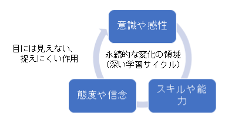

        - 「スキルや能力」、「意識や感性」、「態度や信念」のループ構造
            - 新しいスキルや能力を養うと、それによって理解力が変化し、新しい意識や感性も育ってくる。モノの見方や感じ方が変わるにつれて、新たな信念や仮説が形成される。それがさらなるスキルや能力の育成を可能にしていく。

            - スキルや能力
                - 私たちのモノの考え方と他者との相互作用のしかたに深い変化をもたらすものである
                - 3種に分類される
               
                    - 志
                        - 個人、チーム、組織が本当に自分たちの望むことに向かって自らを方向付け、必要に迫られているからではなく、自ら望んで変わっていく能力
                        - 特に自己実現（マスタリー）の実践と、共有ビジョンがこの能力を伸ばす
                    - 内省と対話
                        - 個人や組織に存在する根強い暗黙の仮設や行動パターンについて内省する能力
                        - 学習性に富んだ対話が起こるためには、自分自身の思考プロセスを探求する能力を備えることが必要
                            - たんなる会話はピンポンゲームであり、学習性は低い
                            - メンタルモデルとチーム学習の中で、培われてくる
                    - 概念化
                        - より大きなシステムや作用しているさまざまな力を意識し、それを自分がどのように理解しているか明らかにして、人から反応をひきだせるように表現する能力
                        - 筋の通った全体観を示すためには、従来の組織では用いられなかった概念化のスキルが要求される
                        - システム思考がこのスキルを身に着けるのに欠かせない
                            - 特にメンタルモデルの取り組みよって育まれた内省の深さと解放性をベースにもって、システム思考を行うことで、概念化のスキルが育っていく
        
            - 意識と感性
                - 自分のメンタルモデルを意識する度合いが高まると、自分がどのような道筋で世界を見ているか理解できるようになる
                - 見方が判るとダイアログにおいて、メンバーは全体に耳を傾けるようになり、より深い意味を聞くようになる
                - 共同思考の状態が意識されていき、だれだけのことをなしうるか、実感できるようになる
                - 自己実現（マスタリー）と共有ビジョンを実践するにつれ、組織に活気があるかないかを、敏感に感じられる
                - チームが何らかの意思決定を行うときは、自分たちのビジョンや目的に照らして、選択肢を眺める
                    - 自分たちの目的意識が曖昧な時には見えなかった、新しい選択肢が多数見えてくる。
        
            - 態度と信念
                - 新しい意識のあり方は、根本的な態度や信念に反映される
                    - そのような深層での変化をエドガー・シャインは「目に見えない仮定」と表現している
                - 単に新しい価値観を宣言するだけでは文化は変わらない
                - しかし、深い信念や仮説は経験によって変化し、やがて文化にも影響を与える 
            
    - 学習する組織の構造
        - 学習する組織を構築するとは、深い学習サイクルを構築することである
            - 骨組みは「基本理念」「インフラの刷新」「理論、メソッド（方式）、ツール」の３つ
                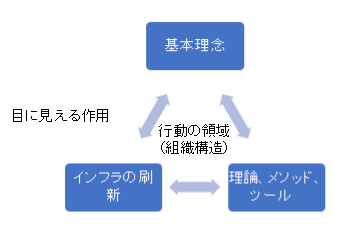
  
                - 基本理念
                    -学習する組織の基本理念はビジョン、価値、目的（その組織は何のために存在するのか？何を生み出そうとしているのか）
                    - 知識創造企業(野中郁次郎)
                        - 会社は機械ではなく、生きた有機体
                        - 会社はアイデンティティと目的を有している
                            - これは自己知識に相当する
                            - 共有化された理解
                                - 会社は何のために存在し、どこへ行き、この世界をどうしたいのか。
                                - そしてそれをどのように実現させるのか
                    - 哲学的深さ
                        - 合衆国憲法は、多くの議論を繰り返し10年もかけて制定

                    - 全体の優先先
                        - 全体は部分よりも根本的
                        - アイデンティティは全体の「機能と設計」の中にしかいない
                            - 何をもって飛行機と言えるのかは個々の部品では説明できない
                        - 組織をモノとして捉えるのではない
                        
                    - 自己のコミュニティ（共同体）的性質
                        - 文化から独立した人間性など存在しない
                            - 「自分の事を話せ」と言われても、家族や仕事、自分が興味あることなど自分はどこにもいない話しかできない
                            - 自分というのは、他社との関係性によってのみ説明できる
                        - 「自分」とは経験の流れを一貫した物語に統合していくひとつの視点
                            - その物語は、他のいくつもの物語と結びつこうとする性質をもっている
                            - 物語は、私たち文化から様々なことを深く吸収している
                            - その物語によって私たちは自分の経験に意義を持たせ行動や考えを意味づける 
                            
                        - 自我は「部分」であり、コミュニティは「全体」とみなすことができる
                            - 自我に価値を置きすぎると、コミュニティは自我の価値を増やすか、減らすかという見方になってしまう。
                        - 他人を自分が利用する対象と捉えるのではなく、一緒に変化していくことができる存在と捉えることによって、はじめて自分が自分であるための新しい可能性を開くことができる

                    - 言語の生成力
                        - 言語はその場所・時などにより多彩に変化する
                            - それは変化への新しい可能性をもっているということ
                        - 言語に正しさを求めることは、地図と現地を混同するようなもの
                         
                - 理論、メソッド（方式）、ツール
                    - 「志」「内省と対話」「概念化」を高めるツール
                        -「志」を高めるツール
                            - 個人のビジョンを引き出すための内省的演習
                                -自分のビジョンを引き出す
                        - 共有ビジョン高めるツール
                            - 相互作用的な演習（共有ビジョンに向かう5つの出発点）
                        -「内省と対話」ツール
                            - メンタルモデルの左側の台詞
                            - プロジェクターとスクリーン
                        - 「概念化」ツール
                            - システム原型

                - インフラの刷新
                    - 組織がメンバーの仕事をサポートする資源を行きわたらせる手段
                        - ハード面の手段も含まれる 
                            - 組織変更、業務プロセス見直し、報奨制度、情報ネットワークなど
                    - インフラとしての「企画」
                        - 企画はマネージャーが解答を見出すという参謀機能ではない
                        - 経営陣が会社や市場・競合他社にたいしてもっている「共有化されたメンタルモデル」を変えていくためのプロセスを推進する場
                    - ラボラトリー（実験室）
                        - ゼネラル・モーターズ
                        - 今までは組み立てや機械加工、同期生産のための設計ツールは従来管理者のモノだった
                            - それを現場作業員にラボトリーで自由に使えるよう解放している
                        - 作業員自分たちで新しい作業プロセスや効率のよい手順などを実験することができる
                            - ラインの調整へつながる
                            
                    - 学習のためのインフラ
                        - 意思決定のためのインフラとは異なる
                        - 作業員が自分たちの仕事の中で「システム思考」「共同探求」などの能力を開発することが可能なインフラ
                        - 仕事の場を学習の場に変えることができない
                            - いつまでも学習は優先度の低い、いいアイデアで終わる
                            
                    - プラクティス・フィールド（練習場）
                        - 失敗が高くつき、個人的脅威が大きく、重要な決定をやり直すチャンスがない中
                            - チャレンジリスクが高い
                                - 学習するチャンスは生まれない
            
            - 骨組みの完全さ
                - 作業員が「自分の時間があるときだけ」学習すべきだと感じた場合、
                    - 組織に対する信頼、学習に対する信頼は失われる           
            
                - 基本理念
                    - 基本理念がないと情熱もなく、何が重要かとう感覚や目的もなくなってしまう
                    - リーダーシップには、状況の変化を乗り越えつづける「基本理念」を明確に規定することも含まれている
                    
                - 理論、メソッド、ツール
                    - より深い学習に要求される新しいスキルを育てる
                - インフラの刷新
                    - 従業員は自分たちのビジョンを追及したり、活用する機会や資源を与えることで、理念や有効なツールを信頼することができる

                - 「永続的な変化の領域（深い学習サイクル）」と「行動の領域（組織構造）」の関係
                    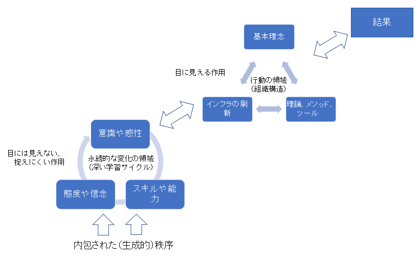

                - 結果の評価
                    - 学習の評価
                        - 最終的にどれだけ成果を挙げたかという観点による評価
                        - 問題は結果をいつ、どのように測定するかである
                            - 忍耐
                                - 深い学習というのは長期にわたって見続ける必要がある
                                - すぐに成果が出ないことが多い
                            - 水量化
                                - 基本的に「数量化すべきものは数量的に測定し、数量化すべきではないのものは質的に測定する」
                                - 学習する組織によって持たされる結果の多くは数量化が難しい
                                    - 知性、開放性、革新性、道徳性など
                                        - 皆が納得する、数量化して測定する方法が必要となる
                                    -容易な数量化の測定は、学習を阻害する要因となる。
    
    - 組織は一人ひとりの思考と相互作用の産物である
    	- いかなる学習する組織において、その最大のレバレッジ（テコの力）は方針や予算・組織図ではなく個々の内にある。
        - 心の中に目を向ける第一歩は、自分たちが暗黙のうちに受け入れいる考え方や、人生において何を選択するのか決めるもととなる願望や期待を意識して、それを探求することである
            - 自己実現（マスタリー）、メンタルモデル、システム思考のアプローチは、ものの考え方を検証し、変化していくことを助けてくれる
        - 相互作用のあり方を変えるとは、公式の組織構造ばかりではなく、人やプロセス間の目に見えにくい相互作用パターンをも再設計するということの含む
            - 共有ビジョン、システム思考、チーム学習は相互作用を変化させることを目的としている
        - 「組織は一人ひとりの思考と相互作用の産物である」という仮説には、固定した考え方や習慣から私たちを解放する力がある
            - 個人やチームよって、組織が変われる事を示唆している
        - 組織における学習とは、経験を絶えず検証し、その経験を（組織全体が利用でき、組織の主目的にかかわる）知識に変えることである。
    
        - 診断する問いかけ
            - あなたは絶えず、自分の経験を検証しているか？
                - 危機な時、順調な時いずれも、自分の経験を検証し、吟味しているか？どのようなやり方をしているか？
            - あなたは知識を生み出しているか？
                - この場合の知識とは、有効な行動を起こす力をもつものを意味する
                - 組織が以前は持ち合わせていなかった能力を発揮しているか？
                - 自分が知っていることは、自分が取り込んだ事実と質的な相違（価値が付加されている）と感じるか？
            - その知識は分かち合われているか？
                - その知識は組織メンバー全員が利用できるか？
                - 知識がどこへ行ったか分かるようになっているか？
            - その学習は（組織にとって）意味があるか？
                - 関係ないと排除せず、この学習は組織の主目的に向けられているか、メンバーはそれを役立てらえることができるかと自問してみる

    - あなたの組織は「学習する組織」かどうか
        - 組織が学習する組織かどうかの見分け方
    
        - ステップ１「もしすでに学習する組織があったのなら・・」	
            - 次の問いに回答してみる
                - 組織はどのような方針、出来事、行動が組織の繁栄や成功を助けているのだろう
                - 組織の中で、メンバーはどのような行動を行い、外の世界とどのような相互作用を作り出しているのだろうか
                - 理想とする組織と、あなたの現在の組織の間には、どのような違いがあるのかだろうか

        - ステップ２「定義を拡張する」
            - 他の人が思いついた学習する組織に、自分の定義を付与してみる
                - 学習する組織のなかでは、人々は自分たちが（組織にとっても、世界にとっても）意味のあることをしていると感じている
                - 組織に属するすべての人が、何らかの形で全力を尽くし、成長したり、何かを生み出したりする力を伸ばしている
                - 人々は一人で行うよりも一緒に力を合わせたときのほうが聡明である。
                - 何か創造的なことを実現したい場合、だれか一人に頼むのではなく、チームに依頼する
    
                - 自分たちの基盤となっているナレッジ・ベース（特に、メンバーの頭や心に蓄えられる言葉で明示されていない暗黙の知識）を強く意識するようになっている
                - 企業の方向性に関するビジョンは、組織のあらゆるレベルから生まれてくる。
                - 組織トップの責任は新たに創発されるビジョンが「共有ビジョン」へと変わるためのプロセスを管理することである
                - メンバーは自分たちの行動が他人にどのような影響を与えるかを理解できるようになるために、組織のすべてのレベルでどんなことが起きているのか学習することが推奨されている
                - 人々は、お互いの（そして自分自身の）仮説や先入観について自由に探求することができる
                    - 話し合うことができないテーマは殆ど存在しない
                - メンバーは互いを同僚として扱い、相手の地位に関係なく、相互に尊敬と信頼が感じられる
                - メンバーは束縛を感じることなく実験し、リスクを背負い、結果をオープンに評価することができる
                    - 失敗を犯した人が、ひどい目にあうということはない。

        - ステップ３「それは私に何をもたらすのか・・・」
            - ステップ２でのリストを見直し、組織がそのような特徴を持っていたら、どのようなことが起きるか。
                - それは組織に何をもたらすだろうか。

        - ステップ４「上位５項目を選び、改良を加える」
            - ステップ３の結果から、組織にとって最も注目すべき特徴を５つ選択
                - 適切さや達成容易度は気にしない
                - いまだ組織で一度も実現できていなかった項目をすくなくとも１、２個選ぶ
    
        - ステップ５「妨げるものは」
            - あなたのビジョンを構成している一つ一つの要素を達成するためには何をしないといけないのか。どのような障害や阻害要因を克服する必要があるのか。一つ一つポイント明記する。
    
        - ステップ６「私が、自分たちの進歩を知ることができるのは・・」
            - ５つの主目標と、それに対する阻害要因の組み合わせに関する一つ以上の「指標」を見つける
                - 指標とは、もしそれが発生したとすれば、何らかの進捗があったことをがわかる徴候のこと

    - ５：学習する輪
        - 人は、行動と内省、活動と休息を交互に繰り返す 
            - マネージャーは効率的な変化が発生するこのリズムを利用する方法を見つけて、回転し続けるようにすること
                - 目的意識を持ち続ける力と、自分と異なる学習スタイルをもった人たちのメンタルモデルを進んで理解しようとする両方が必要となる
    
        - 内省する→つなぐ→決定する→行動する→内省する　・・・のループ構造
            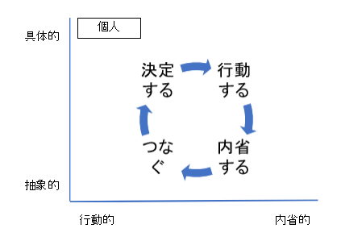
                
            - 学習の輪をたどって、内省と創造する時間枠をとることにより、集団を低次元の混乱から救い出すことができる
                - 低次元の混乱
                    - 事態が慌ただしく場当たり的な対応
                    - 注意が行き届かない行い
                    - 実行プロセスを何日も行う
                    - 実行プロセスの途中でやり方を見直す
                - 行動以外のプロセスの大切さに気づくことになる
    
            - 繰り返し実践することで、習慣となる
    
        - 内省する
            - 自分の行動を客観視すること
                - 行動の最中、何を考え、何を感じていたかを振り返る
                - 根底にあるどのような信念（使われている理論、暗黙知）がどのようなものなのか
                    - どのように影響を与えたと思えるか
                - 自分たちのゴールを以前とは違った目でみているだろうか
            - 内省のテクニックはメンタルモデルの「左側の台詞」を有効
    
        - つなぐ
            - 行動のためのアイデアや可能性を生み出し、整理し直して新しい選択肢をつくること
                - 可能性が見えている行動と周囲のシステムの中にある他の行動パターンとの間のつながりを探す
                - 対象がどのように機能しているのか仮説を生み出す時間ともいえる
            - 今終わったばかりの行動は、今後とるべき実りある選択肢に関して何を示唆しているのか考える
                - 私たちは次にどこを見るべきなのか。
            - この段階では「システム思考」が特別な関連性を持つ
    
        - 決定する
            - 行動のメソッド（方式）を決定すること
            - 「つなぐ」で生み出された選択肢や代替案の中から取り組み方法を選択し、改善を加える
            - 「決定する」ことには、選択という選択という要素が含まれている
        - 行動する
            - できる限り実験的な態度で決めたことを実行すること
            - 行動を終えたら「内省」フェーズに戻る
        
        - チーム学習の輪
            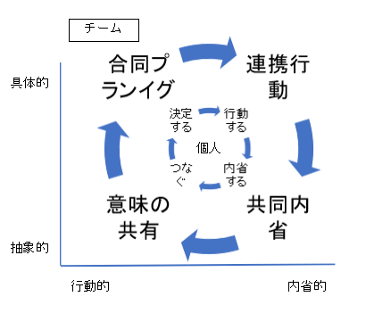

	- 「学習する輪」における個人スタイル
		- チームにおける学習の輪のサイクル
            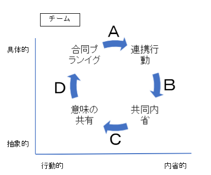

            - B地点：共同内省→意味の共有
                - 拡散思考家とよばれる人たちが活躍する
                    - さまざまな観点から見る力に優れている人たち
                    - 問題解決の初期段階やなど状況分析をしよとしているときに、異なる観点は非常に重要となる
                    - しかしある程度経ったら、C地点にすすむ必要がある

            - C地点：意味の共有→合同プランニング
                - つながりを作る人たちが活躍する
                    - 仮説を作り、なぜそれが起きたのか、原因を提示する
                    - システム思考になれている人たち

            - D地点：合同プランニング→連携行動
                - 解決策を見出す人々が活躍する
                    - 収束思考家であり、実験に興味がある人々
                    - 物事はなんらかの核心に向かって進むべきと考えている人々
                    - 分析が得意だったり、行動ができる人

            - A地点：連携行動→共同内省
                - 調整家とよばれる人々
                    - グループのアイデアを現実にあうように調整し、解決策を実施、事実に照らして実験の仮説を評価する
                    - アイデアが現実に合わない場合、潔くアイデアを手放すことができる人々

            - チームが輪の順番をたどっていけないと混乱状態に陥る	
                - Aで事態の核心にふれようとしているときに、Bで問題を眺めるための多数な観点を持ち出し、Dがとにかく行動したくてしかたなく、Cがその瞬間に新しいつながりを発見した
                - リーダーは輪の正常な動きの維持に注意を払う

    - ６：リーダシップの「場」
        - リーダーにとって自己実現（マスタリー）は大切な学習要素
            - 自分が重要だと考える行動を行うときでも、他の参加者の考え方に対してもオープンであることが、周囲の目にもはっきりとわかるようにならければならない
            - 共有ビジョンの対話スキルが決定的に重要になる
            - 他の人の意見を本当によく理解するためにはメンタルモデルの「内省と探求」スキルが欠かせない
                - そういう理解を「インフラの刷新」という課題に置き換えることによって、あなたがつくりだすば「場」は強化されていく
                    - システム思考における設計スキルが必要になる

    - ７：組織内の関係を再構築する
        - 権限の共有化
            - 通常「難しい意思決定」はリスク（解雇や減給、降格など）を伴うため、チームで決定するのではなく、ある特定の責任者が行うものと思われえていることが多い
                -しかし、学習する組織においては逆に考える
                    - 難しい意思決定は重要であり、多数に影響を及ぼすものであるので、影響を受ける人々や責任を負う人の参画が求められる
                        - 全員が決定事項が長期に影響を与える可能性があること、個人的利益がプロセスを支配することがないこと、共有する情報が可能な限り正確であるように努めることで、可能になる
            - 組織が「権限の共有家」への動きを始めると、「親密さ」にも付加価値が生じる
                - 難しい状況での難しい判断を支持する風潮が生み出される

- システム思考
    - 1:システム思考を学習すすために
    - 2:システム思考の実践に伴う注意点
        - 全員が一緒に全体を見る
            - 「システム思考」はひとりで実践することはできない
                - 複雑なシステムにおいては、できるだけ多数の意見を受け入れなければ、良い結果は生まれない
                    - 部門を超えた解決策を提案することにたいする上位の許可をとりつけておく必要もある
                - 組織内のどの領域も、立ち入り禁止や保護区域を設けてはならない
                - さまざまな学習スタイルを持った人を参加させることが大事
    
        - 原因と結果は、時間的・空間的に近接しているとは限らない
            - 問題となる現象の近くにレバレッジ（解決の働きかけをするポイント）を探そうとしてはならない
                - 根本的原因を探して、問題の上流にさかのぼり、時間的にも過去にさかのぼる
    
        - 最も安易な出口はまた元に戻る
            - ハード面（規則、組織の機構、仕事のプロセス、原料や情報の流れ、評価制度、管理体制）といった要素が見えやすいものは、取り組むためのスキルがあまり必要とされていない
            - ソフト面（個々の人々の深層にある信念など）のほうが実は、効果的に変化を起こすための影響力は大きくなる。
                - なぜ規則や組織機構、仕事のプロセスが今の姿になっているのか、その背景や経緯、根本理由が見えやすくなる
    
        - 行動は改善される前に一度悪化する
    - 3:4つのレベルでシステムを見る
        - 「出来事」「パターン」「構造」「メンタルモデル」

    - 4:自分自身のストーリーからシステム思考の基礎を学ぶ
        - 一見、何も脈絡もなく起きているように見える出来事同士の相互関係から、整合性のあるストーリを見出し、自分自身が置かれている状況をシステム的に理解する
            - ステップ１：問題を提示する
                - 問題は自分自身、組織にとって重要なものである
                - 慢性的に繰り返し起きている問題である
                - 範囲が限られている
                - 経緯を知っており説明できる問題
                - 問題はできる限り正しく描写すること
            - ステップ２：ストーリを語る
                - 問題の根本的な原因に関する推測・仮説を立てる
                - システムの範囲に対する感覚を養う
                - チーム内の様々な考えを表面化させる
                - いくつかの変数を選び出す感覚を養う
                - ストーリに基づく図（グラフ）を描く
                
    - 5: システム思考で使われる用語
        - 拡張循環の基本形
            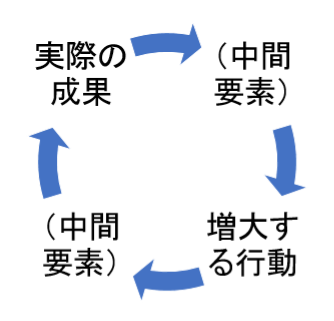  

        - 平衡循環の基本形        
            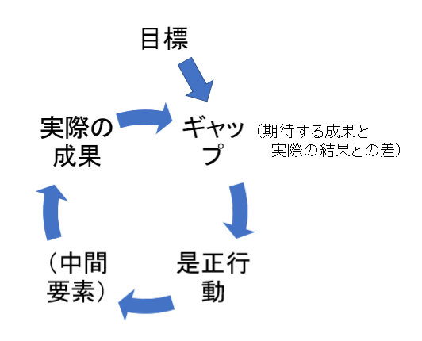
        
        - 逆効果の応急処置の基本形
            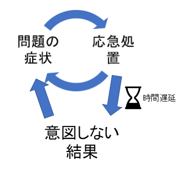

        - 成長の限界の基本形
            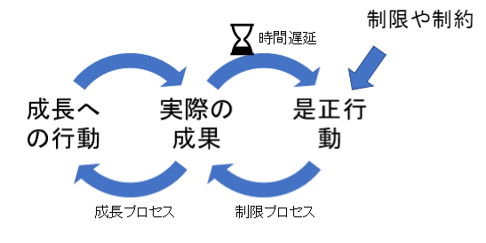
            - 自分たちでは成長を阻害する制限は見えない
                - 組織の中（財政、人的、技術資源など）
                - 組織の外（市場の飽和や新規競合の参入）
                - 自分の中（メンタルモデルや伝統や行動様式に縛られる）
            - 制限要因に注目しないで、過去のうまくいった事例を探して、それに注力してしまうことが多い
            - 平衡循環の遅れの長さと、それに対する私たちの反応によって、安定状態にはいるか、頂点に達した後に崩壊するかが決めることが多い
                - 平衡循環の遅れが長いということは、限界が意識される前に、成長のサイクルがシステムの能力を超えてしまう場合があることを示している
            - 成長の限界における真のレバレッジは、まだ自由に使える時間や資源をもっている成長初期段階にある
                - 成長初期時に、将来大きな力となる制限要因を予測し、取り除けないまでも効果的な取り組みを行い、次の拡張の波の中に組み込むことができる
                - どのような手段をとれば、成長し続けると同時に、制限要因に取り組む力も培われるか自問してみる
        
        - 問題の転嫁の基本形
            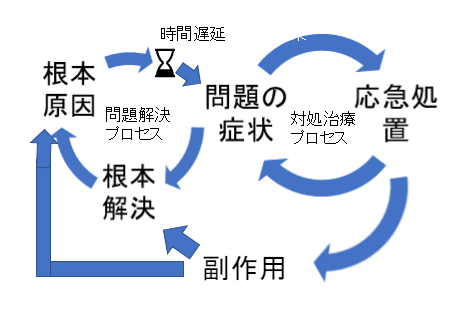
            
            - 多くの<問題の転嫁>の構造には、システムを依存のパターンに引き込む「拡張循環」が存在する
                - これらの依存ループは、<逆効果の応急措置>における「意図せぬ結果」と同様に、問題をさらに悪化させる予期しない可能性を表している
                - 依存は最初の問題よりも厄介なものとなることが多い
                    - 依存によって、問題を問題としてとらえる能力が蝕まれるから
            - 組織における依存の多くは、特定の方針、内部手続き、部署、人間関係、思考法などによって陥ることが多い
                - 危機対策の英雄がその行為に習慣性をもたらし、根本解決に至らなくなってしまうなど
        
        - 共有地の悲劇の基本形
            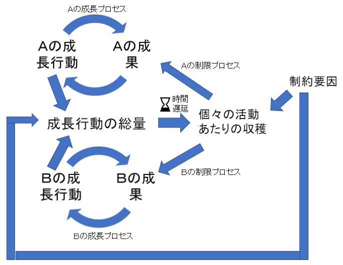
            
            - フォワードで新車開発の際、各車両部品の担当者は性能は良い機器を各々取り入れたが、電気総量が車のバッテーリーを上回ってしまった
                - 各担当者は自分たちの必要電気容量の割り当てを譲らない
            
        - 予期せぬ敵対関係の基本形
            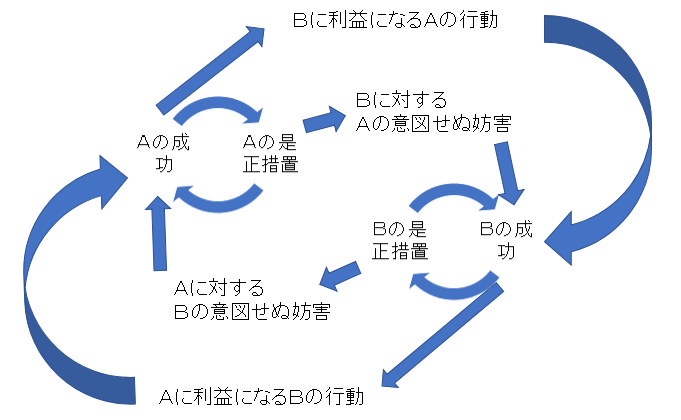
            
        - 原型系どうしの関係性
            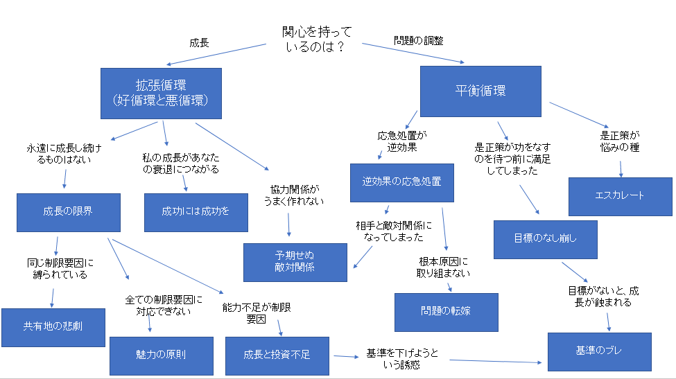

    - ９：組織の行き詰まりを打破するための７つのステップ
        - 組織の行き詰まりは、メンバーは各自のことしか考えないときに起きる
        - 下記は「問題の転嫁の原型」を使った７段階のアプローチ
            - チームが行き詰まりループからの抜け出す方法を見つけるのに役立つ
        - ステップ１「最初の問題症状を突き止める」
            - ふりかえりにて、何度も繰り返し起きていた問題症状を探し出す。
        - ステップ２「すべての応急処置を作図する」
            - 見つかった問題に取り組むために行われていた「応急処置」図化する
                - 問題に対応できているように見える「平衡循環」を見つけるのが目的
    
        - ステップ３「好ましくない影響を（他者への影響も含めて）探し出す」
            - 応急処置として行った行動が、組織の内外へどのように影響していたか洗い出す
                - 行き詰まり状況が持続するということは人をパターン化した反応にはめ込む「拡張プロセス」が存在していることを示唆する
                - ひとつの「応急処置」が他の「応急処置」を生むという悪循環が発生している
        - ステップ４「根本的解決策を明らかにする」
            - 応急処置による好ましくない影響を突き止めたら、問題に対して根本的な取り組みをする解決策を探す
                - 複数人が関与している状況では、関係者すべての人の見地から眺める必要がある
        - ステップ５「応急処置の習慣性がある副作用を作図する」
            - 通常、問題の転嫁の構造には、根本的解決策の実現可能性を阻害する副作用が存在している
                - これが習慣性のある拡張循環（依存の悪循環）へつながる
        - ステップ６「根本的解決策のループとの相互関係を探る」
            - 副作用による相互作用の影響と根本的解決策のつながりを見つける
                - チームの解決策が他チームの問題の原因になっている場合、相互作用の影響は相手チームを嫌悪感を増大させ、ますますコミュニケーションが低下することになる
                - 私たちVS彼らの精神構造が、もうひとつの習慣性のある力となり、根本的解決策の実現が困難になっていく
    
        - ステップ７「レバレッジの高い行動を見つける」
            - 渋滞の中にいる人は、自分がどこにいるのか、どうやって抜け出せばいいのか状況把握することは難しい
            - しかし、高い地点から俯瞰してみることができれば、より広い範囲を把握することができる
            - おなじように、行き詰まり状況を俯瞰することは、高いレバレッジをもった行動になりうるのである。
    
    
    
    

