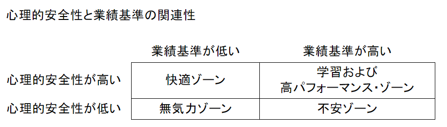
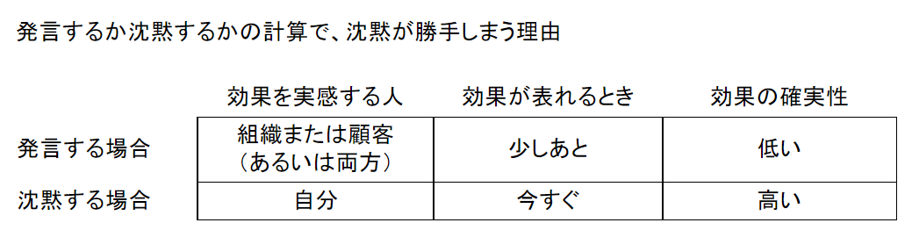

# 恐れのない組織
## 「心理的安全性」が学習・イノベーション・成長をもたらす

- 著者
  - エイミー・C・エドモンドソン

- 翻訳
  - 野津智子

---

- 特典などない
  - 不安定性（volanility）、不確実性（uncerainty）、複雑さ（compliexity）、曖昧さ（ambiguity）、すなわちVUCAに直面しているあらゆる企業にとって、心理的安全性は最終的な収益に直結している。
  - なぜなら従業員の指摘、疑問、アイデア、懸念は、市場と組織で起きていることについて重要な情報をもたらすからである。
  - これに、今日ではダイバーシティ（多様性）、インクルージョン（包摂）、ビロンギング（自分らしさを発揮しながら組織に関われる心地よさ）が職場重視されてきていることを加味すれば、心理的安全性の構築がリーダーの極めて重要な責務であることは明らかだ。
  - 従業員が貢献、成長および学習、強力できるかどうかは、心理的安全性によって左右されるのである。

- してしまったことに対する後悔は、時間が和らげてくれる。
  - だが、しなかったことに対する後悔は、どなものも慰めにならない。
  - シドニー・ハリス

- 率直に意見を言う事が当たり前になるためには、心理的安全性（および発言を期待する事）が制度化、組織化される必要がある。
  - 飛行機で副操縦士が機長に意見を述べるクルー・リソース・マネジメント（CRM）訓練をおこなっている

- 心理的安全性を確率するためのリーダーのツールキット
  - 土台をつくる
    - 仕事をフレーミングする
      - 失敗、不確実性、相互依存を当たり前とし、率直な発言の必要性を明確にする
    - 目的を際立たせる
      - 危機にさらされているものと、それがなぜ、誰にとって重要であるかを意識する
    - 成果
      - 期待と意味の共有
  - 参加を求める
    - 状況的謙虚さを示す
      - 完璧で無いことを認める
    - 探究的な質問をする
      - よい質問をする
      - 集中して「聴く」手本を示す
    - 仕組みとプロセスを確率する
      - 意見を募るためのフォーラムを設ける
      - ディスカッションのためのガイドラインを示す
    - 発言が歓迎されるという確信
  - 生産的に対応する
    - 感謝を表す
      - 耳を傾ける
      - 受け容れ、感謝する
    - 失敗を恥ずかしいものではないとする
      - 未来に目を向ける
      - 支援を申し出る
      - 次のステップについて話し合い、熟慮し、プレーンストーミングする
      - 明かな違反に制裁措置をとる
    - 絶え間ない学習への方向づけ

- 失敗の典型例　－ 定義とコンテクスト
  - 回避可能な失敗
    - 定義
      - 既知のプロセスから逸脱し、望まない結果が起きる
    - 共通する原因
      - 行動・スキル・注意の欠如
    - 特徴を示す表現
      - プロセスからの逸脱
    - 古典的なコンテクスト
      - 製造業の生産ライン
      - ファストフード店
      - 公共事業やサービス
  - 複雑な失敗
    - 定義
      - 出来事や行動がかつてない特異な組み合わさり方をして、望まない結果が起きる
    - 共通する原因
      - 慣れた状況に複雑さ、多様性・かつてない要因が加わる
    - 特徴を示す表現
      - システムの破綻
    - 古典的なコンテクスト
      - 病院での医療
      - NASAのシャトル計画
      - 航空母艦
      - 原子力発電所
  - 賢い失敗
      - 定義
          - 新たなことを始めて、望まない結果が起きる
      - 共通する原因
          - 不確実性、試み
          - リスクをとること
      - 特徴を示す表現
          - うまくいかなかった試み
      - 古典的なコンテクスト
          - 医薬品開発
          - 新製品の設計

- 上司の役割についての枠組み

| 　     | 一般的な枠組み                                    | リフレーミング後の枠組み                                                |
|-------|--------------------------------------------|-------------------------------------------------------------|
| 上司    | 答えを持っている  命令する 部下のパフォーマンスを評価する  | 方向性を決める 考えを明らかにしてもらい方向性に磨きをかける 絶えず学習し、卓抜するための条件を整える |
| ほかの人々 | 指示通りに行動しなければならない部下                         | 貴重な知識と知恵を持つ貢献者                                              |

- 心理的安全性をつくるために、失敗を恥ずかしいものではないとする

| 　            | 従来の枠組み          | 失敗を恥ずかしいものではないとする新たな枠組み           |
|--------------|-----------------|-----------------------------------|
| 失敗に対する考え方    | 失敗は受容できない       | 試みに失敗はつきものである                     |
| 高い業績についての考え方 | 高い業績をあげる人は失敗しない | 高い業績をあげる人は賢い失敗をし、失敗から学び、その学びを共有する |
| 目標           | 失敗を回避する         | 素早い学習を促進する                        |
| 枠組みがもたらす影響   | 保身のために失敗を隠す     | 率直に話し合い、素早く学び、イノベーションを起こす         |

- 発言と沈黙
  - 発言より沈黙を好む心理的・社会的な力の基本的非対称性、つまり自己表現より自己防衛しようとする性質は、変わるのは難しい。
  - 発言と沈黙では、見返りもまた非対称である。
  - 自己防衛したところで空虚な勝利しか手に入らないのに比べ、自己表現すれば、意欲的な目標を実現しうるチームの一員になって野心的な目的に積極的に貢献し、それによって充実感を得られるのだ。
  - これは負けないようにプレーするか、勝つためにプレーするかの違いに等しい。
  - 負けないようにプレー
    - マイナスの側面からの身を守ろうとするマインドセット
    - 安全第一
  - 勝つためのプレー
    - プラスの側面にフォーカスし、チャンスを探し、必然的にリスクを取ることになる

- イノベーション
  - イノベーションは計画的に生み出せるものではない。
  - しかしイノベーションが起こりやすい条件は明らかになっている
    - 多様性の活用
    - 失敗を恐れず挑戦すること
  - 心理的安全性はこの２つの要素の触媒なのである

- 学習を促進する失敗とは？
  - 