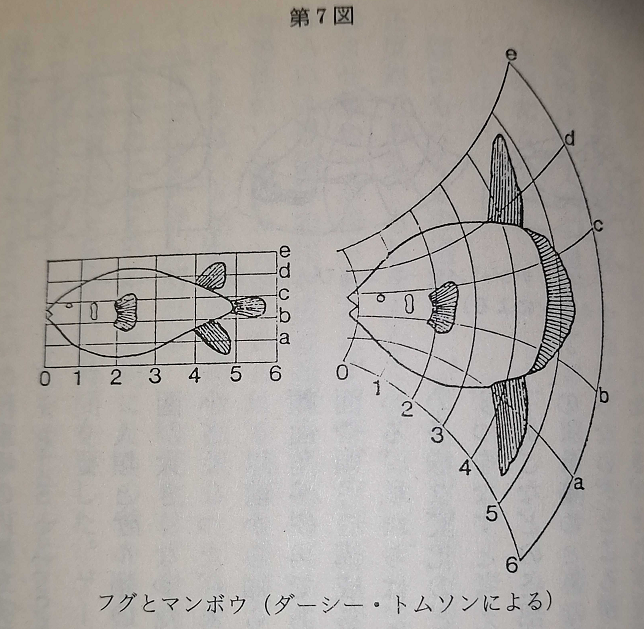

# 機械の中の幽霊

- 著者
    - アーサー・ケストラー

- 翻訳
    - 日高敏隆
    - 長野敬
    
---
- 不思議の国のアリス
    - アリスがしゃべる前にはよく考えなさいと忠告されたとき、彼女はこう言った。
    - 「私が何をしゃべっているか判るまでは、何をかんがえているかわからないじゃない」
        - 発想というものは、ことばによる概念に結晶化して実体のある形を獲得しないうちは、しばしば空気のように無にひとしいものだということも事実である。
        - 何を言おうとしているかは判っているのだが、言葉で表せないことがときどきある。
        - そして別の時になって、明白で正確な言葉の表現によって、はじめて自分が性格には何を言おうとしていたのかを見出すことになる。

- 論理計算機やチェスを指す機械を設計したH・J・サイモン教授
    - 単純な系から複雑な系が進化するとき、もし安定な中間形が存在すれば、それが存在しないときよりも進化はずっと速やかにおこるだろう。
    - 前の場合、生じる複雑なものは階層的なものとなるであろう。

- 階層の個々のメンバーは、ローマ神話のヤヌスのように、反対に向いた２つの顔を持っている
    - 下のレベルに向いた顔は、自己完結した全体という顔であり、
    - 上に向いた顔は、依存的な部分という顔である

- 自己主張的傾向はホロンの全体性の動的な表現であり、全体帰属的傾向はその部分性の動的表現である

- 無機的システム
    - 生物体を構成している階層性を、器官、組織、細胞、細胞器官、巨大分子等々と下のほうへたどっていくと、どこまで行っても底というものはなく、生命に対する古い機械論的なアプローチから期待されるような、最終的構成要素はついに見つからない。
    - 階層性は、上の方へ向かって同じように、下のほうへ向かってもその末端は開いたままなのである。

- 我々はつねに、ルールを知ることなくゲームをしているのである。

- 階層性のnレベルにあるサブ・スキルあるいはホロンは、（n-1）レベルにあるホロンより多くの自由度をもっている
  - 規則で許されている選択の幅は広い
  - 何気ない会話で次に何が頭に浮かんでくるかを予知することは難しい、選択の幅は大変広い
  - 次に何を言おうか決めてもその言い回しはたくさんある
  - とはいえ文法の規則とか、その人の語彙の限界とかにより、限界はされてくる。

- どのようなスキルあるいは習慣も固定的な面と、可変的な面をもっている
  - 固定的な面はゲームの規則によって決定される
    - チェスのプレイヤーは許される手の中で広域な選択をすることができる
    - 規則にはしばれれにこれらの選択は、ホロンの作動する局所的な環境によって左右される
    - それらはフィードバックに導かれた戦略の問題なのである
    - 別の言い方をするならば、規則の固定的な規則が許される手を決定し、可変的な戦略が許された手の中から実際にどの手を選ぶべきか決定するのである。
    - 度の場合でも高いレベルに登っていくにつれて、可変性が増し、固定性が減っていくのがわかる

- 習慣の機械化
  - 最初は意識して乗っていた自転車も、そのうち無意識に乗れるようになる
  - 意識していた規則を、無意識のうちに適用できるようになったといえる。
    - その規則がどんなものか意識せずに、その規則にしたがっているのである
  

- ホロンの安定性
  - 型にはめたとしても、その上位レベルでは多様性に富む
  - 

- 支配の移動
  - ある技能を学習によって身につけるには高度の注意力の手中が必要となる
  - しかしそれが自分のものとなり、習熟してくると「自分で面倒みさせておけばよい」というようになる
  - これは規則で支配されている行動を支配する規則、すなわち技能の基準（カノン）が無意識に働くということである
  - これは「精神的」な活動が「機械的」な活動へたえず変形されていくこと、すなわち「心理的過程」から「機械的過程」への変形である
  - 意識というものを負の記述してみれば、習慣の形成におうじて減ってくるような、ある活動にともなう属性ともいえる。
  - 学習から機械的なお定まりの動作へと変形していくのにともなって、意識性の照明はうす暗くなっていく。
  - それゆえ、機械的繰り返しが妨げられたときには、逆の過程が行われると予期される
  - すなわち「機械的」な行動が「心して行う」行動へと変化させられると予期される。

  - 習慣とか技能は機械的なホロンであり、各々一定の規則の基準と、融通性（可変性）にとむ戦略を備えている。
    - 融通性にとむ戦略というのは、いくつかの未知のうちからどれかを選ぶという意味である
    - 問題はこの選び出すはどのように行われるかということになる。
    - 自転車にのっているときは環境からのフィードバックに即して運転している、すなわち閉じた世界での反応である
    - それが猫が横切るなど思いかげないことが生じ、機械的反応をこえた戦略的選択を迫られるとき、上位にお伺いをたてることになる・
    - 機械的行動から、心して行う行動へ移ることが、意識された決断というものの本質、また主観的な自由意志体験の本質なのである。

- 階層性内で、い段ずつ上のレベルにあるホロンは、順次に複雑になり、融通性にとみ、活動のパターンが順次に予想しがたくなっていく。
  - 一段ずつ低いレベルに降りていくと、機械的になり、型にはまり、予想しやすいパターンになる。